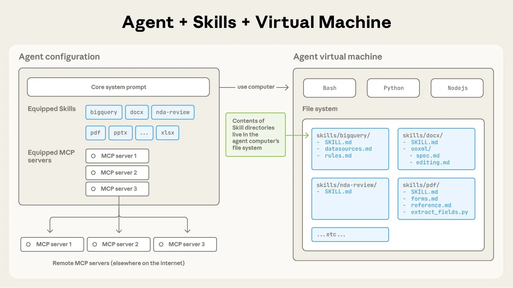

# 에이전트 스킬(Agent Skills)로 에이전트를 실전에 투입하기

카테고리: Claude Code, 에이전트
제품: Claude Code, Claude 플랫폼
날짜: 2025년 10월 16일
읽기 시간: 5분

클로드(Claude)는 강력하지만, 실제 업무를 수행하려면 절차적 지식과 조직적 맥락이 필요합니다. 파일과 폴더를 활용해 특화된 에이전트를 구축할 수 있는 새로운 방식인 '에이전트 스킬(Agent Skills)'을 소개합니다.

---

> **업데이트 안내**: 우리는 에이전트 스킬을 크로스 플랫폼 이식성을 위한 개방형 표준으로 공개했습니다. (2025년 12월 18일)

## 소개

모델의 성능이 향상됨에 따라, 이제 본격적인 컴퓨팅 환경과 상호작용하는 범용 에이전트를 구축할 수 있게 되었습니다. 예를 들어, Claude Code는 로컬 코드 실행 및 파일 시스템을 활용하여 다양한 도메인에 걸친 복잡한 작업을 수행할 수 있습니다. 하지만 이러한 에이전트가 더욱 강력해짐에 따라, 도메인별 전문 지식을 부여하기 위해 더욱 조합 가능하고 확장성 있으며 이식성 높은 방법이 필요해졌습니다.

이를 계기로 우리는 **에이전트 스킬(Agent Skills)**을 개발하게 되었습니다. 이는 에이전트가 특정 업무를 더 효율적으로 수행할 수 있도록, 지침, 스크립트, 리소스를 체계적으로 정리한 폴더로, 에이전트가 이를 찾아 동적으로 불러올 수 있습니다. 스킬은 사용자의 전문 지식을 Claude를 위한 조합 가능한 리소스로 패키징하여 Claude의 기능을 확장하고, 범용 에이전트를 사용자의 필요에 맞는 전문 에이전트로 변환합니다.

에이전트용 스킬을 구축하는 것은 신입 사원을 위한 온보딩 가이드를 작성하는 것과 같습니다. 이제 각 사용 사례에 맞춰 분산되고 맞춤형으로 설계된 에이전트를 구축하는 대신, 누구나 절차적 지식을 포착하고 공유함으로써 에이전트를 조합 가능한 기능으로 전문화할 수 있습니다. 이 글에서는 스킬이 무엇인지 설명하고, 작동 방식을 보여드리며, 직접 스킬을 구축하기 위한 모범 사례를 공유합니다.

## 스킬의 구조 (The Anatomy of a Skill)

스킬이 실제로 어떻게 작동하는지 살펴보기 위해, 실제 예제를 살펴보겠습니다. Claude의 최근 출시된 문서 편집 기능을 구동하는 스킬 중 하나입니다. Claude는 이미 PDF를 이해하는 데 많은 지식을 갖고 있지만, PDF를 직접 조작하는 능력(예: 양식 작성)에는 한계가 있습니다. 이 PDF 스킬을 통해 Claude에 이러한 새로운 기능을 부여할 수 있습니다.

가장 단순한 형태의 스킬은 `SKILL.md` 파일을 포함하는 디렉토리입니다. 이 파일은 필수 메타데이터인 `name`과 `description`을 포함하는 YAML 프론트매터(frontmatter)로 시작해야 합니다. 시작 시, 에이전트는 설치된 모든 스킬의 `name`과 `description`을 시스템 프롬프트에 미리 로드합니다.

이 메타데이터는 **점진적 공개(progressive disclosure)**의 **첫 번째 단계**입니다. 모든 것을 컨텍스트에 로드하지 않고도 Claude가 각 스킬을 언제 사용해야 하는지 알 수 있을 만큼의 정보만 제공합니다. 이 파일의 실제 본문은 **두 번째 단계**의 상세 정보입니다. Claude가 현재 작업에 해당 스킬이 관련이 있다고 판단하면, 전체 `SKILL.md`를 컨텍스트에 로드하여 스킬을 활성화합니다.

## 점진적 공개와 파일 구조 (Progressive Disclosure and File Structure)

스킬이 복잡해지면 단일 `SKILL.md`에 담기에 너무 많은 컨텍스트가 포함되거나, 특정 시나리오에서만 관련이 있는 컨텍스트가 있을 수 있습니다. 이러한 경우, 스킬은 스킬 디렉토리 내에 추가 파일을 번들로 포함하고 `SKILL.md`에서 이름으로 참조할 수 있습니다. 이러한 추가 연결 파일은 **세 번째 단계**(그 이상)의 상세 정보이며, Claude는 필요할 때만 탐색하고 발견할 수 있습니다.

아래에 표시된 PDF 스킬에서, `SKILL.md`는 스킬 작성자가 핵심 `SKILL.md`와 함께 번들로 제공하는 두 개의 추가 파일(`reference.md`와 `forms.md`)을 참조합니다. 양식 작성 지침을 별도의 파일(`forms.md`)로 옮김으로써, 스킬 작성자는 스킬의 핵심을 가볍게 유지하면서 Claude가 양식을 작성할 때만 `forms.md`를 읽을 것이라고 신뢰할 수 있습니다.

점진적 공개는 에이전트 스킬을 유연하고 확장 가능하게 만드는 핵심 설계 원칙입니다. 목차로 시작하여 특정 챕터로, 마지막으로 상세한 부록으로 이어지는 잘 정리된 매뉴얼처럼, 스킬은 Claude가 필요할 때만 정보를 로드할 수 있게 합니다.

> "파일 시스템과 코드 실행 도구를 갖춘 에이전트는 특정 작업을 수행할 때 스킬의 전체 내용을 컨텍스트 윈도우에 읽어들일 필요가 없습니다. 이는 스킬에 번들할 수 있는 컨텍스트의 양이 사실상 무제한이라는 것을 의미합니다."

## 스킬과 컨텍스트 윈도우 (Skills and the Context Window)

스킬이 트리거될 때 다음과 같은 일련의 작업이 발생합니다:

1. 시작 시, 컨텍스트 윈도우에는 핵심 시스템 프롬프트와 설치된 각 스킬의 메타데이터, 그리고 사용자의 초기 메시지가 포함됩니다.
2. Claude는 Bash 도구를 호출하여 `pdf/SKILL.md`의 내용을 읽음으로써 PDF 스킬을 트리거합니다.
3. Claude는 스킬과 함께 번들된 `forms.md` 파일을 읽기로 선택합니다.
4. 마지막으로, Claude는 PDF 스킬에서 관련 지침을 로드한 후 사용자의 작업을 진행합니다.

## 스킬과 코드 실행 (Skills and Code Execution)

스킬에는 Claude가 재량에 따라 도구로서 실행할 수 있는 코드도 포함할 수 있습니다.

대규모 언어 모델은 많은 작업에서 뛰어나지만, 특정 작업은 전통적인 코드 실행이 더 적합합니다. 예를 들어, 토큰 생성을 통해 리스트를 정렬하는 것은 단순히 정렬 알고리즘을 실행하는 것보다 훨씬 비용이 많이 듭니다. 효율성 문제를 넘어, 많은 애플리케이션은 코드만이 제공할 수 있는 결정론적 신뢰성을 필요로 합니다.

우리의 예제에서, PDF 스킬은 PDF를 읽고 모든 양식 필드를 추출하는 미리 작성된 Python 스크립트를 포함합니다. Claude는 스크립트나 PDF를 컨텍스트에 로드하지 않고도 이 스크립트를 실행할 수 있습니다. 그리고 코드는 결정론적이므로, 이 워크플로우는 일관되고 반복 가능합니다.

## 스킬 개발 및 평가 (Developing and Evaluating Skills)

스킬을 작성하고 테스트하기 위한 유용한 가이드라인은 다음과 같습니다:

**평가부터 시작하세요:** 대표적인 작업에서 에이전트를 실행하고 에이전트가 어려움을 겪거나 추가 컨텍스트가 필요한 부분을 관찰하여 에이전트 역량의 구체적인 격차를 파악하세요. 그런 다음 이러한 부족한 점을 해결하기 위해 스킬을 점진적으로 구축하세요.

**확장을 고려한 구조화:** `SKILL.md` 파일이 다루기 어려워지면 내용을 별도 파일로 분리하고 참조하세요. 특정 컨텍스트가 상호 배타적이거나 함께 사용되는 경우가 드문 경우, 경로를 분리하면 토큰 사용량이 줄어듭니다. 마지막으로, 코드는 실행 가능한 도구이자 문서로서 기능할 수 있습니다. Claude가 스크립트를 직접 실행해야 하는지, 아니면 참조용으로 컨텍스트에 읽어들여야 하는지 명확해야 합니다.

**Claude의 관점에서 생각하세요:** 실제 시나리오에서 Claude가 스킬을 어떻게 사용하는지 모니터링하고 관찰에 기반하여 반복 개선하세요. 예상치 못한 경로나 특정 컨텍스트에 대한 과도한 의존을 주의 깊게 살펴보세요. 스킬의 `name`과 `description`에 특별히 주의를 기울이세요. Claude는 현재 작업에 대한 응답으로 스킬을 트리거할지 결정할 때 이를 사용합니다.

**Claude와 함께 반복 개선하세요:** Claude와 함께 작업하면서, 성공적인 접근 방식과 흔한 실수를 스킬 내의 재사용 가능한 컨텍스트와 코드로 캡처하도록 Claude에게 요청하세요. 스킬을 사용하여 작업을 완료하는 과정에서 방향이 잘못되면, 무엇이 잘못되었는지 자기 성찰하도록 요청하세요. 이 과정은 미리 예측하려 하지 않고 Claude가 실제로 필요로 하는 컨텍스트를 발견하는 데 도움이 됩니다.

## 스킬 사용 시 보안 고려사항 (Security Considerations When Using Skills)

스킬은 지침과 코드를 통해 Claude에 새로운 기능을 제공합니다. 이는 스킬을 강력하게 만들지만, 동시에 악성 스킬이 사용 환경에 취약점을 도입하거나 Claude가 데이터를 유출하고 의도하지 않은 행동을 취하도록 유도할 수 있음을 의미합니다.

> "신뢰할 수 있는 출처의 스킬만 설치할 것을 권장합니다. 신뢰도가 낮은 출처의 스킬을 설치할 때는 사용 전에 철저히 감사하세요. 먼저 스킬에 번들된 파일의 내용을 읽어 무엇을 하는지 파악하고, 특히 코드 종속성과 이미지나 스크립트와 같은 번들된 리소스에 주의를 기울이세요. 마찬가지로, 잠재적으로 신뢰할 수 없는 외부 네트워크 소스에 연결하도록 Claude에 지시하는 지침이나 코드에도 주의하세요."

## 스킬의 미래 (The Future of Skills)

에이전트 스킬은 현재 Claude.ai, Claude Code, Claude Agent SDK, Claude 개발자 플랫폼에서 지원됩니다.

앞으로 몇 주 동안, 스킬의 생성, 편집, 발견, 공유 및 사용의 전체 생애주기를 지원하는 기능을 계속 추가할 예정입니다. 특히 스킬이 조직과 개인이 Claude와 자신의 컨텍스트 및 워크플로우를 공유할 수 있도록 돕는 기회에 대해 기대하고 있습니다. 또한 스킬이 외부 도구와 소프트웨어를 포함하는 보다 복잡한 워크플로우를 에이전트에게 가르치는 방식으로 모델 컨텍스트 프로토콜(MCP) 서버를 보완하는 방법도 탐구할 것입니다.

더 나아가, 에이전트가 스스로 스킬을 생성, 편집, 평가할 수 있도록 하여, 자신의 행동 패턴을 재사용 가능한 기능으로 체계화할 수 있게 하는 것을 목표로 하고 있습니다.

스킬은 간단한 개념이며 그에 상응하는 간단한 형식을 가지고 있습니다. 이러한 단순성은 조직, 개발자, 최종 사용자가 맞춤형 에이전트를 구축하고 새로운 기능을 부여하는 것을 더 쉽게 만듭니다.

스킬로 사람들이 무엇을 만들어낼지 기대됩니다. 오늘 바로 스킬 문서와 쿡북을 확인하여 시작해 보세요.

---

*작성: Barry Zhang, Keith Lazuka, Mahesh Murag — 모두 폴더를 정말 좋아하는 사람들입니다. 이 스킬을 지지하고, 지원하고, 구축한 Anthropic의 많은 분들께 특별히 감사드립니다.*
