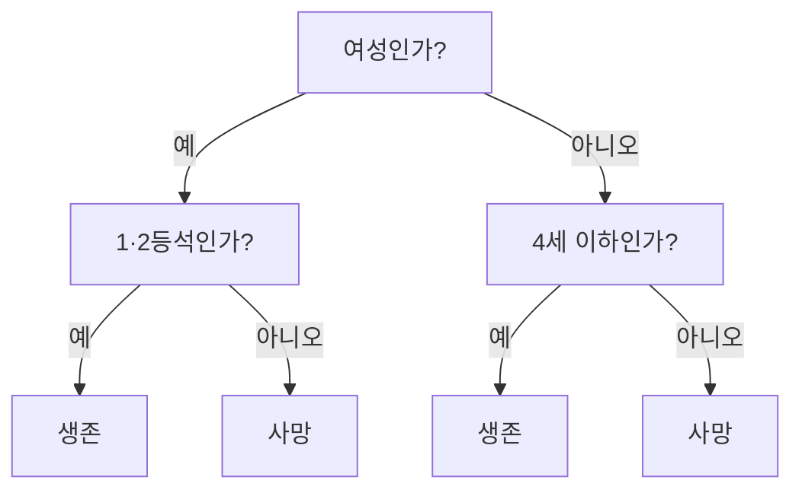

# 지도학습 모델 3가지, 비유로 한 번에 이해하기

> 5·6회차에서 사용한 지도학습 모델을 세 가족으로 묶어 정리한 번외 자료입니다. 수식 없이 비유만으로 읽을 수 있게 썼습니다.

정답이 있는 데이터로 "규칙을 배우는" 모델 세 가지를 **부동산 중개사**, **스무고개**, **전문가 회의** 에 빗대어 설명합니다.

---

## 1. 한눈에 비교

| 항목 | 선형 계열 (선형회귀, 로지스틱 회귀) | 의사결정나무 | 앙상블 (랜덤포레스트, 그라디언트부스팅) |
| --- | --- | --- | --- |
| 비유 | 공식 하나로 계산하는 **부동산 중개사** | 질문을 이어 가는 **스무고개** | 여러 사람이 모여 정하는 **전문가 회의** |
| 한 줄 요약 | 변수마다 점수를 매겨 더한다 | 예/아니오 질문으로 나눠 간다 | 나무 여러 그루의 의견을 모은다 |
| 장점 | 빠르고, 결과를 설명하기 쉽다 | 사람이 규칙을 그대로 읽을 수 있다 | 성능이 가장 좋고 안정적이다 |
| 약점 | 꺾이는 관계(곡선)를 못 잡는다 | 깊어지면 외워 버린다 (과적합) | 왜 그렇게 판단했는지 보기 어렵다 |
| 스케일링 | **필요** | 필요 없음 | 필요 없음 |
| scikit-learn | `LinearRegression`, `LogisticRegression` | `DecisionTreeClassifier` / `Regressor` | `RandomForestClassifier`, `GradientBoostingClassifier` (회귀는 `Regressor`) |

> [!IMPORTANT]
> 세 모델 모두 사용법은 같습니다. `model.fit(X_train, y_train)` 로 배우고 `model.predict(X_test)` 로 답합니다.

---

## 2. 선형 계열: 공식 하나로 계산하는 부동산 중개사

경험 많은 중개사는 집을 보자마자 머릿속 공식으로 값을 매깁니다.

"기본 1억에, 방 하나당 3천만 원 더하고, 역에서 1km 멀어질 때마다 2천만 원 빼고…"

**선형회귀** 가 바로 이 공식을 데이터에서 찾아냅니다. 변수마다 붙는 금액(3천만 원, -2천만 원)이 **계수** 이고, 기본 1억이 **절편** 입니다.

**로지스틱 회귀** 는 같은 공식으로 점수를 낸 뒤, 그 점수를 0~100% **확률** 로 바꿉니다. "이 승객의 생존 점수는 높으니 생존 확률 80%" 처럼 분류에 씁니다. 이름에 "회귀" 가 붙었지만 **분류 모델** 입니다.

| 좋은 점 | 아쉬운 점 |
| --- | --- |
| "방 하나에 3천만 원" 처럼 이유를 바로 설명할 수 있다 | "강남이면서 역세권일 때만 비싸다" 같은 조합 규칙은 못 배운다 |
| 학습이 매우 빠르다 | 변수 단위가 제각각이면 공식이 틀어지므로 스케일링이 필요하다 |

> 팁: 타이타닉 정확도 0.80, 주택가격 R² 0.67 이 이 모델의 성적이었습니다. 다른 모델과 비교하는 **기준선** 으로 먼저 돌려 보세요.

---

## 3. 의사결정나무: 질문을 이어 가는 스무고개

스무고개처럼 예/아니오 질문을 이어 가며 답을 좁혀 갑니다.



모델이 배우는 것은 **어떤 질문을 어떤 순서로 할지** 입니다. 첫 질문은 데이터를 가장 깔끔하게 둘로 나누는 질문이 됩니다. 타이타닉에서는 "여성인가?" 였습니다.

| 좋은 점 | 아쉬운 점 |
| --- | --- |
| 위 그림처럼 규칙을 사람이 그대로 읽을 수 있다 | 질문을 끝없이 하면 승객 한 명 한 명을 외워 버린다 |
| 값의 크기가 아니라 순서로 자르므로 스케일링이 필요 없다 | 데이터가 조금만 바뀌어도 나무 모양이 크게 달라진다 |

> 주의: 깊이 제한 없이 키우면 학습 정확도는 거의 1.0 인데 시험(test) 점수는 떨어집니다. `max_depth` 로 질문 횟수를 제한하세요.

---

## 4. 앙상블: 여러 사람이 모여 정하는 전문가 회의

나무 한 그루는 실수가 잦지만, 서로 다르게 생각하는 나무를 여럿 모으면 실수가 서로 상쇄됩니다. 모으는 방식에 따라 두 가지로 나뉩니다.

| 항목 | 랜덤포레스트 | 그라디언트부스팅 |
| --- | --- | --- |
| 비유 | **청중 찬스**: 100명에게 따로 묻고 다수결 | **골프**: 첫 샷 후 남은 거리만큼 다음 샷 |
| 나무를 만드는 방식 | 각자 다른 자료로 **동시에** 따로 배운다 | 앞 나무가 **틀린 부분** 을 다음 나무가 이어서 배운다 |
| 성격 | 튜닝을 거의 안 해도 안정적이다 | 잘 튜닝하면 성능이 가장 높다 |
| 주의할 설정 | `n_estimators` (나무 수) | `learning_rate` (한 번에 고치는 양) × `n_estimators` |

### 4.1 랜덤포레스트: 각자 답하고 모은다

나무 여러 그루가 같은 문제를 **각자 따로** 풀고, 그 답을 모아 최종 답을 정합니다. 모으는 방법은 문제 종류에 따라 다릅니다.

| 문제 | 모으는 방법 |
| --- | --- |
| 분류 (생존 여부) | 나무들의 생존 확률을 **평균** 내서 0.5 이상이면 생존 |
| 회귀 (집값) | 나무들이 예측한 가격의 **평균** |

#### 분류 예시: 타이타닉 승객 한 명 (3등석 여성, 28세)

나무 10그루짜리 랜덤포레스트에 넣은 결과입니다.

| 나무 | 1 | 2 | 3 | 4 | 5 | 6 | 7 | 8 | 9 | 10 |
| --- | :---: | :---: | :---: | :---: | :---: | :---: | :---: | :---: | :---: | :---: |
| 생존 확률 | 0.83 | 0.64 | 0.18 | 0.64 | 0.83 | 0.51 | 0.39 | 0.22 | 0.24 | 0.58 |
| 투표 | 생존 | 생존 | 사망 | 생존 | 생존 | 생존 | 사망 | 사망 | 사망 | 생존 |

- 손을 드는 방식으로 세면 생존 6표, 사망 4표입니다.
- 확률을 평균 내면 0.507 이고, 0.5 이상이라 최종 예측은 **생존** 입니다.

> 주의: scikit-learn 의 `RandomForestClassifier` 는 손드는 다수결이 아니라 **확률 평균** 으로 정합니다. 대부분은 결과가 같지만, 나무 100그루로 test 승객 179명을 예측했을 때 두 방식의 답이 다른 승객이 5명 있었습니다.

#### 회귀 예시: 캘리포니아 주택 구역 하나 (실제 16.3만 달러)

| 나무 | 1 | 2 | 3 | 4 | 5 | 6 | 7 | 8 | 9 | 10 |
| --- | :---: | :---: | :---: | :---: | :---: | :---: | :---: | :---: | :---: | :---: |
| 예측 (만 달러) | 18.8 | 20.1 | 15.2 | 14.7 | 14.4 | 14.9 | 14.2 | 14.4 | 13.5 | 12.7 |

```text
최종 예측 = (18.8 + 20.1 + 15.2 + ... + 12.7) / 10 = 약 15.3만 달러
```

나무 10개의 예측값을 모아 **단순 평균** 을 낸 것이 최종 예측입니다. 성적이 좋은 나무에 가중치를 더 주지는 않습니다. 나무마다 12.7만~20.1만 달러로 흩어져 있지만, 높게 본 나무와 낮게 본 나무의 실수가 상쇄되어 평균은 실제 값에 가까워집니다.

| 모델 | test R² |
| --- | :---: |
| 나무 1그루 | 0.64 ~ 0.69 |
| 나무 10그루 평균 | 0.75 |
| 나무 200그루 평균 (6회차) | 0.82 |

#### 나무마다 답이 다른 이유

같은 데이터를 같은 방식으로 배우면 모든 나무가 같은 답을 내서 투표할 의미가 없습니다. 그래서 일부러 다르게 만듭니다.

1. **데이터를 다르게 뽑아 준다**: 전체에서 무작위로 다시 뽑아서, 어떤 데이터는 두 번 들어가고 약 37%는 빠집니다.
2. **변수를 일부만 보여 준다**: 질문을 고를 때마다 변수 일부만 후보로 줍니다. 어떤 나무는 성별 없이 객실등급과 나이로만 판단하게 됩니다.

> 주의: 회귀 나무는 잎(leaf)에 모인 학습 데이터의 가격 평균을 예측값으로 냅니다. 그래서 랜덤포레스트는 **학습 데이터에서 본 범위를 벗어나는 값을 예측하지 못합니다.** 학습 최댓값이 500,001 달러면 100만 달러짜리 구역도 50만 달러 이하로 예측합니다.

### 4.2 그라디언트부스팅: 남은 오차를 이어서 고친다

그라디언트부스팅은 **평균을 내지 않고 더해 나갑니다.** 각 나무는 가격 자체가 아니라 **앞에서 아직 틀린 만큼(남은 오차)** 만 배우고, 그 보정값이 차례로 쌓입니다.


```text
최종 예측 = 평균 + 0.1 × 나무1 보정 + 0.1 × 나무2 보정 + ... + 0.1 × 나무200 보정
```

#### 예시: 같은 주택 구역 (실제 162,800 달러), learning_rate 0.1, 나무 200개

| 단계 | 이번 보정 | 누적 예측 |
| --- | :---: | :---: |
| 시작 (학습 데이터 평균) | | 206,707 |
| 나무 1 | -359 | 206,348 |
| 나무 2 | +1,994 | 208,343 |
| 나무 3 | -1,631 | 206,712 |
| 나무 10까지 | | 205,669 |
| 나무 50까지 | | 170,729 |
| 나무 200까지 | | **152,755** |

나무 하나의 보정은 몇 천 달러로 작지만, 200번 쌓이면서 평균값 20.7만에서 실제 값 16.3만 쪽으로 다가갑니다. 골프에서 첫 샷 후 남은 거리만큼 다음 샷을 치는 것과 같습니다.

#### 학습률(learning_rate)의 역할

보정을 한 번에 얼마나 반영할지 정합니다. 같은 구역을 `learning_rate=0.5` 로 돌리면 나무 4에서 한 번에 -33,237 달러를 고치는 등 크게 움직이다가, 나무 200개에서 120,330 달러로 실제 값을 지나쳤습니다.

| 나무 수 | 1 | 10 | 50 | 200 |
| --- | :---: | :---: | :---: | :---: |
| test R² (learning_rate 0.1) | 0.10 | 0.48 | 0.74 | 0.81 |
| test R² (learning_rate 0.5) | 0.38 | 0.74 | 0.80 | 0.82 |

학습률이 크면 빨리 다가가지만 지나치기 쉽고, 작으면 천천히 정확하게 다가가는 대신 나무가 많이 필요합니다. 그래서 학습률과 나무 수는 교차검증으로 **함께** 조정합니다. XGBoost, LightGBM 은 이 방식을 더 빠르게 만든 도구입니다.

### 4.3 두 방식 비교

| 항목 | 랜덤포레스트 | 그라디언트부스팅 |
| --- | --- | --- |
| 각 나무가 배우는 것 | **가격(정답) 자체** | **앞 나무들이 남긴 오차** |
| 나무를 만드는 순서 | 동시에, 서로 독립적으로 | 하나씩 차례로, 앞 결과에 이어서 |
| 합치는 방법 | 예측값들의 **평균** | 보정값들의 **합** (학습률을 곱해서) |
| 나무 하나만 떼어 보면 | 그럭저럭 정답을 맞힘 | 그 자체로는 정답이 아님 (보정값일 뿐) |
| 나무 깊이 | 깊게 키움 | 얕게 (보통 3~5) |

> 팁: 주택가격 R² 가 선형회귀 0.67 에서 랜덤포레스트 0.82, 그라디언트부스팅 0.85 로 올랐습니다. 위치처럼 직선으로 표현할 수 없는 관계가 많을수록 앙상블이 유리합니다.

---

## 5. 그래서 언제 무엇을 쓰나

| 상황 | 추천 모델 | 이유 |
| --- | --- | --- |
| 결과를 사람에게 설명해야 한다 | 선형 계열, 얕은 의사결정나무 | 계수나 질문 규칙을 그대로 보여 줄 수 있다 |
| 일단 성능 좋은 모델이 빨리 필요하다 | 랜덤포레스트 | 튜닝이 적어도 안정적이다 |
| 최고 성능을 노린다 | 그라디언트부스팅 (XGBoost, LightGBM) | 튜닝하면 대개 1등이다 |
| 데이터가 작고 관계가 단순하다 | 선형 계열 | 복잡한 모델의 이득이 거의 없다 |
| 스케일링·이상치 처리 시간이 없다 | 나무 계열 (의사결정나무, 앙상블) | 값의 크기에 영향을 거의 받지 않는다 |

> [!TIP]
> AICE 시험에서 모델이 지정되지 않으면 **랜덤포레스트로 먼저 기준 점수** 를 만들고, 시간이 남을 때 그라디언트부스팅을 시도하는 순서가 안전합니다.
