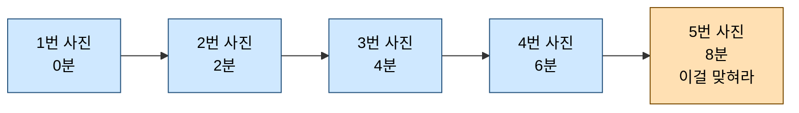
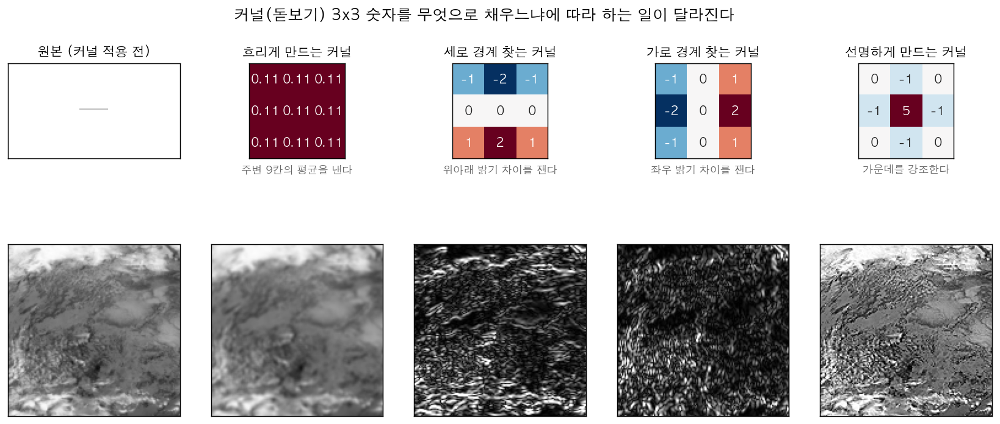
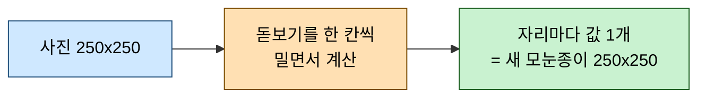
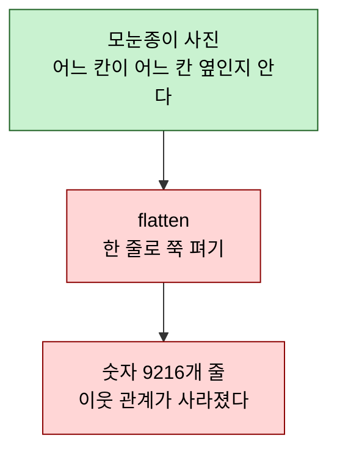
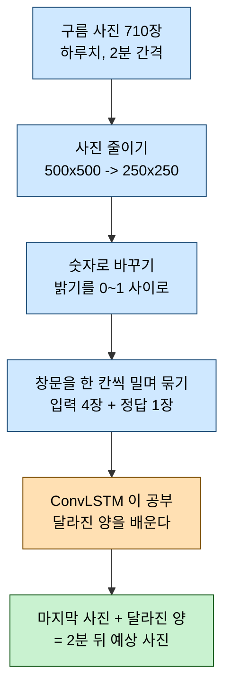
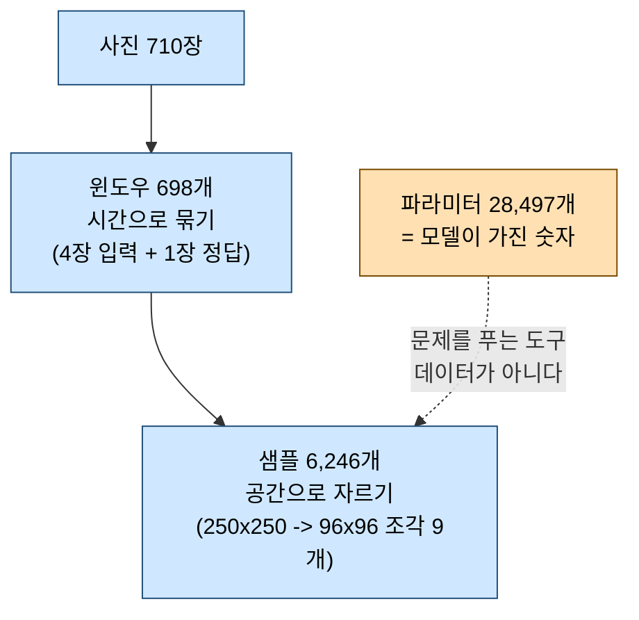

# ConvLSTM 쉽게 이해하기

> 이 문서는 [convlstm_principles.md](convlstm_principles.md)의 쉬운 버전이다.
> 미리 알아야 할 지식은 없다. 곱셈과 덧셈만 할 줄 알면 끝까지 읽을 수 있다.
> 수학 기호가 나오지만 **전부 한글로 읽는 법을 같이 적어** 두었다.

인공지능이 **구름 사진을 보고 2분 뒤 사진을 그리는 방법**을 설명한다.

---

## 1. 한눈에 보기

우리가 만들려는 것은 이런 프로그램이다.

| 주는 것 | 받는 것 |
| --- | --- |
| 2분 간격 구름 사진 4장 | 그다음 사진 1장 (아직 찍히지 않은 사진) |

이걸 하려면 컴퓨터에게 두 가지 능력이 필요하다.

| 필요한 능력 | 쉬운 말로 | 담당 |
| --- | --- | --- |
| 사진에서 구름 **모양**을 알아보기 | 옆을 둘러보는 눈 | CNN |
| 구름이 어디로 **움직였는지** 기억하기 | 메모하는 공책 | LSTM |

이 둘을 하나로 합친 것이 **ConvLSTM**이다.

> [!IMPORTANT]
> 이 문서에서 기억할 딱 한 문장:
> **ConvLSTM은 "공책"을 글자가 아니라 "모눈종이 그림"으로 쓰는 방법이다.**

---

## 2. 우리가 푸는 문제

하늘 사진이 2분마다 한 장씩 찍힌다. 구름은 조금씩 흘러간다.

앞의 4장을 보고 5번째를 그리는 것이 목표다.

사진은 컴퓨터에게 **숫자가 적힌 모눈종이**다. 칸 하나가 픽셀 하나이고, 칸마다 밝기 숫자가 들어 있다.

| 밝은 구름 | 어두운 하늘 |
| --- | --- |
| 0.9 | 0.1 |

---

## 3. CNN — 돋보기로 옆을 둘러보는 아이

### 3.1 비유

CNN은 **작은 돋보기를 들고 사진 위를 훑는 아이**다.
한 칸만 보는 게 아니라 **그 칸과 이웃한 3×3 = 9칸을 함께** 본다.

혼자 있는 밝은 점은 먼지지만, 밝은 점 아홉 개가 모여 있으면 구름이다.
**옆을 같이 봐야 무엇인지 알 수 있다.** 이것이 CNN이 하는 일이다.

### 3.2 직접 계산해 보기

사진의 한 부분이 이렇다고 하자.

| 왼쪽 | 가운데 | 오른쪽 |
| --- | --- | --- |
| 1 | 2 | 3 |
| 4 | 5 | 6 |
| 7 | 8 | 9 |

돋보기(**커널**이라고 부른다)에도 아홉 칸에 숫자가 적혀 있다. 전부 $\frac{1}{9}$이라고 하자.

계산은 딱 두 단계다.

1. **같은 자리끼리 곱한다** (왼쪽 위는 왼쪽 위끼리, 가운데는 가운데끼리)
2. **곱한 아홉 개를 전부 더한다**

$$
1 \times \tfrac{1}{9} + 2 \times \tfrac{1}{9} + 3 \times \tfrac{1}{9} + \cdots + 9 \times \tfrac{1}{9}
= \frac{1 + 2 + \cdots + 9}{9} = \frac{45}{9} = 5
$$

> [!WARNING]
> 2단계는 **더하기**이지 평균 내기가 아니다.
> 위에서 결과 5가 마침 아홉 칸의 평균과 같아진 것은 **돋보기 숫자가 전부 $\frac{1}{9}$이었기 때문**이다.
> $\frac{1}{9}$씩 곱해서 더하면 그게 곧 평균이 되는, 아주 특별한 경우일 뿐이다.

### 3.3 돋보기 숫자를 바꾸면 하는 일이 달라진다

말로만 하면 와닿지 않으니 실제 구름 사진에 적용해 보자.
위 줄이 돋보기(**커널**)의 3×3 숫자판이고, 아래 줄이 그것을 적용한 결과다.

**똑같은 사진인데 숫자판만 바꾸니 전혀 다른 것이 나온다.**
경계를 찾는 돋보기는 구름의 테두리만 하얗게 뽑아내고, 흐리게 하는 돋보기는 뭉갠다.

숫자로도 확인해 보자. 결과가 평균(5)과 전혀 상관없어진다.

| 돋보기 종류 | 결과 | 무엇을 알아냈나 |
| --- | --- | --- |
| 전부 $\frac{1}{9}$ | 5 | 주변 평균 밝기 (흐리게) |
| 가운데만 1, 나머지 0 | 5 | 아무것도 안 함 (원본 그대로) |
| 세로 엣지 찾기 | **24** | 위아래로 얼마나 급히 변하나 |
| 가로 엣지 찾기 | **8** | 좌우로 얼마나 급히 변하나 |

세로 결과가 24로 큰 이유는 이 사진이 **위아래로 3씩** 커지기 때문이다(1 → 4 → 7).
좌우로는 1씩만 커져서(1 → 2 → 3) 가로 결과는 8이다. 정확히 3배 차이다.

즉 이 숫자는 밝기가 아니라 **"어느 방향으로 얼마나 급하게 변하는가"**를 잰 값이다.

돋보기를 어떻게 채우냐에 따라 흐리게 만들 수도, 경계선을 찾을 수도, 선명하게 만들 수도 있다.
그리고 **그 숫자를 사람이 정해 주지 않고 컴퓨터가 스스로 찾아내는 것**이 인공지능 학습이다.

> [!IMPORTANT]
> 우리 모델이 가진 3×3 돋보기는 모두 **3,152개**다.
> 칸이 9개씩이니 채워야 할 숫자가 `3,152 × 9 = 28,368` 개이고,
> 여기에 편향(bias) 129개를 더하면 **28,497** — 앞에서 본 파라미터 개수와 정확히 같다.
>
> 즉 **"파라미터 28,497개"란 곧 "돋보기 칸에 들어갈 숫자 28,497개"** 다.
> 돋보기를 여러 개 두는 이유는, 하나는 경계를 찾고 하나는 질감을 보는 식으로
> 각자 다른 것을 찾게 하기 위해서다. `FILTERS = 16` 이 그 개수를 정한다.

이 계산에 붙은 이름이 **convolution**(합성곱)이고, 기호로는 별표 $*$ 로 쓴다.

> 읽는 법: $A * B$ 는 "A를 B라는 돋보기로 훑는다"라는 뜻이다. 보통의 곱셈이 아니다.

### 3.4 돋보기는 한 칸씩 밀면서 사진 전체를 훑는다

지금까지는 3×3 한 곳만 계산했고, 값이 **하나** 나왔다. 하지만 여기서 끝이 아니다.
돋보기를 오른쪽으로 한 칸 밀어서 또 계산하고, 끝까지 가면 한 줄 내려서 또 훑는다.

자리마다 값이 하나씩 나오니, 결과를 모으면 **다시 모눈종이 한 장**이 된다.

> [!IMPORTANT]
> 들어간 것도 모눈종이, 나온 것도 모눈종이다.
> 이 성질 덕분에 ConvLSTM은 마지막에 **사진을 그려낼 수 있다.**
> 뒤에 나올 5장의 "퍼즐을 한 줄로 늘어놓는 문제"와 정반대다.

### 3.5 CNN이 못 하는 것

CNN은 사진 한 장만 본다. **어제 본 사진을 기억하지 못한다.**
구름이 왼쪽으로 가는지 오른쪽으로 가는지 알 수 없다.

---

## 4. LSTM — 공책에 메모하는 아이

### 4.1 비유

LSTM은 **공책을 든 아이**다. 사진을 순서대로 보면서 중요한 것을 공책에 적는다.
이 공책을 **기억**(cell state)이라고 부른다.

공책 앞에는 **문지기 세 명**이 서 있다. 문지기는 "통과 / 차단"을 딱 잘라 정하지 않고
**몇 퍼센트 통과시킬지**를 정한다.

| 누구 | 하는 일 | 진짜 이름 |
| --- | --- | --- |
| 지우개 문지기 | 옛날 메모를 얼마나 남길까 | forget gate $f$ |
| 연필 문지기 | 새로 본 것을 얼마나 적을까 | input gate $i$ |
| 입 문지기 | 지금 기억에서 얼마나 말할까 | output gate $o$ |
| **작가** | **무엇을** 쓸까 (내용 그 자체) | 후보값 (candidate) $g$ |

> 문지기 셋은 **"몇 퍼센트"** 라는 비율만 정하고, 작가 하나만 **"무엇을"** 쓸지 정한다.
> 작가만 음수를 낼 수 있어 기억을 **깎는 방향**으로도 쓸 수 있다.
> 넷이 각자 자기 돋보기를 갖기 때문에 나중에 파라미터를 셀 때 4를 곱하게 된다.
> 자세한 그림 설명은 [convlstm_inside_easy.md](convlstm_inside_easy.md) 에 있다.

문지기가 내는 숫자는 항상 **0과 1 사이**다. 0이면 전부 막고, 1이면 전부 통과, 0.5면 절반이다.

이 "0~1 사이로 바꿔주는 장치"를 $\sigma$(시그마, sigmoid)라고 부른다.

> 읽는 법: $\sigma(\text{어떤 수})$ 는 "그 수를 0과 1 사이 값으로 눌러 담는다"는 뜻이다.

### 4.2 직접 계산해 보기

공책에 지금 **5**라고 적혀 있다고 하자. 그리고 이번에 새로 본 내용이 **2**다.

문지기들이 이렇게 정했다고 하자.

| 문지기 | 값 | 뜻 |
| --- | --- | --- |
| 지우개 $f$ | 0.8 | 옛 기억의 80%를 남긴다 |
| 연필 $i$ | 0.6 | 새 내용의 60%를 적는다 |

새 공책 값은 이렇게 된다.

$$
\text{새 기억} = 0.8 \times \underbrace{5}_{\text{옛 기억}} + 0.6 \times \underbrace{2}_{\text{새 내용}} = 4 + 1.2 = 5.2
$$

이것이 LSTM의 핵심 공식이다. 진짜 기호로 쓰면 이렇다.

$$C_t = f_t \odot C_{t-1} + i_t \odot g_t$$

읽는 법은 다음 표와 같다.

| 기호 | 읽는 법 |
| --- | --- |
| $C_t$ | 지금 공책 (t는 "지금 시각") |
| $C_{t-1}$ | 조금 전 공책 |
| $g_t$ | 이번에 새로 본 내용 |
| $\odot$ | 같은 자리끼리 곱하기 |

방금 한 산수와 **완전히 똑같은 식**이다.

### 4.3 LSTM이 못 하는 것

공책은 **한 줄로 쓰는 글**이다. 사진은 모눈종이인데, 공책에 적으려면
**모눈종이를 잘라 한 줄로 길게 이어 붙여야** 한다.

---

## 5. 문제 발견 — 퍼즐을 한 줄로 늘어놓으면

이 "한 줄로 이어 붙이기"를 **flatten**(납작하게 펴기)이라고 한다. 그런데 여기서 큰 문제가 생긴다.

96×96 사진은 9,216칸이다. 이걸 한 줄로 늘어놓으면 이렇게 된다.

**퍼즐 100조각을 한 줄로 늘어놓은 것과 같다.** 조각은 그대로 있지만
"이 조각이 저 조각 위에 있었다"는 정보가 없어진다.

구름 모양을 알아보려면 위아래 이웃을 봐야 하는데, 한 줄로 펴면 위쪽 이웃은
96칸이나 떨어진 곳으로 밀려난다. 사실상 남남이 된다.

> 주의: 그래서 사진을 그대로 LSTM에 넣으면 안 된다. 구름 모양이 뭉개진다.

---

## 6. ConvLSTM — 공책을 모눈종이로 바꾸기

### 6.1 해결 방법은 놀랍도록 단순하다

퍼즐을 펴는 게 문제라면, **펴지 않으면 된다.**

공책을 한 줄 글씨가 아니라 **모눈종이 그대로** 쓰는 것이다. 그리고 문지기도
한 명이 아니라 **칸마다 한 명씩** 세운다.

| 비교 항목 | 보통 LSTM | ConvLSTM |
| --- | --- | --- |
| 공책 모양 | 한 줄 글씨 | 모눈종이 |
| 문지기 수 | 전체에 1명 | **칸마다 1명** |
| 옆 칸 참고 | 못 한다 | 돋보기로 본다 |

칸마다 문지기가 있다는 건 이런 뜻이다.

> 구름이 있는 칸은 "기억을 오래 붙잡아 둬" 라고 하고,
> 텅 빈 하늘 칸은 "기억할 것 없으니 지워" 라고 한다.

**장소마다 다르게 기억한다.** 이것이 ConvLSTM이 강한 이유다.

### 6.2 수식은 글자 하나만 바뀐다

이것이 이 문서에서 가장 중요한 부분이다. 두 식을 나란히 놓고 비교해 보자.

보통 LSTM의 지우개 문지기:

$$f_t = \sigma(W_{xf} \, x_t + W_{hf} \, h_{t-1} + b_f)$$

ConvLSTM의 지우개 문지기:

$$f_t = \sigma(W_{xf} * \mathcal{X}_t + W_{hf} * \mathcal{H}_{t-1} + b_f)$$

**다른 곳을 찾았는가?** 곱셈 자리에 별표 $*$ 가 들어갔다. 그게 전부다.

| 비교 항목 | 보통 LSTM | ConvLSTM |
| --- | --- | --- |
| 연산 | 그냥 곱하기 | 돋보기로 훑기 ($*$) |
| 다루는 것 | 한 줄 숫자 | 모눈종이 |
| 문지기 결과 | 숫자 1개 | 모눈종이 1장 |

곱하기를 **돋보기 훑기로 바꿨더니**, 자동으로 옆 칸을 보게 되고 모눈종이 모양도 유지된다.
2015년에 나온 이 아이디어 하나로 날씨 예측 인공지능이 크게 발전했다.

### 6.3 외울 것이 2,000배 줄어든다

돋보기 방식에는 숨은 장점이 하나 더 있다. **돋보기 하나를 사진 전체에 돌려쓴다.**

칸마다 다른 규칙을 외우려면 규칙이 어마어마하게 많아진다. 하지만 돋보기는 3×3짜리 하나뿐이라
사진이 커져도 외울 게 늘지 않는다.

| 방식                   | 외워야 할 숫자 개수   |
| -------------------- | ------------- |
| 한 줄로 펴서 처리 (FC-LSTM) | 약 19,900,000개 |
| 돋보기 방식 (ConvLSTM)    | **9,856개**    |

**약 2,000배 차이다.** 우리 프로그램 전체가 숫자 28,497개로 만들어져 있고,
그래서 커다란 서버 없이 **노트북 한 대로 학습이 된다.**

---

## 7. 흐릿한 그림 문제 — 베껴 그리고 달라진 곳만 고치기

### 7.1 왜 흐릿해지는가

인공지능에게 "다음 사진을 처음부터 그려라" 하면, 자신 없을 때 **흐릿한 회색 그림**을 그린다.

시험에서 답을 모를 때 애매하게 적으면 부분점수라도 받는 것과 같다.
또렷하게 그렸다가 틀리면 크게 감점되지만, 흐리멍덩하게 그리면 조금만 감점되기 때문이다.

### 7.2 해결책

그래서 문제를 이렇게 바꿔 냈다.

> "다음 사진을 그려라" (어렵다)
> → **"마지막 사진을 그대로 베끼고, 달라진 곳만 고쳐라"** (쉽다)

2분 사이에 구름은 거의 안 움직인다. 그러니 대부분은 베끼면 맞고, 인공지능은
**달라진 부분만** 신경 쓰면 된다. 선명함은 원본 사진에서 그대로 물려받는다.

$$\hat{Y} = X_{\text{마지막}} + \Delta$$

| 기호 | 읽는 법 |
| --- | --- |
| $\hat{Y}$ | 우리가 그린 예상 사진 |
| $X_{\text{마지막}}$ | 마지막으로 본 진짜 사진 |
| $\Delta$ (델타) | 달라진 양. 인공지능은 이것만 계산한다 |

$\Delta$는 **마이너스도 될 수 있다.** 구름이 사라진 곳은 밝기가 줄어야 하기 때문이다.
그래서 이 부분만은 음수를 못 만드는 장치를 붙이면 안 된다.

이 방식을 **잔차(residual) 구조**라고 부른다.

---

## 8. 우리 프로그램이 실제로 한 일

`ConvLSTM_prediction.ipynb`가 하는 일을 순서대로 정리하면 이렇다.

### 사진을 왜 절반으로 줄일까

원래 사진은 500×500칸인데, 프로그램은 이것을 **250×250으로 줄여서** 쓴다.
멀쩡한 사진을 왜 일부러 작게 만들까?

**첫째, 공부가 4배 빨라진다.**

한 변을 절반으로 줄이면 칸 수는 절반이 아니라 **4분의 1**이 된다(가로도 절반, 세로도 절반이니까).
그만큼 만들어지는 문제 수와 계산량이 줄어든다.

| | 500×500 그대로 | 250×250 으로 줄이면 |
| --- | --- | --- |
| 칸 수 | 250,000 | 62,500 |
| 문제 조각 수 | 36개/장 | **9개/장** |
| 사진 710장 무게 | 710 MB | **178 MB** |
| 공부 시간 (4번 반복) | 약 54분 | **13분** |

노트북 한 대로 여러 번 실험해 보려면 이 차이가 크다.

**둘째, 줄여도 구름은 잘 보인다.**

이 위성 사진은 한 칸이 **2km**다. 250×250으로 줄이면 한 칸이 4km가 된다.
그런데 우리가 보려는 구름 덩어리는 보통 수십 km 크기다.
4km 자로 재도 구름 덩어리의 모양과 움직임은 충분히 보인다는 뜻이다.

> 우리가 맞히려는 것은 "저 구름이 어디로 흘러가나"이지
> "이 픽셀 하나가 정확히 얼마나 밝나"가 아니다.

**셋째, 줄이는 방법이 중요하다.**

2×2칸을 1칸으로 합칠 때 두 가지 방법이 있다.

| 방법 | 하는 일 | 문제점 |
| --- | --- | --- |
| 솎아내기 | 4칸 중 1칸만 남기고 3칸은 버린다 | 작은 구름이 통째로 사라질 수 있다 |
| **평균 내기** | 4칸을 더해 4로 나눈 값을 쓴다 | 없음 (네 칸 정보가 모두 반영된다) |

우리 프로그램은 **평균 내기**를 쓴다. 4명 중 1명만 뽑아 대표를 삼는 대신,
4명의 의견을 모아 하나로 만드는 셈이다. 그래야 구름 모양이 덜 뭉개진다.

> [!WARNING]
> 줄일 크기는 아무 숫자나 되지 않는다. 500은 250으로는 딱 나눠지지만(2칸씩 묶기),
> 300으로는 나눠지지 않는다. 300을 넣으면 **줄이는 게 아니라 왼쪽 위 귀퉁이만 오려내서**
> 사진의 64%가 사라진다. 그런데도 에러가 안 나기 때문에 알아채기 어렵다.
> 그래서 코드에 "정수배로 나눠지지 않으면 멈춰라"는 안전장치를 넣어 두었다.

### 문제집은 몇 개나 만들어질까

사진 710장으로 문제(입력 4장 + 정답 1장)를 몇 개 만들 수 있을까?
"5장씩 뚝뚝 잘라 쓰니까 710 ÷ 5 = 142개"라고 생각하기 쉽지만 **훨씬 많이 만들 수 있다.**

창문을 **한 칸씩 밀면서** 만들기 때문이다.

| 문제 번호 | 입력 사진 | 정답 사진 |
| --- | --- | --- |
| 0번 | 0, 1, 2, 3 | 4 |
| 1번 | 1, 2, 3, 4 | 5 |
| 2번 | 2, 3, 4, 5 | 6 |

한 칸만 밀었으니 앞 문제와 사진 3장이 겹친다. 이렇게 하면 **사진 한 장이 여러 문제에 재사용된다.**
사진 100번은 4개 문제에서 입력으로, 1개 문제에서 정답으로, 모두 다섯 번 쓰인다.

| 만드는 방법 | 문제 수 | 평가 |
| --- | --- | --- |
| 5장씩 뚝뚝 잘라 쓰기 | 142 | 사진 한 장을 한 번씩만 쓴다 |
| **한 칸씩 밀기** | **698** | 같은 사진으로 **약 5배** 많은 문제를 만든다 |

710장인데 706개가 아니라 698개인 이유는 **결측으로 구간이 3개로 끊겨서**다.
구간이 끝나는 곳마다 뒤에 붙일 사진이 모자라 문제를 못 만든다.

> 주의: 이 698개는 전부 **정답지가 있는 연습문제**다.
> 진짜로 모르는 미래를 그리는 것은 맨 마지막 4장으로 만든 **딱 한 장**뿐이다.

### 문제 하나를 아홉 조각으로 쪼개기

698개도 아직 부족하다. 그래서 한 번 더 늘린다.
**사진 한 장을 96×96 크기의 작은 조각으로 잘라, 조각마다 따로 문제를 만든다.**

250×250 사진에서 조각을 뜨면 가로 3개 세로 3개, 즉 **9조각**이 나온다.

| | 문제 수 |
| --- | --- |
| 사진 통째로 쓰기 | 698 |
| **9조각으로 쪼개기** | **698 × 9 = 6,282** |

이래도 되는 이유는 **구름이 움직이는 규칙이 화면 어디서나 같기 때문**이다.
왼쪽 위 구름이든 오른쪽 아래 구름이든 흘러가는 방식은 다르지 않다.
그러니 조각마다 따로 배워도 되고, 오히려 같은 규칙을 아홉 번 연습하는 셈이 된다.

> [!IMPORTANT]
> 흔한 오해: "조각내면 메모리를 아끼는 것 아닌가?"
> **아니다. 오히려 조금 늘어난다.** 조각끼리 19칸씩 겹치게 자르기 때문에 겹친 부분이 중복 저장된다.
>
> | | 차지하는 크기 | 문제 수 |
> | --- | --- | --- |
> | 사진 통째로 | 0.70 GB | 698 |
> | 9조각으로 | 0.93 GB | 6,282 |
>
> 크기는 1.3배인데 문제는 9배다. **이 거래가 남는 장사**라서 조각을 낸다.

조각을 **겹치게** 자르는 이유도 있다. 96씩 건너뛰며 자르면 250 안에 두 조각(0~96, 96~192)밖에
안 들어가서 **오른쪽과 아래쪽 58칸이 한 번도 학습되지 않는다.**
77칸씩 건너뛰면 0, 77, 154 세 자리가 나오고 154+96=250 으로 오른쪽 끝에 딱 맞는다.

#### 문제가 많아서 좋은 걸까, 다양해서 좋은 걸까

"문제가 9배니까 9배 더 연습하는 셈"이라고 생각하기 쉽다. 그런데 실제로 재 보면 그게 아니다.
**같은 문제를 여러 번 푸는 것과, 다른 문제를 푸는 것은 전혀 다르다.**

| 어떻게 공부했나 | 문제 수 | 고친 횟수 | 시험 점수(틀린 정도) |
| --- | --- | --- | --- |
| **9조각을 4번 반복** | 2,700 | 676 | **0.00604** (기준선보다 좋음) |
| 1조각을 4번 반복 | 300 | 76 | 0.00876 |
| 1조각을 **36번** 반복 | 300 | 684 | 0.00896 |

첫 줄과 셋째 줄을 보라. **가중치를 고친 횟수는 676 대 684 로 거의 같다.**
그런데 점수는 크게 갈린다. 고친 횟수가 같으니 차이를 만든 것은 하나뿐이다 — **문제가 다양했는가.**

둘째 줄과 셋째 줄은 더 분명하다. 같은 300문제를 4번에서 36번으로 **9배 더 많이 풀었는데
점수가 오히려 떨어졌다.** 같은 문제만 반복하면 그 문제만 외우게 되기 때문이다(과적합).

> [!IMPORTANT]
> 조각내기의 이득은 "더 많이 연습해서"가 아니라 **"더 다양한 상황을 봐서"** 생긴다.
> 왼쪽 위 구름과 오른쪽 아래 구름은 서로 다른 문제이고,
> 그 둘을 다 풀어 본 모델이라야 처음 보는 사진에서도 통한다.

마지막으로, 작게 배웠다고 작게만 쓰는 것은 아니다.
돋보기는 크기와 상관없이 작동하므로, **96×96 조각으로 공부한 실력을 250×250 전체 사진에 그대로 쓸 수 있다.**

### 공부하는 때와 그림 그리는 때는 다르다

여기서 아주 헷갈리기 쉬운 것이 있다.
**"사진 4장을 공부해서 다음 한 장을 그린다"가 아니다.**

순서는 이렇다.

| 순서 | 하는 일 | 남는 것 |
| --- | --- | --- |
| 1. 공부 (딱 한 번) | 698개 문제를 여러 번 풀며 채점하고 돋보기 숫자를 고친다 | **돋보기 숫자 28,497개** |
| 2. 그리기 (매번) | 고쳐진 돋보기를 그대로 쓰면서 사진 4장을 통과시킨다 | 예상 사진 1장 |

공부가 끝나면 **사진 710장은 더 이상 필요 없다.** 남는 것은 숫자 28,497개뿐이고,
그림을 그릴 때 공부에 썼던 사진을 다시 꺼내 보지 않는다.
그래서 **처음 보는 사진 4장**을 넣어도 그림이 나온다.

실제로 확인해 보면 이렇다. **똑같은 사진 4장**을 두 번 넣어 본 결과다.

| 언제 | 돋보기 숫자 | 틀린 정도 |
| --- | --- | --- |
| 공부하기 전 | 아무렇게나 넣은 값 | 0.02877 |
| 공부한 후 | 학습으로 찾은 값 | **0.00524** |

넣은 사진은 글자 하나 다르지 않다. 달라진 것은 **돋보기 숫자뿐**인데 결과가 5배 이상 좋아졌다.
사진이 정답을 알려준 게 아니라, **사진을 읽는 방법이 좋아진 것**이다.

> [!IMPORTANT]
> "기억"이라는 말이 두 곳에 나와서 헷갈린다. 둘은 전혀 다른 것이다.
>
> | | 돋보기 숫자 (가중치) | 공책 (cell state) |
> | --- | --- | --- |
> | 무엇 | 공부해서 얻은 규칙 | 사진 4장을 훑는 동안의 임시 메모 |
> | 언제 지워지나 | 안 지워진다 | **문제 하나 끝날 때마다 지워진다** |
> | 어디에 남나 | 모델 파일 | 아무 데도 안 남는다 |
>
> 4장을 훑으며 쓰는 공책은 그 문제 안에서만 살아 있다. 오래 쌓이는 것은 돋보기 숫자뿐이다.

### 얼마나 잘했을까

성적을 매기려면 **비교 대상**이 필요하다. 여기서 쓴 상대는 "아무것도 안 하기 작전"이다.

> 아무것도 안 하기 작전: 2분 뒤 사진이 **지금과 똑같다**고 우기기.
> 구름이 느리게 움직이니까 이것만으로도 꽤 정답에 가깝다. 이름은 **Persistence**다.

여기서 아주 헷갈리기 쉬운 것이 있다.
"지금 사진을 그대로 냈으면 똑같으니까 틀린 게 없는 거 아닌가?" 라는 생각이다. **아니다.**

**낸 답**과 **채점하는 정답**은 다른 사진이기 때문이다.

| | 무엇을 답으로 냈나 | 무엇과 비교해 채점하나 |
| --- | --- | --- |
| 아무것도 안 하기 | **4번 사진**을 그대로 베껴서 냄 | **5번 사진** |
| ConvLSTM | 계산해서 만든 그림 | **5번 사진** |

4번 사진을 냈지만 채점은 5번 사진으로 한다. 2분 동안 구름이 조금 움직였으니
4번과 5번은 **다른 사진**이고, 그 움직인 만큼이 그대로 틀린 양이 된다.

같은 5번 사진으로 여러 답안을 채점해 보면 이렇다.

| 낸 답 | 틀린 정도 |
| --- | --- |
| 5번 사진 (정답을 그대로 — 커닝) | 0.00000 |
| 4번 사진 (아무것도 안 하기) | 0.01749 |
| 2번 사진 (더 옛날 것) | 0.04219 |

틀린 정도가 0 이 되는 것은 **정답을 그대로 베꼈을 때뿐**이다.
그리고 2번보다 4번이 나은 걸 보면, **가장 최근 사진을 베끼는 것이 공부 안 하고 할 수 있는 최선**이다.
그래서 이것을 넘어야 "공부한 보람이 있다"고 말할 수 있다.

### 공부한 쪽이 당연히 이기는 것 아닌가

전혀 아니다. **실제로 지는 일이 훨씬 흔하다.**

같은 데이터로 조건만 바꿔가며 재 본 결과다.

| 어떻게 했나 | 틀린 정도 | 결과 |
| --- | --- | --- |
| 아무것도 안 하기 | 0.00623 | 기준 |
| 공부하기 전 (아무 값이나 넣은 상태) | 0.02877 | **크게 짐** |
| 조금만 공부 + 통째로 그리기 | 0.01978 | **짐** |
| 조금만 공부 + 달라진 곳만 고치기 | 0.01014 | **짐** |
| 충분히 공부 + 달라진 곳만 고치기 | **0.00392** | **이김** |

공부를 시켰는데도 지는 경우가 세 줄이나 된다. 왜 그럴까?

**첫째, 정답이 원래 "거의 그대로"이기 때문이다.**
2분 사이 구름은 아주 조금 움직인다. 그러니 아무것도 안 하기는 게으른 방법이 아니라
**이미 정답 코앞에 서 있는 방법**이다. 여기서 뭔가를 바꾸면 방향이 맞을 때만 좋아지고,
틀리면 가만히 있느니만 못하다.

**둘째, 자신 없으면 흐릿하게 그리기 때문이다.**
또렷하게 그렸다가 위치가 어긋나면 크게 감점되지만, 뿌옇게 그리면 조금만 깎인다.
그래서 인공지능은 애매할 때 흐린 그림을 낸다. 그러면 **선명한 원본을 베낀 것보다 나빠진다.**

위 표에서 "통째로 그리기"가 "달라진 곳만 고치기"보다 두 배 나쁜 이유가 바로 이것이다.
두 방법은 다른 조건이 전부 똑같고 이 차이 하나뿐이다.

> [!IMPORTANT]
> 그래서 아무것도 안 하기는 **경쟁 상대가 아니라 합격선**이다.
> 이걸 못 넘는 인공지능은 만들 이유가 없다.
> 숫자 28,497개를 13분 동안 공부시키느니, 마지막 사진을 복사하는 코드 한 줄이
> 더 정확하고 더 빠르기 때문이다.

| 방법 | 틀린 정도 (작을수록 좋음) | 닮은 정도 (클수록 좋음) |
| --- | --- | --- |
| 아무것도 안 하기 | 0.00623 | 0.9595 |
| **ConvLSTM** | **0.00392** | **0.9866** |

인공지능이 이겼다. 틀린 정도가 약 **37% 줄었다.**

여기서 두 가지를 잰다는 점에 주의하자.

| 재는 것 | 진짜 이름 | 무엇을 보나 |
| --- | --- | --- |
| 틀린 정도 | MAE | 숫자가 **얼마나** 어긋났나 |
| 닮은 정도 | SSIM | 무늬와 모양이 **어떻게** 달라졌나 |

둘 다 필요하다. 숫자만 맞추면 흐릿한 그림으로도 점수를 딸 수 있기 때문이다.
"닮은 정도"는 1 이 만점이라 0.9595 → 0.9866 이 작아 보이지만, **안 닮은 정도**로 뒤집어 보면
0.0405 → 0.0134 로 **3배** 줄었다. 자세한 설명은 [ssim_explained.md](ssim_explained.md) 에 있다.

재미있는 사실이 하나 있다. 사진이 30장뿐일 때는 인공지능이 이 단순한 작전에 **졌다.**
사진을 710장으로 늘리자 이기기 시작했다. **똑같은 인공지능인데 공부할 자료가 늘자 실력이 는 것이다.**

---

## 9. 헷갈리는 네 단어 — 윈도우 · 패치 · 샘플 · 파라미터

이 네 가지가 가장 많이 섞인다. 먼저 **셋은 데이터 쪽이고 하나는 모델 쪽**이라는 것만 기억하면 된다.

> [!TIP]
> 실제 구름 사진으로 그린 그림을 보며 이해하려면 [terms_visual_guide.md](terms_visual_guide.md) 로 가라.
> 아래 설명과 같은 내용을 그림 4장으로 풀어 두었다.

| 단어 | 무엇인가 | 어느 쪽 | 우리 숫자 |
| --- | --- | --- | --- |
| 윈도우 (window) | **시간**으로 묶은 문제 하나 | 데이터 | 698개 |
| 패치 (patch) | **공간**으로 자른 조각 | 데이터 | 윈도우마다 9개 |
| 샘플 (sample) | 신경망이 실제로 푸는 문제 한 건 | 데이터 | 6,246개 |
| 파라미터 (parameter) | 모델이 공부해서 찾아낸 숫자 | **모델** | 28,497개 |

### 데이터가 만들어지는 순서

### 하나씩 풀어보면

**윈도우**는 "이 사진 4장을 보고 다음 1장을 맞혀라"라는 **문제 하나**다.
시간 축에서 5장씩 묶어 만들되 한 칸씩 밀며 만들기 때문에 710장에서 698개가 나온다.

**패치**는 그 문제가 250×250 이라 너무 크니 96×96 조각으로 자른 것이다.
**공간을 자른다**는 점이 윈도우와 다르다. 가로 3 × 세로 3 = 9조각.

**샘플**은 윈도우를 패치로 자르고 나온 최종 단위다. 신경망이 한 번에 먹는 (입력, 정답) 한 쌍이다.
윈도우와 패치는 **자르는 축이 다르므로 서로 곱해진다.**

$$698 \times 9 = 6{,}282 \;\longrightarrow\; \text{누수 방지로 4윈도우를 버려서 } 694 \times 9 = 6{,}246$$

**파라미터**만 성격이 다르다. 데이터가 아니라 **모델이 가진 숫자**이고,
공부란 이 28,497개를 조금씩 고쳐 나가는 일이다. 데이터를 아무리 늘려도 이 개수는 변하지 않는다.

### 시험에 비유하면

| 이 프로그램 | 시험으로 치면 |
| --- | --- |
| 샘플 6,246개 | **문제집에 실린 문제 수** |
| 파라미터 28,497개 | **학생 머릿속 지식의 양** |
| 배치 (batch) 16 | 한 번에 채점하는 문제 묶음 |
| 스텝 (step) 314 | 채점하고 고치는 횟수 (한 바퀴당) |
| 에폭 (epoch) | 문제집을 처음부터 끝까지 한 바퀴 |

`5,022 ÷ 16 = 314` 가 스텝 수이고, 스텝마다 파라미터 28,497개가 조금씩 조정된다.

> [!WARNING]
> **문제집이 두꺼워져도 학생 머리 용량은 커지지 않는다.**
> 샘플을 9배로 늘려도 파라미터는 28,497개 그대로다. 반대로 파라미터만 크게 하고
> 샘플이 적으면 문제를 외워 버린다(과적합). 앞에서 "1조각을 36번 반복"이 오히려
> 나빠진 것이 바로 그 경우다.

---

## 10. 용어 정리 — 쉬운 말과 진짜 이름

이 문서에서 쓴 쉬운 말이 실제로는 이런 이름을 갖고 있다.
[convlstm_principles.md](convlstm_principles.md)를 읽을 때 이 표를 옆에 두면 도움이 된다.

| 쉬운 말 | 진짜 이름 | 기호 |
| --- | --- | --- |
| 돋보기 | 커널 (kernel), 필터 | $W$ |
| 돋보기로 훑기 | 합성곱 (convolution) | $*$ |
| 공책, 기억 | 셀 상태 (cell state) | $C_t$ |
| 지우개 문지기 | 망각 게이트 (forget gate) | $f_t$ |
| 연필 문지기 | 입력 게이트 (input gate) | $i_t$ |
| 입 문지기 | 출력 게이트 (output gate) | $o_t$ |
| 0~1로 눌러 담기 | 시그모이드 (sigmoid) | $\sigma$ |
| 같은 자리끼리 곱하기 | 아다마르 곱 (Hadamard product) | $\odot$ |
| 한 줄로 펴기 | 플래튼 (flatten) | — |
| 달라진 양 | 잔차 (residual) | $\Delta$ |
| 아무것도 안 하기 작전 | 지속성 기준선 (Persistence baseline) | — |
| 틀린 정도 | 평균 절대 오차 (MAE) | — |
| 닮은 정도 | 구조적 유사도 (SSIM) | — |
| 시간으로 묶은 문제 | 윈도우 (window) | — |
| 공간으로 자른 조각 | 패치 (patch) | — |
| 한 번에 옮기는 거리 | 스트라이드 (stride) | — |
| 신경망이 푸는 문제 한 건 | 샘플 (sample) | — |
| 모델이 가진 숫자 | 파라미터 (parameter), 가중치 | — |

---

## 11. 다음에 무엇을 볼까

| 궁금한 것 | 읽을 문서 |
| --- | --- |
| 수식을 제대로, 빠짐없이 보고 싶다 | [convlstm_principles.md](convlstm_principles.md) |
| "닮은 정도(SSIM)"가 무엇인지 알고 싶다 | [ssim_explained.md](ssim_explained.md) |
| 윈도우·패치·샘플·파라미터를 그림으로 보고 싶다 | [terms_visual_guide.md](terms_visual_guide.md) |
| 모델의 층이 각각 무엇을 하는지 알고 싶다 | [convlstm_model_structure.md](convlstm_model_structure.md) |
| 모델 속에서 무슨 일이 일어나는지 쉽게 보고 싶다 | [convlstm_inside_easy.md](convlstm_inside_easy.md) |
| 실제 코드가 어떻게 처리하는지 알고 싶다 | [nc_predict_pipeline.md](nc_predict_pipeline.md) |
| 모델의 층 구조와 숫자 개수를 보고 싶다 | [../nc_model_architecture.md](../nc_model_architecture.md) |
| 직접 돌려 보고 싶다 | [../ConvLSTM_prediction.ipynb](../ConvLSTM_prediction.ipynb) |

> [!TIP]
> 직접 해 볼 수 있는 실험이 하나 있다. `ConvLSTM_prediction.ipynb`에서 `FILTERS = 16`을 `32`로 바꿔 보자.
> 돋보기 개수가 두 배가 된다. 더 똑똑해질까, 아니면 그냥 느려지기만 할까?
> 답을 미리 정하지 말고 직접 돌려서 확인해 보는 것이 인공지능 공부의 가장 좋은 방법이다.
