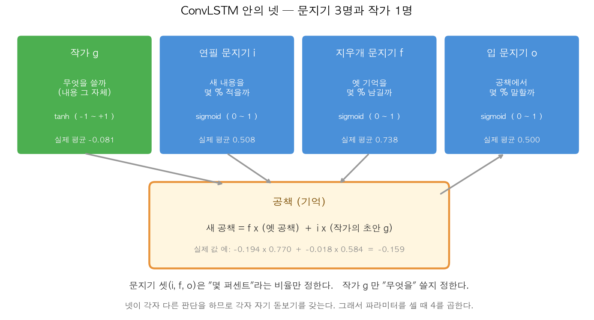
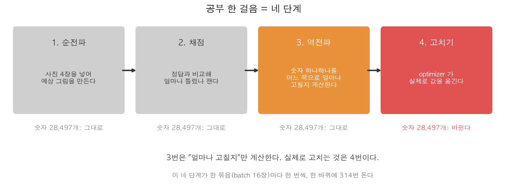

# 모델 속에서 무슨 일이 일어나는가 (쉬운 설명)

> 미리 알아야 할 지식은 없다. 곱셈과 덧셈만 할 줄 알면 끝까지 읽을 수 있다.
> ConvLSTM 이 무엇인지부터 알고 싶다면 [convlstm_easy_guide.md](convlstm_easy_guide.md) 를 먼저 보라.
> 이 문서의 숫자는 모두 `ConvLSTM_prediction.ipynb` 를 실제로 돌려 나온 값이다.

"인공지능이 공부한다"는 말이 실제로 무엇을 뜻하는지, 모델 안을 열어 하나씩 본다.

---

## 1. 한눈에 보기

모델은 결국 **숫자 28,497개를 담은 상자**다. 공부란 그 숫자를 고쳐 나가는 일이다.

| 궁금한 것 | 짧은 답 |
| --- | --- |
| 모델이 가진 게 뭔가 | 돋보기 숫자 28,497개 |
| 그 숫자는 누가 정하나 | 처음엔 제비뽑기, 그다음은 데이터 |
| 언제 바뀌나 | 사진 16장을 채점한 직후, 한 번에 전부 |
| 한 바퀴에 몇 번 바뀌나 | 314번 |
| 왜 층을 두 번 쌓나 | 더 넓게 보기 위해서 (필터를 늘려선 안 되는 일)  |

---

## 2. 모델 안에는 넷이 있다 — 문지기 3명과 작가 1명

ConvLSTM 은 사진을 한 장씩 보면서 **공책(기억)** 을 고쳐 쓴다.
그 공책 옆에 네 명이 붙어 있다.



| 누구        | 하는 일                 | 낼 수 있는 값 |
| --------- | -------------------- | -------- |
| **작가 g**  | **무엇을** 쓸까 (내용 그 자체) | −1 ~ +1  |
| 연필 문지기 i  | 새 내용을 **몇 %** 적을까    | 0 ~ 1    |
| 지우개 문지기 f | 옛 기억을 **몇 %** 남길까    | 0 ~ 1    |
| 입 문지기 o   | 공책에서 **몇 %** 말할까     | 0 ~ 1    |

> [!IMPORTANT]
> 셋은 **"몇 퍼센트"** 라는 비율만 정하고, 작가 하나만 **"무엇을"** 쓸지 정한다.
> 작가만 음수를 낼 수 있어서 기억을 **깎는 방향**으로도 쓸 수 있다(실제로 61% 가 음수였다).

공책이 바뀌는 식은 이렇게 간단하다.

$$\text{새 공책} = f \times (\text{옛 공책}) + i \times (\text{작가의 초안 } g)$$

실제 값 하나를 넣어보면 이렇다.

$$-0.194 \times 0.770 \;+\; -0.018 \times 0.584 \;=\; -0.159$$

이 계산을 손으로 해서 컴퓨터 결과와 맞춰 보니 차이가 **0.00000016** 이었다.
즉 진짜로 이 곱셈과 덧셈이 전부다.

> 지우개 문지기가 평균 0.738 인 것에는 이유가 있다.
> 처음부터 "과거를 73% 유지" 하는 상태로 출발하도록 만들어 두었기 때문이다.
> 0.5 에서 시작하면 기억이 매번 절반씩 사라져 공부가 어려워진다.

---

## 3. 돋보기가 두 종류다

앞에서 돋보기(커널)로 사진을 훑는다고 했다. 그런데 **훑을 대상이 두 가지**다.

| 돋보기 | 무엇을 훑나 |
| --- | --- |
| `kernel` | **지금 새로 들어온 사진** |
| `recurrent_kernel` | **지금까지 기억한 공책** |

```
넷의 판단 = ( 새 사진을 훑은 결과 ) + ( 옛 기억을 훑은 결과 ) + 편향
```

두 돋보기의 shape 는 세 번째 숫자만 다르다. **훑을 대상의 채널 수**이기 때문이다.

| 자리     | `kernel` | `recurrent_kernel` | 뜻                                      |
| ------ | -------- | ------------------ | -------------------------------------- |
| 첫째, 둘째 | 3, 3     | 3, 3               | 돋보기 세로·가로 크기                           |
| **셋째** | **1**    | **16**             | **훑을 대상의 채널 수** (흑백 사진 1장 vs 은닉상태 16장) |
| 넷째     | 64       | 64                 | 필터 16 × 게이트 4                          |

### 과거가 오는 길은 두 개다

`recurrent_kernel` 을 **과거로 가는 유일한 길**이라고 오해하기 쉽다. 그렇지 않다.

| 길 | 무엇이 넘어오나 | 끊을 수 있나 |
| --- | --- | --- |
| 공책 자체 (C<sub>t−1</sub>) | 쌓인 **값 그 자체** | 못 끊는다 (식에 항상 들어 있다) |
| `recurrent_kernel` | 과거를 **보고 판단**하는 능력 | 이것만 끊을 수 있다 |

공책 갱신식을 보면 분명하다. `새 공책 = f × (옛 공책) + i × g` 에서
**옛 공책은 언제나 곱해져 넘어온다.**

실제로 4시점에 **똑같은 사진**을 넣고 `recurrent_kernel` 을 0 으로 만들어 보면,
그래도 시점마다 값이 계속 달라진다.

| 시점 | 공책 C 평균 | 내보낸 H 평균 |
| --- | --- | --- |
| 1 | −0.005895 | −0.002557 |
| 2 | −0.010279 | −0.004396 |
| 3 | −0.013541 | −0.005703 |
| 4 | −0.015969 | −0.006632 |

> [!IMPORTANT]
> 그러니 이렇게 말해야 정확하다.
> `recurrent_kernel` 은 **"지금까지 공책에 뭘 적었는지 보고 문지기들의 결정을 조절하는" 통로**다.
> 이걸 끊으면 문지기들이 **눈앞의 사진만 보고** 기계적으로 비율을 정한다.
> 공책은 여전히 쌓이지만, 그 내용을 참고하지 못한다.

학습이 끝난 모델에서 이 돋보기를 0 으로 만들어 보면 손해가 얼마나 되는지 알 수 있다.

| 상태 | 틀린 정도 |
| --- | --- |
| 정상 | 0.01801 |
| 과거로 가는 길을 끊음 | 0.02566 (1.43배 나빠짐) |
| 다시 이어줌 | 0.01801 (완전 복구) |

사진 4장을 넣어도 시간 정보를 쓰지 못하니, 아무것도 안 하기(0.01848)보다도 나빠졌다.

> 사진을 20장 넣어도 돋보기 개수는 늘지 않는다. **한 벌을 20번 돌려 쓰기** 때문이다.
> 그래서 긴 영상을 넣어도 모델이 무거워지지 않는다.

---

## 4. 숫자 28,497개는 어디서 나온 수인가

세 덩어리로 나눠 세면 된다. 네 명이 각자 자기 돋보기를 가지므로 **모든 항에 4를 곱한다.**

**1층** (흑백 사진 1장을 받는다)

| 덩어리       | 계산                   | 개수        |
| --------- | -------------------- | --------- |
| 새 사진용 돋보기 | 3×3 × **1** × 16 × 4 | 576       |
| 옛 기억용 돋보기 | 3×3 × 16 × 16 × 4    | 9,216     |
| 편향        | 16 × 4               | 64        |
|           |                      | **9,856** |

**2층** (1층이 만든 16장을 받는다)

| 덩어리       | 계산                    | 개수         |     |
| --------- | --------------------- | ---------- | --- |
| 새 사진용 돋보기 | 3×3 × **16** × 16 × 4 | 9,216      |     |
| 옛 기억용 돋보기 | 3×3 × 16 × 16 × 4     | 9,216      |     |
| 편향        | 16 × 4                | 64         |     |
|           |                       | **18,496** |     |

**두 층의 차이는 굵게 표시한 곳 하나뿐이다.** 1층은 흑백 1장을 받고, 2층은 16장을 받는다.
그래서 첫 덩어리만 16배가 되고, 나머지는 완전히 같다.

$$18{,}496 - 9{,}856 = 8{,}640 = 9{,}216 - 576$$

여기에 마지막 `Conv2D` 의 145개를 더하면 `9,856 + 18,496 + 145 = 28,497` 이다.

---

## 5. 그 숫자는 누가 정하나

### 5.1 처음엔 제비뽑기 — 다만 아무 제비나 아니다

$$\text{뽑는 범위} = \sqrt{\frac{6}{\text{들어오는 수} + \text{나가는 수}}} = \sqrt{\frac{6}{9+576}} = 0.1013$$

`-0.1013 ~ +0.1013` 사이에서 무작위로 뽑는다. 이 범위를 층 크기에 맞춰 자동으로 계산하는 이유는,
**값이 너무 크면 신호가 폭발하고 너무 작으면 사라지기** 때문이다.

### 5.2 그다음은 데이터가 정한다

같은 숫자 세 개를 공부하는 동안 지켜보면 이렇게 움직인다.

| 걸음 | 숫자 1 | 숫자 2 | 숫자 3 |
| --- | --- | --- | --- |
| 0 | +0.027451 | −0.019894 | +0.047497 |
| 1 | +0.037445 | −0.009917 | +0.037500 |
| 2 | +0.037609 | −0.010110 | +0.029671 |
| 5 | +0.021671 | −0.025397 | +0.008244 |

**저마다 다른 방향으로 움직인다.** 어떤 값은 올라갔다 내려오고, 어떤 값은 계속 줄어든다.
각 숫자가 틀린 정도에 얼마나 기여했는지에 따라 따로따로 정해지기 때문이다.

> 사람이 정하는 것은 **개수**뿐이다(돋보기 16종류, 3×3 크기, 층 2개).
> 그 개수가 "빈칸 28,497개"를 만들고, 빈칸을 채우는 것은 데이터다.

---

## 6. 공부 한 걸음은 네 단계다



| 단계 | 하는 일 | 숫자 28,497개 |
| --- | --- | --- |
| 1. 순전파 | 사진 4장을 넣어 예상 그림을 만든다 | 그대로 |
| 2. 채점 | 정답과 비교해 얼마나 틀렸나 잰다 | 그대로 |
| 3. 역전파 | 숫자마다 어느 쪽으로 얼마나 고칠지 **계산한다** | **그대로** |
| 4. 고치기 | optimizer 가 실제로 값을 **옮긴다** | **바뀐다** |

> [!WARNING]
> 흔히 "역전파로 공부한다"고 하지만, **역전파는 계산만 하고 값은 건드리지 않는다.**
> 실제로 확인해 보면 3번 직후에도 숫자가 한 자리도 안 바뀌어 있다.
> 값을 옮기는 것은 4번, optimizer 의 일이다.

이 구분이 두 가지를 설명한다.

- **시험(검증) 때 숫자가 안 바뀌는 이유**: 기울기를 못 구해서가 아니라 4번을 부르지 않아서다.
- **같은 계산 결과로도 다르게 움직이는 이유**: 4번이 optimizer 마음이기 때문이다.

네 단계는 사진 묶음(16장)마다 한 번씩, **한 바퀴에 314번** 돈다.

---

## 7. 왜 층을 두 번 쌓나 — 돋보기를 늘리면 안 되는가

안 된다. 둘은 **서로 다른 능력**이기 때문이다.

| | 늘리면 생기는 것 |
| --- | --- |
| 돋보기 개수 (너비) | 같은 수준의 특징을 **더 여러 종류** |
| 층 수 (깊이) | 특징을 **조합**하고, **더 넓게 본다** |

가장 큰 차이는 **한 점을 그릴 때 얼마나 넓은 범위를 참고하는가**다.

| 층 수 | 참고 범위 | 실제 거리 |
| --- | --- | --- |
| 1층 | 5×5 칸 | 약 20km |
| **2층** | **7×7 칸** | **약 28km** |
| 3층 | 9×9 칸 | 약 36km |

**돋보기를 100개로 늘려도 이 범위는 넓어지지 않는다.** 층을 쌓아야만 넓어진다.

같은 숫자 개수를 주고 어디에 쓸지만 바꿔 재 보면 분명하다.

| 어떻게 썼나 | 숫자 개수 | 틀린 정도 |
| --- | --- | --- |
| **2층 × 16돋보기 (현재)** | 28,497 | **0.00630** |
| 1층 × 27돋보기 | 27,568 | 0.01272 (2배 나쁨) |
| 3층 × 16돋보기 | 46,993 | 0.00623 |

같은 예산을 **너비에 몰아준 쪽이 2배 더 틀린다.**
3층은 숫자를 65% 더 쓰고도 나아지는 폭이 0.00007 뿐이라 쓰지 않는다.

---

## 8. 마지막 층은 16장을 1장으로 줄인다

2층까지 오면 그림이 **16장** 쌓여 있다. 마지막 `Conv2D` 가 이것을 **1장**으로 만든다.

$$\text{한 점의 값} = \sum (\text{16장의 주변 3×3 값} \times \text{돋보기 값}) + \text{편향}$$

숫자로 세면 **16장 × 9칸 = 144개**를 곱해 더하고 편향 1개를 더한다. 그래서 145개다.
한 점을 손으로 계산해 컴퓨터 결과와 비교해 보았다.

```
손 계산 : -0.0083199
실제 값 : -0.0083199   일치
```

이 층이 배운 것은 **"어떤 특징이 보이면 밝기가 어느 쪽으로 움직이는가"** 다.

| 돋보기 값 | 뜻 |
| --- | --- |
| 음수 (예: −0.81) | 이 특징이 강하면 **어두워진다** |
| 양수 (예: +0.32) | 이 특징이 강하면 **밝아진다** |

결과가 음수도 양수도 나와야 하므로 이 층에는 **값을 눌러 담는 장치를 붙이지 않는다.**
붙였다면 "어두워지는 변화"를 아예 표현하지 못한다.

---

## 9. 한 장으로 정리

| 질문 | 답 |
| --- | --- |
| 모델이 가진 것 | 돋보기 숫자 28,497개 (그중 99.5% 가 돋보기, 0.5% 가 편향) |
| ConvLSTM 안의 넷 | 문지기 3명(비율) + 작가 1명(내용) |
| 돋보기 두 종류 | 새 사진용, 옛 기억용 |
| 처음 값 | 층 크기에 맞춘 범위에서 제비뽑기 |
| 나중 값 | 데이터가 정한다 (한 바퀴에 314번 수정) |
| 역전파의 일 | 얼마나 고칠지 **계산**만 (수정은 optimizer) |
| 층을 쌓는 이유 | 더 넓게 보려고 (돋보기로는 대체 불가) |

---

## 참고

- ConvLSTM 이 무엇인가 (더 쉬운 입문): [convlstm_easy_guide.md](convlstm_easy_guide.md)
- 같은 내용을 코드와 함께: [convlstm_model_structure.md](convlstm_model_structure.md)
- 용어 그림 설명: [terms_visual_guide.md](terms_visual_guide.md)
- 수식과 이론: [convlstm_principles.md](convlstm_principles.md)
