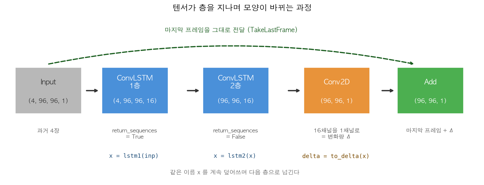
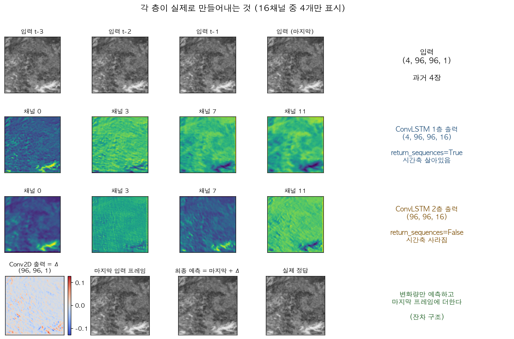

# ConvLSTM 모델의 구성 — 층 하나하나 뜯어보기

> `ConvLSTM_prediction.ipynb` 의 `build_model()` 안에서 층들이 무엇을 하는지 설명한다.
> 그림은 실제로 학습시킨 모델에서 뽑은 중간 출력이다.
> ConvLSTM 원리 자체는 [convlstm_easy_guide.md](convlstm_easy_guide.md) 를 먼저 보면 이해가 빠르다.

---

## 1. 한눈에 보기

모델은 층 네 개로 되어 있다. 각 층이 텐서의 **모양을 바꿔가며** 다음 층으로 넘긴다.



| 층 | 하는 일 | 나오는 모양 |
| --- | --- | --- |
| `Input` | 과거 4장을 받는다 | `(4, 96, 96, 1)` |
| `ConvLSTM 1층` | 시간 흐름을 읽으며 특징 16종류 추출 | `(4, 96, 96, 16)` |
| `ConvLSTM 2층` | 4장 분량을 **한 장으로 압축** | `(96, 96, 16)` |
| `Conv2D` | 특징 16개를 **변화량 Δ 한 장**으로 요약 | `(96, 96, 1)` |
| `Add` | 마지막 입력 프레임 + Δ | `(96, 96, 1)` |

> [!IMPORTANT]
> 두 ConvLSTM 층의 차이는 **`return_sequences` 하나**다.
> 1층은 `True` 라 4장이 그대로 나오고, 2층은 `False` 라 마지막 1장만 나온다.
> 이 한 글자가 시간축을 없애는 스위치다.

---

## 2. 각 층이 실제로 만들어내는 것

말로 설명하기 전에 실제 출력을 보자. 학습된 모델에 구름 사진 4장을 넣고
각 층에서 나온 값을 그린 것이다(16채널 중 4개만 표시).



- **1층·2층 출력**: 채널마다 그림이 다르다. 어떤 채널은 구름 덩어리를, 어떤 채널은 경계를 강조한다.
  16개의 돋보기가 각자 다른 것을 보고 있다는 뜻이다.
- **Conv2D 출력(Δ)**: 흑백이 아니라 **빨강·파랑**으로 그렸다. 값이 음수도 되기 때문이다.
  빨간 곳은 밝아질 자리, 파란 곳은 어두워질 자리다.
- **최종 예측**: 마지막 입력 프레임에 이 Δ 를 더한 결과다. 원본의 선명함이 그대로 남아 있다.

---

## 3. `ConvLSTM2D` 매개변수 하나씩

```python
lstm1 = layers.ConvLSTM2D(filters, (3, 3), padding='same',
                          return_sequences=True, activation='tanh')
```

| 매개변수 | 우리 값 | 뜻 |
| --- | --- | --- |
| 첫 번째 (`filters`) | `16` | 돋보기를 **16종류** 쓴다 → 출력 채널이 16개가 된다 |
| 두 번째 (`kernel_size`) | `(3, 3)` | 돋보기 한 장의 크기. 이웃 3×3 = 9칸을 함께 본다 |
| `padding` | `'same'` | 가장자리를 채워서 **출력 크기를 입력과 같게** 유지 |
| `return_sequences` | `True` / `False` | 4장 전부 내보낼지, 마지막 1장만 내보낼지 |
| `activation` | `'tanh'` | 셀 내부 계산 결과를 −1~1 로 눌러 담는다 |

### 3.1 `filters=16` — 돋보기 종류의 수

채널 1장(흑백)이 들어가서 **16장**이 나온다. 각 장은 서로 다른 돋보기로 훑은 결과다.
2장의 그림에서 채널마다 모양이 다른 것이 이 때문이다.

값을 32로 올리면 표현력이 늘지만 파라미터와 시간이 대략 4배가 된다
(ConvLSTM 파라미터는 채널 수의 제곱에 비례한다).

### 3.2 `padding='same'` — 크기를 지키는 장치

3×3 돋보기를 가장자리에 대면 밖으로 삐져나간다. `'same'` 은 바깥을 0 으로 채워
**96×96 이 그대로 96×96 으로 나오게** 한다.

| padding | 96×96 입력의 출력 | 층을 4번 쌓으면 |
| --- | --- | --- |
| `'valid'` (채우지 않음) | 94×94 | 88×88 로 계속 줄어든다 |
| **`'same'`** | **96×96** | **96×96 유지** |

우리는 입력과 같은 크기의 그림을 내놓아야 하므로 `'same'` 이 필수다.

### 3.3 `return_sequences` — 시간축을 남길지 없앨지

**이 문서에서 가장 중요한 매개변수다.**

ConvLSTM 은 4장을 t=1, 2, 3, 4 순서로 하나씩 읽으며 공책(기억)을 갱신한다.
그 과정에서 **매 시점마다 결과가 하나씩** 나오는데, 그것을 다 내보낼지 마지막 것만 내보낼지 정한다.

| 설정 | 내보내는 것 | 출력 모양 |
| --- | --- | --- |
| `True` (1층) | t=1,2,3,4 **네 시점 전부** | `(4, 96, 96, 16)` |
| `False` (2층) | t=4 **마지막 시점만** | `(96, 96, 16)` |

1층이 `True` 인 이유는 **2층도 시퀀스를 받아야** 하기 때문이다.
2층이 `False` 인 이유는 이제 **한 장의 그림을 만들어야** 하기 때문이다.

> [!WARNING]
> 1층을 `False` 로 바꾸면 2층에 3차원 텐서가 들어가 shape 에러가 난다.
> 반대로 2층을 `True` 로 두면 출력이 `(4, 96, 96, 16)` 이 되어
> 그다음 `Conv2D`(2차원 이미지용)와 맞지 않는다.

### 3.4 `activation='tanh'`

셀 내부에서 계산한 값을 **−1 ~ 1** 범위로 눌러 담는다.
값이 무한정 커지거나 작아져 학습이 발산하는 것을 막는 장치다.
LSTM 계열의 기본값이며, 특별한 이유가 없으면 바꾸지 않는다.

---

## 4. 왜 두 번 쌓고, 왜 `x` 를 다시 넣나

```python
x = lstm1(inp)        # 입력 -> 1층
x = lstm2(x)          # 1층의 결과 -> 2층
delta = to_delta(x)   # 2층의 결과 -> Conv2D
```

### 4.1 `x` 를 계속 덮어쓰는 것은 "다음 층으로 넘긴다"는 뜻

`x` 는 그냥 **바통** 이다. 앞 층이 만든 결과를 담아 다음 층에 건네주고,
건네준 뒤에는 새 결과로 덮어쓴다. 이름을 달리 써도 동작은 같다.

```python
# 위 코드와 완전히 동일하다. 이름만 다를 뿐이다.
h1 = lstm1(inp)
h2 = lstm2(h1)
delta = to_delta(h2)
```

이름을 `x` 하나로 재사용하는 것은 파이썬에서 흔한 관습이다.
"지금 흘러가고 있는 텐서"라는 뜻으로 읽으면 된다.

### 4.2 왜 두 층인가

| 층 | 보는 것 |
| --- | --- |
| 1층 | 원본 밝기에서 **기본 특징**을 뽑는다 (경계, 밝기 변화, 이동 흔적) |
| 2층 | 1층이 뽑은 16종류 특징을 **조합해 더 복잡한 패턴**을 만든다 |

층을 쌓아도 **가로세로 96×96 은 그대로**다(`padding='same'` 덕분).
바뀌는 것은 채널 수와 시간축, 그리고 아래에서 볼 **참조 범위**뿐이다.

### 4.3 "필터를 늘리면 되지 않나" — 안 된다

`filters` 를 키우는 것(너비)과 층을 쌓는 것(깊이)은 **서로 다른 능력**이다.

| | 늘리면 생기는 능력 |
| --- | --- |
| 필터 수 (너비) | 같은 수준의 특징을 **더 여러 종류** 뽑는다 |
| 층 수 (깊이) | 낮은 수준 특징을 **조합**하고, **보는 범위를 넓힌다** |

결정적인 차이는 **한 출력 픽셀이 입력에서 참조하는 범위**(receptive field)다.
3×3 커널을 쌓으면 범위가 넓어지지만, 필터를 늘려서는 절대 넓어지지 않는다.

| 구성 | 참조 범위 | 실제 거리 (한 칸 4km) |
| --- | --- | --- |
| ConvLSTM 1층 + Conv2D | 5×5 | 약 20km |
| **ConvLSTM 2층 + Conv2D** | **7×7** | **약 28km** |
| ConvLSTM 3층 + Conv2D | 9×9 | 약 36km |

실제로 재 보면 분명하다. 같은 데이터·같은 학습량으로 구성만 바꾼 결과다.

| 구성 | 파라미터 | 검증 오차 |
| --- | --- | --- |
| **2층 × 16필터 (현재)** | 28,497 | **0.00630** |
| 1층 × 27필터 (파라미터 맞춤) | 27,568 | 0.01272 |
| 1층 × 16필터 | 10,001 | 0.01838 |
| 3층 × 16필터 | 46,993 | 0.00623 |

**같은 파라미터 예산을 너비에 몰아준 쪽(1층 × 27필터)이 2배 더 틀린다.**
필터를 16 → 27 로 늘려 1층 성능이 나아지긴 하지만, 2층에는 미치지 못한다.

3층은 2층보다 파라미터를 65% 더 쓰고도 개선이 `0.00007` 에 그친다.
참조 범위 28km 면 2분간 구름 이동을 담기에 충분하다는 뜻이고, 그래서 2층에서 멈춘다.

> 위 수치는 1,800샘플 2 epoch 로 짧게 돌린 것이라 네 구성 모두 절대 성능은 낮다.
> 같은 조건에서 비교했으므로 **상대 순위만** 의미가 있다.

---

## 5. `Conv2D` — 16채널을 그림 한 장으로

```python
to_delta = layers.Conv2D(1, (3, 3), padding='same',
                         activation=None, dtype='float32')
delta = to_delta(x)
```

| 매개변수 | 우리 값 | 뜻 |
| --- | --- | --- |
| 첫 번째 (`filters`) | `1` | 출력 채널 **1개** — 흑백 그림 한 장을 만든다 |
| 두 번째 (`kernel_size`) | `(3, 3)` | 이웃을 함께 보며 요약 |
| `padding` | `'same'` | 크기 유지 (96×96) |
| `activation` | `None` | **활성화 없음(linear)** — 값을 그대로 통과시킨다 |
| `dtype` | `'float32'` | mixed precision 을 써도 이 층만은 32비트로 계산 |

### 5.1 왜 여기서는 ConvLSTM 이 아니라 Conv2D 인가

2층을 지나면 시간축이 이미 사라져 `(96, 96, 16)` 이다.
**시간이 없으니 시간을 다루는 층(ConvLSTM)이 필요 없다.**
남은 일은 "채널 16개를 1개로 줄이기"뿐이고, 그것은 평범한 `Conv2D` 의 몫이다.

### 5.2 `activation=None` 이 중요한 이유

이 층의 출력은 **변화량 Δ** 다. 구름이 사라지는 곳은 밝기가 **줄어야** 하므로
Δ 가 음수가 될 수 있어야 한다.

| 활성화 | 낼 수 있는 값 | 결과 |
| --- | --- | --- |
| `'relu'` | 0 이상만 | 어두워지는 변화를 표현 못 함 |
| `'sigmoid'` | 0~1 만 | 마찬가지로 감소 표현 불가 |
| **`None`** | **음수·양수 전부** | 정상 |

2장 그림에서 Δ 를 빨강·파랑으로 그린 것이 이 때문이다.

### 5.3 `dtype='float32'` 는 왜 이 층에만

앞 셀에서 `mixed_float16` 을 켜면 대부분의 계산이 16비트로 돌아 빨라진다.
그러나 마지막 출력과 손실 계산까지 16비트로 하면 정밀도가 부족해 학습이 흔들릴 수 있다.
그래서 **출력층과 Add 층만 32비트로 고정**한다.

---

## 6. 마지막 조립 — 잔차 연결

```python
take_last = TakeLastFrame(dtype='float32')
last = take_last(inp)                      # 입력에서 마지막 프레임만 뽑기
out  = layers.Add(dtype='float32')([last, delta])   # 예측 = 마지막 프레임 + Δ
```

여기서 `inp` 가 다시 등장하는 것에 주목하자. 1층 → 2층 → Conv2D 로 이어지는 **본선**과 별개로,
입력에서 곧장 끝으로 가는 **샛길**이 있다. 그림의 초록 점선이 그것이다.

이 구조 때문에 `Sequential` 로는 표현할 수 없고 Functional API 를 쓴다.

$$\hat{Y} = \underbrace{X_{\text{마지막}}}_{\text{샛길}} + \underbrace{\Delta}_{\text{본선}}$$

모델은 "다음 그림 전체"가 아니라 **"무엇이 달라지는가"만** 학습하면 되고,
선명함은 원본에서 그대로 물려받는다.

---

## 7. 전체 코드와 대응

| 코드 | 만들어지는 것 | 모양 |
| --- | --- | --- |
| `inp = keras.Input(...)` | 입력 자리 | `(4, 96, 96, 1)` |
| `x = lstm1(inp)` | 1층 통과 | `(4, 96, 96, 16)` |
| `x = lstm2(x)` | 2층 통과, 시간축 소멸 | `(96, 96, 16)` |
| `delta = to_delta(x)` | 변화량 Δ | `(96, 96, 1)` |
| `last = take_last(inp)` | 샛길: 마지막 프레임 | `(96, 96, 1)` |
| `out = Add()([last, delta])` | 최종 예측 | `(96, 96, 1)` |

파라미터는 모두 합쳐 **28,497개**이고, 층별 내역은 다음과 같다.

| 층 | 파라미터 | 계산 |
| --- | --- | --- |
| ConvLSTM 1층 | 9,856 | 게이트 4개 × ((3×3×1 + 3×3×16) × 16 + 16) |
| ConvLSTM 2층 | 18,496 | 게이트 4개 × ((3×3×16 + 3×3×16) × 16 + 16) |
| Conv2D | 145 | 3×3×16 × 1 + 1 |
| `TakeLastFrame`, `Add` | 0 | 학습할 것이 없는 순수 연산 |

---

## 8. 바꿔보면 좋은 것

| 바꿀 값 | 효과 | 주의 |
| --- | --- | --- |
| `FILTERS` 16 → 32 | 표현력↑ | 파라미터·시간 약 4배 |
| ConvLSTM 층 2 → 3 | 참조 범위 28 → 36km | 파라미터 65%↑ 인데 **실측 개선은 0.00007** (4.3 참고) |
| `kernel_size` (3,3) → (5,5) | 더 넓은 이웃 참조 | 파라미터 약 2.8배 |
| `activation` 을 `'relu'` 로 | — | **하지 말 것.** 감소 변화를 표현 못 한다 |
| `padding` 을 `'valid'` 로 | — | **하지 말 것.** 출력이 입력보다 작아진다 |

> [!TIP]
> 가장 먼저 해볼 만한 실험은 `FILTERS = 32` 다.
> 돋보기가 두 배로 늘면 정말 더 잘 맞히는지, 아니면 느려지기만 하는지 직접 확인해 보라.

---

## 참고

- ConvLSTM 원리 (쉬운 설명): [convlstm_easy_guide.md](convlstm_easy_guide.md)
- 같은 내용을 더 쉽게 (그림 위주): [convlstm_inside_easy.md](convlstm_inside_easy.md)
- 수식과 이론: [convlstm_principles.md](convlstm_principles.md)
- 용어 정리: [terms_visual_guide.md](terms_visual_guide.md)
- 파이프라인 전체: [nc_predict_pipeline.md](nc_predict_pipeline.md)
- 층별 shape 표: [../nc_model_architecture.md](../nc_model_architecture.md)
