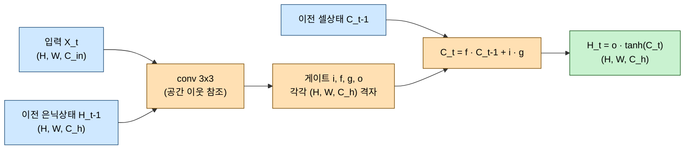
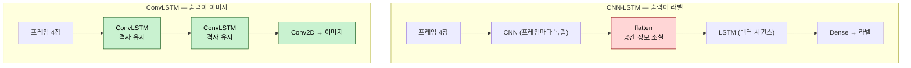

# CNN-LSTM과 ConvLSTM: 시공간 예측의 원리

> 선수 지식: CNN의 convolution 연산, LSTM의 게이트 구조를 알고 있다고 가정한다.
> 이 문서는 모델 원리를 다루고, 실제 구현은 [nc_predict_pipeline.md](nc_predict_pipeline.md)에서 설명한다.
> 선수 지식 없이 비유와 산수 예시로 먼저 이해하려면 [convlstm_easy_guide.md](convlstm_easy_guide.md)를 읽어라.

영상처럼 **공간(space)과 시간(time)을 동시에 가진 데이터**를 예측하는 모델의 원리를 정리한다.
"CNN LSTM"이라는 이름으로 뭉뚱그려 부르는 구조에는 사실 **두 가지 다른 설계**가 있고,
`ConvLSTM_prediction.ipynb`가 쓰는 것은 그중 ConvLSTM이다.

---

## 1. 핵심 요약 — CNN-LSTM과 ConvLSTM은 다른 모델이다

| 구분 | CNN-LSTM (하이브리드) | ConvLSTM |
| --- | --- | --- |
| 구조 | CNN으로 특징 추출 후 벡터를 LSTM에 입력 | LSTM 셀 내부의 행렬곱을 convolution으로 교체 |
| 시간축을 처리하는 곳 | LSTM (1차원 벡터 위에서) | ConvLSTM 셀 (2차원 격자 위에서) |
| 중간 표현 | 벡터 `(features,)` | 격자 `(H, W, channels)` |
| 공간 정보 | flatten 시점에 **소실** | 끝까지 **보존** |
| 출력 | 분류 라벨, 스칼라 값 | 이미지 한 장 |
| 대표 용도 | 비디오 행동 분류, 영상 캡셔닝 | 강수 예측, 위성영상 다음 프레임 예측 |

> [!IMPORTANT]
> 판단 기준은 하나다. **출력이 이미지면 ConvLSTM, 출력이 라벨이면 CNN-LSTM.**
> 다음 프레임 예측은 출력이 이미지이므로 ConvLSTM을 쓴다.

---

## 2. 왜 CNN 단독으로도, LSTM 단독으로도 안 되는가

위성영상 다음 프레임 예측은 두 가지를 동시에 요구한다.

| 요구사항 | 필요한 능력 | 단독 모델의 한계 |
| --- | --- | --- |
| 구름의 모양·경계를 이해 | 공간적 지역성 (spatial locality) | LSTM은 픽셀을 1차원으로 펴서 이웃 관계를 잃는다 |
| 구름이 어디로 움직였는지 파악 | 시간적 기억 (temporal memory) | CNN은 프레임 간 순서 개념이 없다 |

CNN에 4장을 채널로 쌓아 넣는 방법(`(H, W, 4)`)도 가능하지만, 이때 시간은 **채널 축에 섞여**
순서가 명시되지 않는다. 입력 길이를 바꾸면 모델을 다시 만들어야 하고, 장기 의존성도 학습하지 못한다.

두 능력을 한 셀 안에서 결합한 것이 ConvLSTM이다.

---

## 3. LSTM 복습 — 게이트는 "무엇을 얼마나 통과시킬지"의 문제다

LSTM 셀은 네 개의 게이트로 cell state $C_t$를 갱신한다.

$$
\begin{aligned}
i_t &= \sigma(W_{xi} x_t + W_{hi} h_{t-1} + b_i) &&\text{input gate: 새 정보를 얼마나 받을까} \\
f_t &= \sigma(W_{xf} x_t + W_{hf} h_{t-1} + b_f) &&\text{forget gate: 과거를 얼마나 지울까} \\
g_t &= \tanh(W_{xg} x_t + W_{hg} h_{t-1} + b_g) &&\text{후보값: 새로 쓸 내용} \\
o_t &= \sigma(W_{xo} x_t + W_{ho} h_{t-1} + b_o) &&\text{output gate: 얼마나 내보낼까}
\end{aligned}
$$

$$C_t = f_t \odot C_{t-1} + i_t \odot g_t, \qquad h_t = o_t \odot \tanh(C_t)$$

여기서 $x_t$와 $h_t$는 **1차원 벡터**이고, $W$와의 연산은 **행렬곱**이다.
이 구조를 96×96 이미지에 적용하려면 9,216개 값으로 flatten해야 하고, 그 순간
"어떤 픽셀이 어떤 픽셀 옆에 있었는지"가 사라진다.

---

## 4. ConvLSTM — 행렬곱을 convolution으로 바꾼다

Shi et al.(2015)의 아이디어는 놀라울 만큼 단순하다. **수식의 곱셈 기호만 바꾼다.**

$$
\begin{aligned}
i_t &= \sigma(W_{xi} * \mathcal{X}_t + W_{hi} * \mathcal{H}_{t-1} + b_i) \\
f_t &= \sigma(W_{xf} * \mathcal{X}_t + W_{hf} * \mathcal{H}_{t-1} + b_f) \\
g_t &= \tanh(W_{xg} * \mathcal{X}_t + W_{hg} * \mathcal{H}_{t-1} + b_g) \\
o_t &= \sigma(W_{xo} * \mathcal{X}_t + W_{ho} * \mathcal{H}_{t-1} + b_o)
\end{aligned}
$$

$$\mathcal{C}_t = f_t \odot \mathcal{C}_{t-1} + i_t \odot g_t, \qquad \mathcal{H}_t = o_t \odot \tanh(\mathcal{C}_t)$$

바뀐 것은 두 가지뿐이다.

- 행렬곱이 convolution($*$)으로 교체됐다
- $\mathcal{X}_t, \mathcal{H}_t, \mathcal{C}_t$가 벡터가 아니라 **3차원 텐서** `(H, W, channels)`가 됐다

게이트 $i_t, f_t, o_t$도 스칼라가 아니라 **격자**다. 즉 "이 픽셀 위치에서는 과거를 얼마나 잊을지"를
위치마다 따로 결정한다. 구름이 있는 곳과 없는 곳의 기억 전략이 달라질 수 있다는 뜻이다.

### 파라미터 수가 극적으로 줄어든다

convolution은 커널을 모든 위치에서 공유하므로, 입력 해상도와 무관하게 파라미터 수가 고정된다.

| 방식 | 96×96 입력 처리 시 파라미터 | 비고 |
| --- | --- | --- |
| FC-LSTM (hidden 512) | 약 19,900,000 | 9,216차원 flatten × 512 × 4게이트 |
| ConvLSTM2D(16, 3×3) | **9,856** | 커널을 전 위치에서 공유 |

약 2,000배 차이다. `ConvLSTM_prediction.ipynb`의 전체 모델이 파라미터 28,497개로 M1 노트북에서
학습 가능한 이유가 여기에 있다.

계산 근거는 다음과 같다. 게이트 4개 각각이 입력용 커널과 은닉상태용 커널을 갖는다.

$$4 \times \left[ (k^2 \cdot C_{in} + k^2 \cdot C_h) \cdot C_h + C_h \right]
= 4 \times \left[ (9 \cdot 1 + 9 \cdot 16) \cdot 16 + 16 \right] = 9{,}856$$

---

## 5. CNN-LSTM(하이브리드)과의 구조 차이

같은 입력이 두 구조에서 어떻게 흐르는지 비교하면 차이가 분명해진다.

CNN-LSTM의 `flatten` 지점이 결정적이다. 여기서 2차원 구조가 1차원으로 접히기 때문에
**출력으로 다시 이미지를 만들 수 없다.** 억지로 Dense로 96×96=9,216개 값을 뽑을 수는 있지만,
파라미터가 폭증하고 공간적 일관성도 보장되지 않는다.

---

## 6. next-frame prediction을 위한 설계 요소

ConvLSTM을 그대로 쓰면 예측이 흐릿해진다(blurry prediction). 이를 완화하는 세 가지 설계를
`ConvLSTM_prediction.ipynb`가 채택하고 있다.

### 6.1 잔차(residual) 구조 — 전체가 아니라 변화량만 예측

다음 프레임 전체를 처음부터 그리게 하면, 모델은 손실을 줄이는 가장 안전한 방법으로
**평균값에 가까운 흐릿한 그림**을 내놓는다(regression to the mean).

$$\hat{Y}_t = X_{t-1} + \Delta, \qquad \Delta = f_\theta(X_{t-4:t-1})$$

마지막 입력 프레임을 그대로 가져오고 **변화량 $\Delta$만 신경망이 예측**하면, 선명함은 입력에서
상속되고 모델은 "무엇이 달라졌는가"에만 집중한다.

> 주의: $\Delta$는 음수가 될 수 있으므로 출력층 activation은 반드시 linear다.
> `relu`나 `sigmoid`를 쓰면 감소 방향 변화를 표현하지 못한다.

### 6.2 손실 함수 — MAE와 SSIM의 결합

| 손실 | 성질 | 단독 사용 시 문제 |
| --- | --- | --- |
| MSE | 큰 오차에 민감 | 평균회귀가 심해 가장 흐릿해진다 |
| MAE | 이상치에 강건 | 구조·엣지 정보를 직접 보지 않는다 |
| SSIM | 밝기·대비·구조를 함께 평가 | 절대 오차 크기를 통제하지 못한다 |

`ConvLSTM_prediction.ipynb`는 두 성질을 절반씩 섞는다.

$$\mathcal{L} = 0.5 \cdot \text{MAE} + 0.5 \cdot (1 - \text{SSIM})$$

SSIM은 높을수록 좋은 지표이므로 손실로 쓰려면 $1 - \text{SSIM}$으로 뒤집는다.
SSIM의 정의·세 구성 요소·`max_val` 주의점은 [ssim_explained.md](ssim_explained.md)에 따로 정리했다.

### 6.3 fully-convolutional — 작게 배우고 크게 추론한다

convolution과 ConvLSTM은 입력 해상도에 의존하지 않는다. 따라서 입력 shape를
`(T, None, None, 1)`로 선언하면 **96×96 패치로 학습한 모델을 250×250 전체 프레임에 그대로 적용**할 수 있다.

이 성질 덕분에 작은 패치로 샘플 수를 늘려 학습 효율을 확보하면서도, 추론은 전체 영역을 한 번에 처리한다.
Dense 층을 하나라도 넣으면 이 성질이 깨진다.

> 주의: Keras 3(TF 2.16 이상, Colab 기본)의 ConvLSTM 은 공간 크기 `None` 을 허용하지 않는다.
> 성질 자체는 같으므로 `ConvLSTM_prediction.ipynb` 와 `nc_predict_colab.py` 는 96×96 으로 학습한 뒤
> 250×250 모델을 새로 만들어 `set_weights` 로 가중치를 옮기는 방식을 쓴다.
> 자세한 내용은 [nc_predict_pipeline.md](nc_predict_pipeline.md) 7.2 절.

---

## 7. 실무 선택 기준

| 상황 | 선택 | 이유 |
| --- | --- | --- |
| 출력이 이미지 (다음 프레임, 강수 분포) | ConvLSTM | 공간 구조를 끝까지 보존해야 한다 |
| 출력이 라벨 (행동 분류, 이상 탐지) | CNN-LSTM | flatten해도 무방하고 학습이 훨씬 빠르다 |
| 시퀀스가 짧고(2~5장) 움직임이 느림 | ConvLSTM 얕게 (2층, 16필터) | 과한 용량은 과적합만 부른다 |
| 긴 시퀀스, 빠른 이동 | PredRNN, TrajGRU 등 | ConvLSTM은 이동 궤적 표현에 한계가 있다 |
| GPU 메모리가 빠듯함 | 패치 학습 + fully-conv 추론 | 배치를 작게 유지하면서 전체 추론 가능 |

> [!TIP]
> 시계열 예측에서는 **Persistence(다음 = 현재) 베이스라인을 먼저 측정**해야 한다.
> 관측 간격이 짧으면 이 단순 규칙이 대단히 강력해서, 모델이 이를 못 넘으면 학습이 무의미하다.
> 실제 측정값은 [nc_predict_pipeline.md](nc_predict_pipeline.md)의 6장에 있다.

---

## 참고

- Shi et al., *Convolutional LSTM Network: A Machine Learning Approach for Precipitation Nowcasting*, NeurIPS 2015 — ConvLSTM 원논문
- Wang et al., *Image Quality Assessment: From Error Visibility to Structural Similarity*, IEEE TIP 2004 — SSIM 원논문
- SSIM 상세: [ssim_explained.md](ssim_explained.md)
- 이 프로젝트의 모델 구조 상세: [../nc_model_architecture.md](../nc_model_architecture.md)
- 구현 파이프라인: [nc_predict_pipeline.md](nc_predict_pipeline.md)
