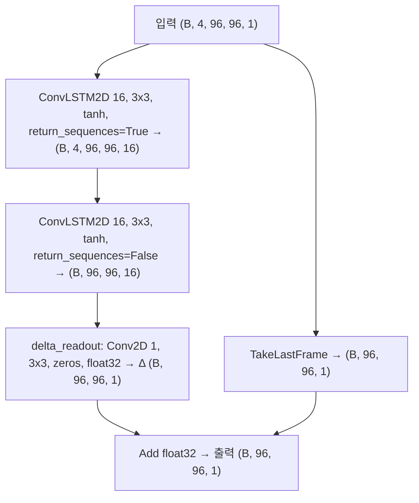
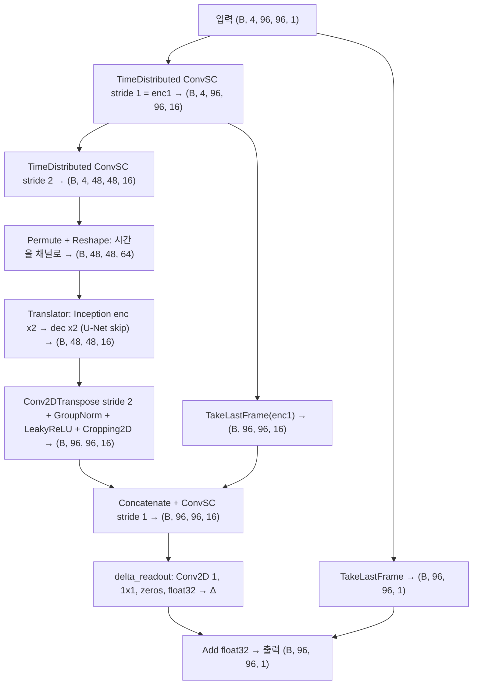
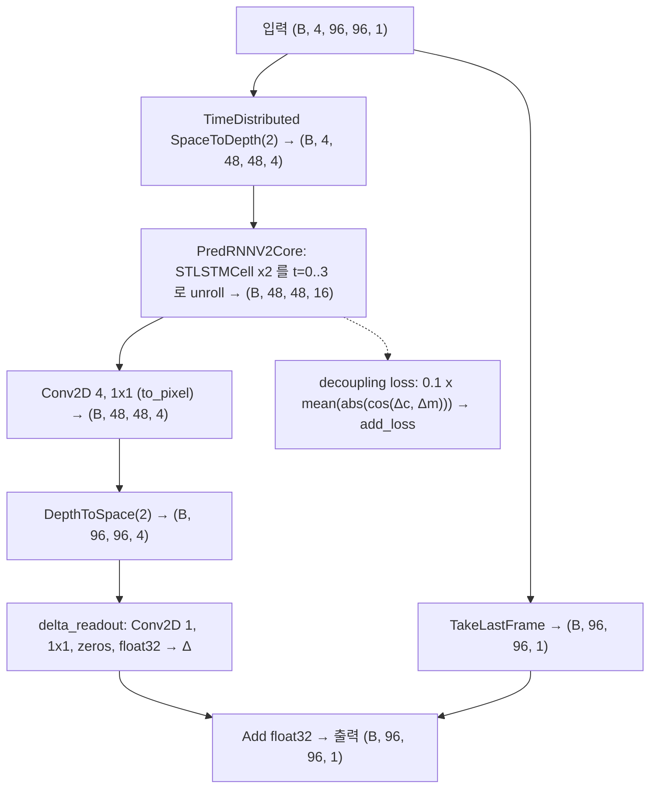
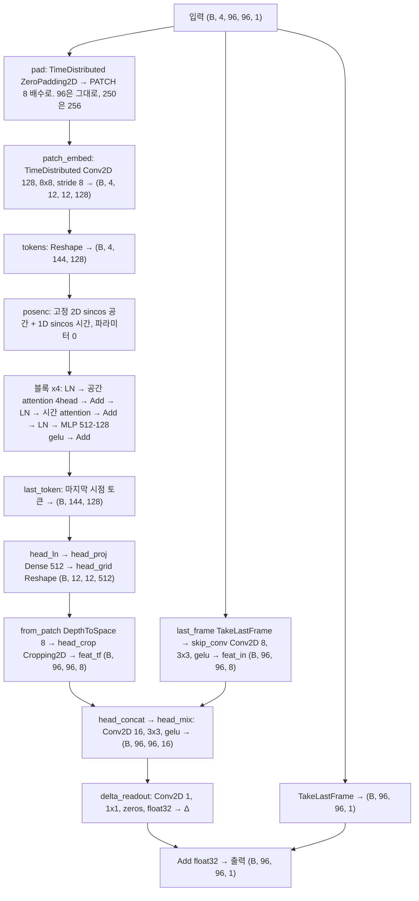
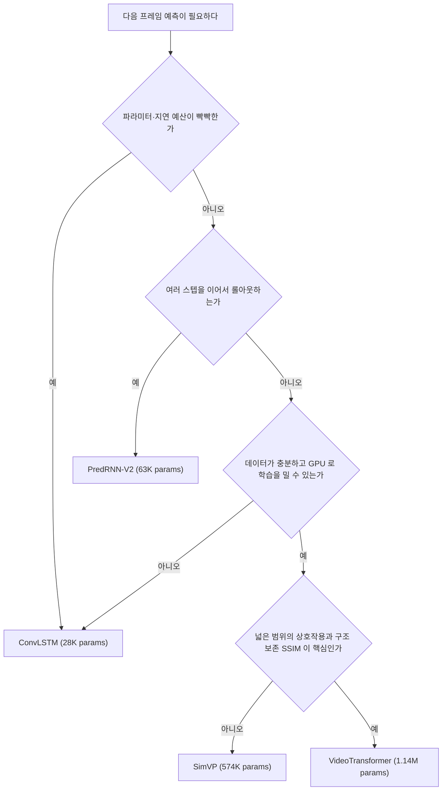

# ConvLSTM · SimVP · PredRNN-V2 · VideoTransformer 다음 프레임 예측 비교

> 대상 데이터: GK2A AMI L1B `sw038` 채널, 2025-10-17 하루치 710장 (2분 간격).
> 네 모델은 데이터·분할·정규화·손실·평가·초기 출발점까지 모두 같은 조건에서 학습한다.
> 코드 근거: `nc_pipeline.py`(공통), `nc_predict_colab.py` · `simvp_predict_colab.py` ·
> `predrnn_v2_predict_colab.py` · `videotf_predict_colab.py`(모델).

같은 위성영상 시퀀스로 "2분 뒤 한 장"을 예측하는 네 가지 시공간 예측 모델을 비교하고,
실행부터 리포트 생성·Netlify 배포까지의 절차를 정리한다.

---

## 1. 핵심 요약

| 항목 | ConvLSTM | SimVP | PredRNN-V2 | VideoTransformer |
| --- | --- | --- | --- | --- |
| 핵심 아이디어 | LSTM 게이트의 행렬곱을 convolution 으로 교체해 격자 위에서 시간을 처리 | RNN 없이 CNN 만 사용. 시간 축을 채널로 접어 Inception 으로 섞는다 | 시공간 메모리 M 을 층·스텝에 걸쳐 zigzag 로 흘리고, Δc·Δm 을 decoupling loss 로 분리 | 3D attention 을 공간 축·시간 축으로 쪼갠(factorized space-time) 순수 transformer + hybrid conv head |
| 논문 | Shi et al., NeurIPS 2015 · [arXiv:1506.04214](https://arxiv.org/abs/1506.04214) | Gao et al., CVPR 2022 · [arXiv:2206.05099](https://arxiv.org/abs/2206.05099) | Wang et al., TPAMI 2022 · [arXiv:2103.09504](https://arxiv.org/abs/2103.09504) | PredFormer, Tang et al., 2024 · [arXiv:2410.04733](https://arxiv.org/abs/2410.04733) |
| 참조 구현 · 라이선스 | Keras 내장 `layers.ConvLSTM2D` · Apache-2.0 | [OpenSTL](https://github.com/chengtan9907/OpenSTL) (공식 후속 구현) · Apache-2.0 | [thuml/predrnn-pytorch](https://github.com/thuml/predrnn-pytorch) · LICENSE 파일 없음 | [yyyujintang/PredFormer](https://github.com/yyyujintang/PredFormer) · README 에 라이선스 표기 없음 (2026-09-04 확인, 재배포 전 확인 필요) |
| 우리 적응 | 2층, BatchNorm 없음, 다음 1장만 예측 | `T_out = 1`, `N_S = N_T = 2`, `incep_ker (3, 5, 7)`, 일반 conv | reverse scheduled sampling 없음, `filter_size 3`, `patch_size 2`, LayerNorm 없음 | 단일 스텝, 고정 sinusoidal 위치 인코딩, `DIM=128` / `DEPTH=4` / `HEADS=4` / `PATCH=8`, hybrid conv head, 250→256 pad 후 crop |
| params (`filters=16`) | 28,497 | 574,257 | 63,494 | 1,135,345 |
| 시간 축 처리 | 순차 recurrent | 채널로 접어 병렬 | 순차 recurrent + 메모리 zigzag | 토큰 축을 접어 시간 attention (병렬) |
| 학습 속도 (상대) | 가장 빠름 | 중간 | 가장 느림 (층·스텝마다 conv 5개 + adapter) | 가장 무겁다 (attention 비용이 토큰 수의 제곱. 96 패치 N=144, 250 프레임 N=1,024) |

> [!IMPORTANT]
> 네 모델은 `filters = 16` 이라는 같은 hidden 폭을 공유할 뿐 **파라미터 예산을 맞춘 비교가 아니다**
> (SimVP 가 ConvLSTM 의 약 20배, VideoTransformer 는 약 40배). 반대로 데이터·분할·손실·평가·학습
> 출발점(Δ=0)은 완전히 같다.

SimVP 파라미터의 98%는 Translator 의 Inception 블록, 특히 7×7 커널에 있다.
`incep_ker` 에서 7 을 빼거나 `hid_T` 배수를 낮추면 용량을 맞춘 비교로 바꿀 수 있다.

구현 대조에 쓴 코드는 원 저자 저장소가 아니다. SimVP 의 `A4Bear/SimVP` 경로는 현재 404 라 공식 후속 구현인
OpenSTL 로 대조했고, `thuml/predrnn-pytorch` 는 저장소에 LICENSE 파일이 없다 (2026-09-03 확인).
`yyyujintang/PredFormer` 도 README 에 LICENSE 섹션이 없다 (2026-09-04 확인).
세 저장소의 코드를 복사하지 않고 논문·코드를 근거로 Keras 로 다시 구현했지만, 재배포 시에는 라이선스를 직접 확인해야 한다.

---

## 2. 공통 실험 조건

모델 파일은 `build_model()` 과 `MODEL_NAME` 만 정의하고, 나머지는 전부 `nc_pipeline.py` 한 곳에서 정의한다.
모델이 데이터나 평가를 재정의할 수 없으므로 조건이 어긋날 여지가 구조적으로 없다.

| 항목 | 값 | 코드 |
| --- | --- | --- |
| 입력 데이터 | GK2A AMI L1B `sw038`(3.8 µm), LA 영역, 2025-10-17 00:00~23:58 UTC, 2분 간격 710장 (720장 중 결측 10장) | `gk2a_download.py`, `NC_GLOB` |
| 해상도 | 원본 500×500 → 250×250 평균풀링. `target` 은 500 의 약수여야 크롭이 아닌 풀링이 된다 | `downsample` |
| 세그먼트 | 간격이 2분이 아닌 지점에서 연속 구간을 끊고, 윈도우는 구간 내부에서만 만든다 | `find_segments`, `window_starts` |
| 정규화 | 전체 프레임 하나의 전역 min/max 로 0~1. 프레임별 정규화는 밝기 차이를 지운다 | `normalize` |
| 샘플 구성 | 과거 4장 → 다음 1장, 96×96 패치, stride 77 (250 을 3×3 격자로 100% 커버) | `build_dataset`, `patch_grid` |
| train/val 분할 | 시간 순서 유지(셔플 금지), 앞 80%가 train. 경계에서 `in_frames` 개 윈도우를 버려 누수 차단 | `split_starts` |
| 베이스라인 | Persistence(다음 = 현재). 세그먼트 경계를 넘는 쌍은 제외 | `persistence_baseline` |
| 손실 | `0.5·MAE + 0.5·(1 − SSIM)` | `ssim_mae_loss` |
| 출력 head | 출력 = 마지막 입력 프레임 + Δ. Δ 는 `kernel_initializer="zeros"` 라 시작 시 출력 = Persistence | `residual_head`, `delta_readout` |
| optimizer | Adam(lr 1e-3). Keras 2 는 Apple Silicon 에서 빠른 `legacy.Adam` | `make_optimizer` |
| 학습 | epochs 4, batch 16, EarlyStopping(patience 8, best 복원), ReduceLROnPlateau(patience 4, factor 0.5) | `train_model` |
| 평가 | 검증 패치 MAE·SSIM, 250×250 full-frame MAE·SSIM, Persistence 대비 MAE 개선율 | `evaluate_patches`, `predict_full_frame` |
| 정밀도 | 기본 `mixed_float16`. Δ 와 최종 합은 항상 float32 (`--no-mixed-precision` 으로 해제) | `setup_gpu`, `delta_readout` |
| 재현성 | `keras.utils.set_random_seed(42)` | `run` |

> [!NOTE]
> 학습은 96×96 패치로 하고 추론은 250×250 전체 프레임으로 한다. 네 모델 모두 두 크기의 파라미터 수가
> 같아서 `build_model` 로 큰 모델을 새로 만든 뒤 `set_weights` 로 가중치를 옮긴다. VideoTransformer 는
> 위치 인코딩이 학습 파라미터가 아닌 고정 상수라 토큰 수가 144 → 1,024 로 늘어도 이 이전이 성립한다.

Δ readout 을 0 으로 초기화하는 이유는 비교 공정성이다. readout 앞의 활성 스케일이 모델마다 달라
(ConvLSTM 은 tanh, SimVP 는 GroupNormalization) 기본 초기화로는 학습 출발점이 모델마다 달라진다.
0 초기화 전에는 SimVP 가 1 epoch 시점에 Persistence 보다 약 4배 나빴고, 적용 후에는 1 epoch 만에
MAE·SSIM 양쪽에서 Persistence 를 앞섰다. VideoTransformer 에서는 이 0 초기화가 학습을 막는 것처럼
보였지만 실제 원인은 readout 구조였다 (3.4 참고). 네 모델 모두 기본값 그대로 Δ=0 에서 출발한다.

---

## 3. 모델별 구조

네 그림 모두 학습 시점 shape(`filters=16`, 96×96 패치, `in_frames=4`) 기준이다.

### 3.1 ConvLSTM



| 항목 | 일반적 구성 | 우리 구현 | 이유 |
| --- | --- | --- | --- |
| 층 구성 | encoding-forecasting 다층 + BatchNorm | ConvLSTM2D 2층, BatchNorm 없음 | Metal 에서 5D BatchNormalization 이 동작하지 않는다 |
| 예측 길이 | 다중 스텝 시퀀스 | 다음 1장 | 네 모델 공통 조건 |
| 출력 | 프레임 직접 회귀 | Δ + 마지막 입력 프레임 | 공통 residual head |
| 입력 크기 | 임의 | `h`, `w` 고정 | Keras 3 의 ConvLSTM 은 공간 크기 `None` 을 허용하지 않는다 |

### 3.2 SimVP

Encoder 로 공간을 절반으로 줄이고, 시간 축을 채널로 접어 Inception 블록으로 섞은 뒤, Decoder 로 복원한다.
Translator 가 시간을 채널로 다루기 때문에 recurrent 연산이 전혀 없다.



`ConvSC` 는 Conv2D → GroupNormalization(groups 2) → LeakyReLU(0.2) 이고,
Inception 블록은 1×1 reduce 후 3·5·7 커널을 병렬로 통과시켜 합한다(GroupNormalization groups 8).

| 항목 | 공식 (OpenSTL) | 우리 구현 | 이유 |
| --- | --- | --- | --- |
| 출력 길이 | `T_out = T` | `T_out = 1` (마지막 dec 출력 채널 `hid_S`) | 다음 1장만 예측 |
| `incep_ker` | `[3, 5, 7, 11]` | `(3, 5, 7)` | 96 패치에 11 커널은 과하고 파라미터가 크게 는다 |
| 병렬 conv | grouped conv (`groups=8`) | 일반 conv, GroupNorm 그룹 수만 8 유지 | 그룹 수에 따른 용량 차이를 없앤다 |
| `N_S` / `N_T` | 4 / 8 | 2 / 2 | 다운샘플 1회로 96 과 250 을 동시에 지원 |
| 업샘플 | `Conv2d(out*4)` + PixelShuffle | `Conv2DTranspose(stride 2)` | 원 SimVP v1 방식. PixelShuffle 은 같은 폭에서 conv 파라미터가 4배 |
| ConvSC 활성 | SiLU | LeakyReLU(0.2) | Inception 쪽은 공식도 LeakyReLU(0.2) 라 모델 내 활성이 통일된다 |
| Decoder skip | `hid + enc1` (덧셈) | `concat(hid, enc1[:, -1])` | 원 SimVP v1 방식. `T_out=1` 이라 마지막 입력 프레임의 `enc1` 을 쓴다 |
| 홀수 크기 | 해당 없음 | `Cropping2D` 추가 | `target` 이 홀수(125)면 stride-2 왕복이 1픽셀 커진다. 짝수면 파라미터 0의 no-op |

### 3.3 PredRNN-V2

`STLSTMCell` 은 시간 메모리 `c` 와 공간 메모리 `m` 을 따로 갖는다. `m` 은 한 스텝 안에서 층을 타고
올라간 뒤 다음 스텝의 첫 층으로 들어간다(zigzag). 두 메모리의 증분 Δc·Δm 이 같은 방향으로만 움직이면
층이 중복 학습되므로, 공유 adapter 를 통과시킨 코사인 유사도의 절댓값 평균을 손실에 더해 분리를 유도한다.



우리 설정: `num_layers = 2`, `num_hidden = filters`(16), `filter_size = 3`, `patch_size = 2`,
`decouple_beta = 0.1`, forget bias 1.0, adapter 는 전 층·Δc/Δm 이 공유하는 `Conv2D(hid, 1×1, use_bias=False)` 하나다.

| 항목 | 공식 (thuml/predrnn-pytorch) | 우리 구현 | 이유 |
| --- | --- | --- | --- |
| reverse scheduled sampling | 사용 | 미사용 | 다음 1장만 예측하므로 적용 대상이 없다 |
| `filter_size` | 5 | 3 | ConvLSTM 과 같은 수용영역 조건으로 맞춘다 |
| LayerNorm | 각 conv 뒤에 사용 | 미사용 | 비교 조건 단순화 |
| conv bias | `bias=False` | `use_bias=True` | LayerNorm 을 뺐으므로 게이트에 학습 가능한 shift 를 남긴다 (공식과 다른 유일한 판단) |
| `patch_size` | 실행 인자 | 2 | `space_to_depth` 로 96→48, 250→125 를 모두 나눈다 |
| readout | `conv_last`(hid → 1) 한 장 | `Conv2D(4, 1×1)` → `DepthToSpace(2)` → Δ readout | patch 를 되돌린 뒤 float32 Δ 를 만든다 |

`add_loss` 로 등록한 decoupling 항이 `model.fit` 손실에 실제로 더해지는지는 Keras 2 / Keras 3 양쪽에서
테스트로 확인했다. Keras 3 는 모델을 한 번 호출하기 전에는 `model.losses` 가 비어 있다.

### 3.4 VideoTransformer

recurrent 도 convolution 도 없이 attention 만으로 시공간을 다룬다. 한 블록 안에서 공간 attention 과
시간 attention 을 따로 걸어(factorized) 3D attention 의 O((T·N)²) 비용을 O(N²) + O(T²) 로 줄인다.
readout 만 예외로 conv 를 쓴다 (아래 hybrid conv head).



블록 하나는 pre-LN + residual 3단이다. 공간 attention 은 `(B, T, N, D)` 를 `(B·T, N, D)` 로 접어
같은 시점의 토큰끼리, 시간 attention 은 `(B·N, T, D)` 로 접어 같은 위치의 시점끼리 self-attention 한다.
접기·펼치기는 `Lambda` 없이 커스텀 Layer 4개로 만들어 Keras 2·3 양쪽에서 직렬화된다.

| 항목 | 공식 (PredFormer) | 우리 구현 | 이유 |
| --- | --- | --- | --- |
| 블록 MLP | Gated Transformer Block (SwiGLU 계열 게이팅) | `Dense(512, gelu) → Dense(128)` | 비교 조건 단순화. 게이팅 변형 탐색은 범위 밖 |
| factorization 변형 | 9종 (`FullAttention`, `FacST`, `BinaryTS`, `Triplet_*`, `Quadruplet_*` 등) | BinaryST 하나 (블록마다 공간 → 시간) | 변형 탐색 없이 한 가지로 고정 |
| 위치 인코딩 | 학습형 positional embedding | 고정 2D+1D sinusoidal (파라미터 0) | 토큰 수에 의존하는 학습 파라미터가 있으면 96 학습 → 250 추론 가중치 이전이 깨진다 |
| 출력 길이 | 다중 프레임 시퀀스 | 다음 1장 (마지막 시점 토큰만 읽는다) | 네 모델 공통 조건 |
| readout | 토큰 → 픽셀 선형 투영 | hybrid conv head (공식에 없는 우리 추가) | 아래 문단 |
| 크기 | 과제별 대형 | `DIM=128`, `DEPTH=4`, `HEADS=4`, `PATCH=8` | 하루치 710장에 맞춘 소형 설정 |
| 입력 크기 | 패치 배수 전제 | 오른쪽·아래 zero-pad 후 `Cropping2D` | 250 은 8 의 배수가 아니다 (250 → 256 → 250) |

hybrid conv head 는 공식에 없는 우리 추가다. 8×8 패치 토큰의 선형 투영만으로 Δ 를 만들면 한 패치의
64픽셀이 모두 같은 토큰에서 나오므로 픽셀 단위 국소 Δ 를 표현할 수 없고, 실제로 readout 을 1채널에서
8채널로 늘리거나 Δ readout 을 std 0.01·0.05 난수로 초기화해도 loss 가 같은 바닥(0.0318)에서 움직이지
않았다 (hours 6–11, 3 epoch 실측 — [계획 0.2 절의 실측 기록](plans/2026-09-04_video_transformer_plan.md)).
마지막 입력 프레임에서 뽑은 픽셀 해상도 conv 특징을 붙여 섞자 Δ 가 입력의 국소 구조와 정렬되면서 loss 가
0.03152 → 0.02573 → 0.02242 로 내려갔고, 다른 세 모델과 같은 zero-init 출발점(초기 출력 = Persistence)도
그대로 유지된다.

`PATCH = 4` 도 같은 조건으로 비교했다. params 는 1,079,665 로 비슷하지만 val MAE 0.00922 / SSIM 0.9770 으로
`PATCH = 8`(val MAE 0.00772 / SSIM 0.9784)보다 나쁘고, 토큰이 4배라 250×250 추론이 0.40 s → 12.9 s/frame 으로
32배 느려져 `PATCH = 8` 로 확정했다.

---

## 4. 실행 방법

### 4.1 로컬 CLI

TensorFlow 가 설치된 인터프리터로 실행한다 (`/usr/local/bin/python3`, TF 2.15 / Keras 2).

```bash
# 1) 데이터 준비 (한 번만). 기본 입력 경로는 resource/netcdf
python3 gk2a_download.py --date 2025-10-17 --channel sw038 --out resource/netcdf

# 2) 네 모델을 같은 조건으로 학습. 결과는 results/<Model>/ 에 쌓인다
/usr/local/bin/python3 nc_predict_colab.py         --epochs 4
/usr/local/bin/python3 simvp_predict_colab.py      --epochs 4
/usr/local/bin/python3 predrnn_v2_predict_colab.py --epochs 4
/usr/local/bin/python3 videotf_predict_colab.py    --epochs 4
```

네 스크립트는 `nc_pipeline.build_arg_parser` 를 공유하므로 옵션이 완전히 같다.

| 옵션 | 기본값 | 설명 |
| --- | --- | --- |
| `--data-dir` | `resource/netcdf` (Colab 은 `MyDrive/netcdf`) | `.nc` 디렉터리 |
| `--data-zip` | 없음 | `.nc` 를 담은 zip. 로컬 디스크에 풀어서 쓴다 |
| `--out-dir` | `results` (Colab 은 `MyDrive/nc_predict_output`) | 모델별 결과 디렉터리의 부모 |
| `--epochs` | 4 | 최대 epoch (EarlyStopping 이 먼저 끊을 수 있다) |
| `--batch` | 16 | 배치 크기 |
| `--filters` | 16 | 기본 hidden 폭. 의미는 모델마다 다르다 |
| `--target` | 250 | 다운샘플 해상도. 0 이면 원본 500 유지 |
| `--hours` | 전체 | 사용할 UTC 시각. 예: `--hours 6 7 8` |
| `--no-cache` | off | npz 캐시를 쓰지 않고 `.nc` 를 다시 읽는다 |
| `--no-mixed-precision` | off | `mixed_float16` 을 끄고 float32 로 학습 |
| `--verbose` | off | DEBUG 로그 |

빠른 확인은 `--hours 23 --epochs 1` 로 한 시간 분량만 돌리면 된다.
`--out-dir` 을 임시 디렉터리로 주면 `results/` 를 건드리지 않는다.

> 주의: VideoTransformer 는 250×250 추론이 프레임당 약 0.40 s 로 네 모델 중 가장 느리다
> (`PATCH = 8`, Keras 2 실측). `PATCH = 4` 였다면 같은 조건에서 12.9 s/frame 였다.

### 4.2 Colab 노트북

| 노트북 | 프로필 | 비고 |
| --- | --- | --- |
| `ConvLSTM_prediction.ipynb` | local | 수작업 노트북. 생성기가 덮어쓰지 않는다 |
| `ConvLSTM_prediction_colab.ipynb` | colab | 생성물 |
| `SimVP_prediction.ipynb` / `SimVP_prediction_colab.ipynb` | local / colab | 생성물 |
| `PredRNN_V2_prediction.ipynb` / `PredRNN_V2_prediction_colab.ipynb` | local / colab | 생성물 |
| `VideoTransformer_prediction.ipynb` / `VideoTransformer_prediction_colab.ipynb` | local / colab | 생성물 |

1. Colab 메뉴 파일 > 노트 업로드로 `<Model>_prediction_colab.ipynb` 를 연다. `.py` 는 노트 업로드가 되지 않는다.
2. 런타임 > 런타임 유형 변경 > T4 GPU 를 확인한다. `_colab` 노트북 메타데이터에 T4 가 지정돼 있다.
3. 입력 `.nc` 를 Drive `MyDrive/netcdf/` 에 둔다 (zip 이면 `data_zip` 으로 지정).
4. 마지막 셀의 `Config(...)` 에서 `epochs`, `hours` 를 조정하고 런타임 > 모두 실행. Drive 마운트를 허용한다.
5. 결과는 `MyDrive/nc_predict_output/<Model>/`, 프레임 캐시는 `MyDrive/nc_predict_output/cache/` 에 모인다.

### 4.3 노트북 재생성과 테스트

생성 노트북은 직접 고치지 않는다. `.py` 를 고친 뒤 다시 만든다.

```bash
# 생성 대상 7개 전부 (수작업 ConvLSTM_prediction.ipynb 는 제외된다)
python3 tools/build_colab_notebook.py --all

# 하나만
python3 tools/build_colab_notebook.py --model simvp --profile colab

# 단위 테스트 (데이터 없이 실행 가능)
/usr/local/bin/python3 -m pytest tests -q
```

`--model` 은 `convlstm | simvp | predrnn_v2 | videotf`, `--profile` 은 `local | colab` 이다.
`--root` 로 다른 디렉터리의 `.py` 를 읽을 수 있고, `--out` / `--out-dir` 로 출력 위치를 바꾼다.

---

## 5. 결과 수집과 리포트 빌드

리포트는 `results/` 아래 모델 디렉터리만 읽는다. Colab 에서 돌렸다면 Drive 폴더를 그대로 복사한다.

```bash
# 1) Colab 결과를 repo 로 (Drive 에서 내려받은 폴더 기준)
cp -r ~/Downloads/nc_predict_output/SimVP results/SimVP

# 2) results/*/metrics.json + png -> site/index.html (외부 리소스 0, 단일 파일)
python3 tools/build_report.py

# 3) 커밋. 가중치(.h5) / 캐시(.npz) / pred_next.npy 는 .gitignore 로 빠진다
git add results/ site/index.html
git commit -m "네 모델 학습 결과와 리포트 갱신"
git push
```

`tools/build_report.py` 는 `--results-dir`(기본 `results`)과 `--out`(기본 `site/index.html`)을 받는다.
표시 순서는 `MODEL_ORDER` = `ConvLSTM, SimVP, PredRNN_V2, VideoTransformer` 고정이고,
결과가 없는 모델은 "결과 없음" 행으로 남으므로 네 모델을 다 돌리지 않아도 페이지는 항상 만들어진다.

> [!NOTE]
> VideoTransformer 결과는 Windows (WSL2, RTX 3070) 에서 만든다. 환경 준비는
> [setup_windows.md](setup_windows.md) 를 따르고, 나온 `results/VideoTransformer/` 를 repo 에 넣은 뒤
> `tools/build_report.py` 를 다시 돌리면 7.2 표와 배포 페이지가 함께 갱신된다.

---

## 6. Netlify 배포

저장소에 `netlify.toml` 이 있고 `publish = "site"` 만 지정한다. 빌드 명령이 없으므로 Netlify 는
`site/` 를 그대로 서빙한다. 한 번만 연결하면 이후에는 push 가 곧 배포다.

1. [app.netlify.com](https://app.netlify.com) 에 로그인한다.
2. Add new site > Import an existing project 를 고른다.
3. Deploy with GitHub 를 선택하고 권한을 승인한 뒤 이 저장소를 고른다.
4. Build command 는 비워 둔다. Publish directory 는 `netlify.toml` 이 `site` 로 지정하므로 화면 값을 건드리지 않는다.
5. Deploy 를 누른다. `site/index.html` 이 그대로 올라간다.
6. 이후 연결한 브랜치에 push 할 때마다 자동으로 재배포된다.
7. 배포 URL(`<이름>.netlify.app`)은 site settings 의 Site details 에서 이름을 바꿔 변경한다.

> 주의: `site/index.html` 은 빌드 산출물이지만 커밋 대상이다. Netlify 가 빌드를 돌리지 않으므로
> 커밋하지 않으면 배포 페이지가 갱신되지 않는다. `tools/build_report.py` 실행을 잊지 않는다.

---

## 7. 결과

### 7.1 어디서 보나

| 위치 | 내용 |
| --- | --- |
| `site/index.html` (= 배포 페이지) | 네 모델 비교표, val MAE·SSIM 막대 차트, epoch 별 loss 꺾은선, 모델별 카드 |
| `results/<Model>/metrics.json` | 원본 수치 전부 (schema_version 1) |
| `results/<Model>/full_frame_prediction.png` | 마지막 입력 · 정답 · 예측 · 오차맵 4장 비교 |
| `results/<Model>/history.png` | train/val loss 곡선 |
| `results/<Model>/samples.png`, `hourly_mean.png` | 입력 데이터 자체의 샘플과 시간대별 평균 밝기 |

`metrics.json` 에서 비교에 쓰는 키는 다음과 같다.

| 키 | 의미 |
| --- | --- |
| `params` | `model.count_params()` |
| `train.epochs_run`, `train.sec_per_epoch` | 실제 돈 epoch 수와 epoch 당 벽시계 초 |
| `val.model_mae`, `val.model_ssim` | 검증 패치에서의 모델 성능 |
| `val.pers_mae`, `val.mae_gain_pct` | 같은 패치의 Persistence 성능과 MAE 개선율 |
| `full_frame.model_mae`, `full_frame.model_ssim` | 250×250 전체 프레임 1장 예측 성능 |
| `env.gpu`, `env.precision_policy` | 실행 환경 (수치 비교 시 함께 봐야 한다) |

### 7.2 측정값

> [!WARNING]
> 네 모델이 **같은 세션·같은 GPU 에서 돌지 않았다**. ConvLSTM 은 macOS Apple M1 (Metal, TF 2.15),
> SimVP·PredRNN-V2 는 Colab Tesla T4 (TF 2.20) 결과다. `sec/epoch` 는 환경 간 비교가 성립하지 않고,
> 정확도 지표도 GPU·TF 버전이 다르면 완전한 동일 조건은 아니다.

| 모델 | params | epochs_run | sec/epoch | val MAE | val SSIM | full-frame MAE | Persistence 대비 MAE 개선율 | 실행 환경 |
| --- | --- | --- | --- | --- | --- | --- | --- | --- |
| ConvLSTM | 28,497 | 4 | 177.6 | 0.00399 | 0.9865 | 0.00675 | +36.0% | M1 Metal · TF 2.15.0 / Keras 2.15.0 |
| SimVP | 574,257 | 4 | 29.5 | 0.00442 | 0.9894 | 0.00591 | +29.0% | Colab T4 · TF 2.20.0 / Keras 3.13.2 |
| PredRNN-V2 | 63,494 | 4 | 24.6 | 0.00521 | 0.9748 | 0.00905 | +16.3% | Colab T4 · TF 2.20.0 / Keras 3.13.2 |
| VideoTransformer | 1,135,345 | (실행 후 갱신) | (실행 후 갱신) | (실행 후 갱신) | (실행 후 갱신) | (실행 후 갱신) | (실행 후 갱신) | Windows WSL2 · RTX 3070 (예정) |

> 주의: MAE 는 정규화 값(0~1) 기준이라 절대값 자체보다 Persistence 대비 개선율이 읽기 쉽다.
> 값의 출처는 `results/<Model>/metrics.json` 이고, 환경은 그 파일의 `env` 블록에서 읽는다.

공통 조건: `filters=16`, 4 epoch, batch 16, `mixed_float16`, seed 42, 같은 데이터 710장·같은 분할.
Persistence 기준값은 네 모델 공통으로 val MAE 0.00623 / SSIM 0.9595, full-frame MAE 0.01091 / SSIM 0.9204 이다
(모델과 무관한 값이라 실행 환경이 달라도 같다).

| 관찰 | 근거 |
| --- | --- |
| 검증 패치 MAE 는 ConvLSTM 이 가장 낮다 | 0.00399 (+36.0%) < SimVP 0.00442 (+29.0%) < PredRNN-V2 0.00521 (+16.3%) |
| 250×250 full-frame 과 SSIM 은 SimVP 가 앞선다 | full-frame MAE 0.00591 / SSIM 0.9791, 패치 SSIM 0.9894 로 셋 중 최고 |
| PredRNN-V2 는 4 epoch 에서 아직 수렴 전이다 | `results/PredRNN_V2/history.png` 의 val loss 가 4 epoch 에서도 하강 중 |
| `sec/epoch` 로 모델 속도를 비교할 수 없다 | 177.6 s 는 M1 Metal, 29.5 s·24.6 s 는 T4 값이라 하드웨어 차이가 그대로 섞여 있다 |

> 참고: VideoTransformer 는 아직 본 실행 전이다. Windows (WSL2, RTX 3070) 에서 학습할 예정이고
> 환경 준비는 [setup_windows.md](setup_windows.md) 에 있다. 예비 실행(hours 6–11, 3 epoch)에서는
> val MAE 0.00772 / SSIM 0.9784 가 나왔다. 학습 목적함수인 복합 손실은 0.01465 로 Persistence 0.02094 보다
> 30% 낮지만, 이득이 전부 SSIM 쪽이라 MAE 단독으로는 아직 Persistence 0.00697 을 넘지 못했다.
> 데이터 부분집합·3 epoch 기준이라 위 표에는 넣지 않는다.

---

## 8. 실무 선택 기준



| 상황 | 선택 | 이유 |
| --- | --- | --- |
| 파라미터·메모리·추론 지연이 제약이다 | ConvLSTM | 네 모델 중 가장 작고(28,497) step 이 가장 빠르다. 잔차 head 덕에 소량 학습으로도 Persistence 를 넘긴다 |
| 데이터가 많고 학습 시간을 GPU 로 밀 수 있다 | SimVP | recurrent 연산이 없어 시간 축이 병렬로 처리되고, 용량이 커서 표현력의 상한이 높다 |
| 2분 뒤 한 장이 아니라 여러 스텝을 이어 예측한다 | PredRNN-V2 | 시공간 메모리와 decoupling 이 장기 의존을 다루는 장치이고, reverse scheduled sampling 을 붙이면 다중 스텝으로 확장된다 |
| 데이터가 더 있고 구조 보존(SSIM)이 중요하다 | VideoTransformer | attention 이 프레임 전체를 한 번에 본다. 대신 가장 무겁고(1,135,345 params) 250×250 추론이 0.40 s/frame 로 가장 느리다. 예비 실행에서 이득은 SSIM 쪽에 몰렸다 |
| 어떤 모델이든 먼저 기준선을 잡고 싶다 | Persistence | 2분 간격 위성영상은 프레임 간 변화가 작아 Persistence 가 강한 베이스라인이다. 이를 못 넘기면 구조 문제가 아니라 학습량 문제일 때가 많다 |

네 모델 모두 단일 스텝에서는 `출력 = 마지막 입력 프레임 + Δ` 라는 같은 형태이므로,
실무에서는 가장 작은 ConvLSTM 으로 파이프라인과 지표를 먼저 고정하고, 그 위에서
용량(SimVP)·시간 모델링(PredRNN-V2)·전역 상호작용(VideoTransformer) 중 어느 쪽이
병목인지 확인하는 순서가 안전하다. 하루치 710장 규모에서는 transformer 가 데이터에 굶주리므로,
VideoTransformer 는 데이터를 더 모은 뒤에 판단하는 편이 낫다.

---

## 참고

- 파이프라인 상세: [nc_predict_pipeline.md](nc_predict_pipeline.md)
- ConvLSTM 원리: [convlstm_principles.md](convlstm_principles.md)
- SSIM 지표 상세: [ssim_explained.md](ssim_explained.md)
- 공통 파이프라인 코드: [../nc_pipeline.py](../nc_pipeline.py)
- 모델 엔트리: [../nc_predict_colab.py](../nc_predict_colab.py), [../simvp_predict_colab.py](../simvp_predict_colab.py), [../predrnn_v2_predict_colab.py](../predrnn_v2_predict_colab.py), [../videotf_predict_colab.py](../videotf_predict_colab.py)
- Windows (WSL2 · RTX 3070) 환경 준비: [setup_windows.md](setup_windows.md)
- VideoTransformer 설계·실측 기록: [plans/2026-09-04_video_transformer_plan.md](plans/2026-09-04_video_transformer_plan.md)
- 리포트 생성기: [../tools/build_report.py](../tools/build_report.py)
- 노트북 생성기: [../tools/build_colab_notebook.py](../tools/build_colab_notebook.py)
- Netlify 설정: [../netlify.toml](../netlify.toml)
