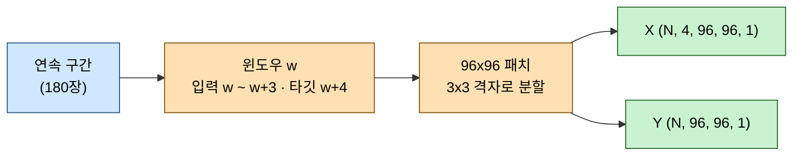

# ConvLSTM_prediction.ipynb 처리 내용

> 기준 데이터: GK2A AMI SW038, 2025-10-17 UTC 00:00~23:58, 710장.
> 실행 환경: Apple M1 Pro (16GB), TensorFlow 2.15.0 + tensorflow-metal.
> 모델 원리는 [convlstm_principles.md](convlstm_principles.md)를 먼저 읽으면 이해가 빠르다.
> Google Colab(T4) 에서 돌리려면 7.5 절의 `nc_predict_colab.py` / `ConvLSTM_prediction_colab.ipynb` 를 쓴다.

GK2A 위성영상으로 **2분 뒤 프레임을 예측**하는 파이프라인이 각 단계에서 무엇을, 왜 그렇게
처리하는지 정리한다. 특히 **에러 없이 조용히 잘못되는 지점** 세 곳을 중심으로 설명한다.

---

## 1. 핵심 요약

| 단계 | 입력 → 출력 | 핵심 처리 |
| --- | --- | --- |
| 1. 적재 | `.nc` 710개 → `(710, 500, 500)` | 파일명 timestamp로 시간 정렬 |
| 2. 구간 분리 | 710장 → 연속 구간 3개 | 관측 결측 지점에서 시퀀스를 끊는다 |
| 3. 다운샘플 | 500×500 → 250×250 | 정수배(2배) 평균 풀링 |
| 4. 정규화 | raw DN → `[0, 1]` | 전역 min/max |
| 5. 데이터셋 | 프레임 → `(5022, 4, 96, 96, 1)` | 구간 내 슬라이딩 윈도우 + 96×96 패치 |
| 6. 학습 | 패치 → 다음 프레임 패치 | ConvLSTM 2층, 잔차 + SSIM 손실 |
| 7. 추론 | `(4, 250, 250)` → `(250, 250)` | fully-conv라 전체 프레임 한 번에 |

실측 성능은 다음과 같다. Persistence는 "다음 프레임 = 현재 프레임"이라는 무학습 기준선이다.

| 평가 대상 | MAE | SSIM | 개선율 |
| --- | --- | --- | --- |
| Persistence (validation) | 0.00623 | 0.9595 | 기준 |
| ConvLSTM 1 epoch | 0.00475 | 0.9831 | +23.7% |
| ConvLSTM 2 epoch | 0.00453 | 0.9859 | +27.3% |
| **ConvLSTM 4 epoch** | **0.00392** | **0.9866** | **+37.1%** |

> [!IMPORTANT]
> 데이터가 30장(1시간)이던 시절에는 이 베이스라인을 넘지 못했다.
> 710장(하루치)으로 늘리자 **1 epoch 만에 넘는다.** 모델 구조는 그대로다.

---

## 2. 입력 데이터

### 2.1 파일 규격

| 항목    | 값                                            |
| ----- | -------------------------------------------- |
| 출처    | AWS Open Data `s3://noaa-gk2a-pds` (익명 접근)   |
| 채널    | SW038 (단파적외 3.8µm)                           |
| 영역    | `la020ge` — Local Area 2km, GEOS 투영, 500×500 |
| 관측 주기 | 2분                                           |
| 변수명   | `image_pixel_values` (uint16 raw DN)         |
| 파일 크기 | 약 0.40MB/장, 하루 710장 = 287MB                  |

```bash
python3 gk2a_download.py --date 2025-10-17 --channel sw038 --out resource/netcdf
```

> 주의: 기존에 쓰던 `ko020lc`(900×900 Lambert)와 **투영과 해상도가 다르다.**
> 두 세트를 한 디렉터리에 섞으면 `np.stack` 단계에서 shape 불일치로 실패한다.

### 2.2 시간 정렬

파일명 끝 12자리(`YYYYMMDDHHMM`)를 기준으로 정렬한다. 사전순 정렬이 곧 시간순이 되는 형식이므로
문자열 비교로 충분하지만, 이후 결측 판정에 쓰기 위해 `datetime`으로도 파싱해 둔다.

---

## 3. 전처리에서 조용히 잘못되는 세 지점

| 함정 | 증상 | 대응 |
| --- | --- | --- |
| 관측 결측 | 12분 점프를 2분 변화로 학습 | 연속 구간으로 분리 |
| `TARGET` 비정수배 | 다운샘플 대신 크롭, 영역 64% 소실 | 정수배 검증 후 `ValueError` |
| `STRIDE` 과대 | 좌상단 59%만 학습 | `STRIDE = 77`로 전 영역 커버 |

세 가지 모두 **예외가 발생하지 않고 정상처럼 통과**한다는 공통점이 있다.

### 3.1 관측 결측 — 연속 구간 분리

하루는 720장이어야 하지만 실제로는 710장이다. 위성 정기 점검으로 두 구간이 비어 있다.

| 결측 구간 | 간격 | 누락 |
| --- | --- | --- |
| 05:58 → 06:10 | 12분 | 5장 |
| 21:08 → 21:20 | 12분 | 5장 |

인덱스를 연속으로 가정하고 슬라이딩 윈도우를 만들면, 경계를 걸친 윈도우가 **12분 변화를 2분 변화의
정답으로 학습**한다. 구름은 12분이면 눈에 띄게 이동하므로 오염된 라벨이 된다.

`find_segments()`가 timestamp 차이를 검사해 구간을 끊는다.

```python
def find_segments(ts, step_min=2):
  """[(start, end), ...] 형태의 연속 구간 목록. end 는 exclusive."""
  segments, start = [], 0
  for i in range(1, len(ts)):
    if ts[i] - ts[i - 1] != timedelta(minutes=step_min):
      segments.append((start, i))
      start = i
  segments.append((start, len(ts)))
  return segments
```

결과는 다음 세 구간이다.

| 구간 | 인덱스 | 시각 (UTC) | 프레임 |
| --- | --- | --- | --- |
| 1 | `[0:180]` | 00:00 ~ 05:58 | 180 |
| 2 | `[180:630]` | 06:10 ~ 21:08 | 450 |
| 3 | `[630:710]` | 21:20 ~ 23:58 | 80 |

이후 윈도우 생성, Persistence 계산, 최종 추론이 모두 이 구간 경계를 존중한다.

### 3.2 다운샘플 — `TARGET`은 정수배 약수여야 한다

원본 500×500을 그대로 쓰면 학습이 느리므로 250×250으로 줄인다. 평균 풀링(area)을 쓰는 이유는
subsampling과 달리 **구름 구조를 뭉개지 않고 보존**하기 때문이다.

문제는 `TARGET` 값이다. 기존 코드는 900×900 데이터 기준으로 `TARGET = 300`(3배)이었는데,
500×500에 그대로 적용하면 `500 // 300 == 1`이 되어 다음과 같이 동작한다.

| `TARGET` | `fy = H // TARGET` | 실제 동작 | 결과 |
| --- | --- | --- | --- |
| 300 | 1 | 좌상단 300×300 **크롭** | 영역의 64% 소실 |
| 250 | 2 | 2×2 평균 풀링 | 정상 |

출력 shape가 `(300, 300)`으로 나오기 때문에 **에러도 경고도 없다.** 아래 가드를 추가해
비정수배일 때 즉시 실패하도록 했다.

```python
if H % target or W % target:
  raise ValueError(
    f'TARGET={target} 는 원본 {H} 의 정수배 약수가 아니다. '
    f'그대로 두면 평균풀링이 아니라 좌상단 {target}x{target} 크롭이 된다.')
```

### 3.3 정규화 — 전역 min/max와 주야 문제

전체 프레임의 min/max로 `[0, 1]` 구간에 맞춘다. 측정된 범위는 `min=14848.5, max=16361.5`이다.

프레임별 정규화가 아니라 **전역 정규화를 쓰는 이유**는 프레임 간 밝기 변화 자체가 예측 대상이기
때문이다. 프레임마다 따로 정규화하면 그 변화가 지워진다.

다만 SW038은 단파적외 채널이라 주간에 태양 반사 성분이 더해져 값 분포가 달라진다.

| 시간대 | 프레임 간 MAE | 비고 |
| --- | --- | --- |
| 주간 (00~06 UTC = 09~15 KST) | 0.01470 | 태양 반사 영향 |
| 야간 (06~24 UTC) | 0.00574 | 안정 |
| 전체 | 0.00801 | 주간이 야간의 **2.6배** |

한 모델이 서로 다른 두 물리 체계를 함께 학습하는 셈이다. 조건을 통일하려면 `HOURS` 파라미터로
시간대를 제한한다.

```python
HOURS = range(6, 24)   # 주간 태양반사 구간 제외 (= 15~08 KST)
```

---

## 4. 학습 데이터셋 구성

### 4.1 슬라이딩 윈도우와 패치

프레임 4장을 입력으로 다음 1장을 맞히는 윈도우를, **각 연속 구간 내부에서만** 생성한다.
각 윈도우는 다시 96×96 패치로 잘라 샘플 수를 늘린다.

윈도우는 **stride 1로 겹치게** 만든다. 즉 `[0,1,2,3]→4` 다음이 `[1,2,3,4]→5`다.
겹치지 않게 4장씩 끊으면 프레임을 4분의 1만 활용하게 된다.
구간 하나에서 만들 수 있는 윈도우는 `길이 - IN_FRAMES`개이므로 전체는 다음과 같다.

$$(180 - 4) + (450 - 4) + (80 - 4) = 176 + 446 + 76 = 698$$

710장이 한 덩어리였다면 706개였겠지만, 구간이 3개로 끊겨 경계마다 3개씩 손실이 생긴다.



### 4.2 `STRIDE`가 커버리지를 결정한다

250×250에서 96 패치를 자를 때 `STRIDE` 값에 따라 학습에 쓰이는 영역이 달라진다.

| `STRIDE` | 패치 시작 위치 | 격자 | 커버 영역 | 커버리지 |
| --- | --- | --- | --- | --- |
| 96 | `[0, 96]` | 2×2 | 192×192 | 59% |
| **77** | `[0, 77, 154]` | 3×3 | 250×250 | **100%** |

`STRIDE = 96`이면 우측·하단 영역이 학습에서 완전히 빠진다. `154 + 96 = 250`이 되는
`STRIDE = 77`을 쓰면 약간 겹치면서 전 영역을 덮는다.

### 4.3 train/val 분할 — 시간 순서와 누수 차단

시계열이므로 무작위 셔플은 금지다. 윈도우를 시간순으로 앞 80% / 뒤 20%로 나눈다.

여기에 한 가지 함정이 더 있다. 경계에서 val의 **입력**이 train의 **타깃**을 포함하면 누수가 된다.
`IN_FRAMES`만큼 띄워서 끊는다.

```python
train_starts = starts[:cut]
val_starts   = starts[cut + IN_FRAMES:]   # 경계 4개를 버려 누수 차단
```

| 항목 | 값 |
| --- | --- |
| 전체 윈도우 | 698개 |
| train | 558 윈도우 → `(5022, 4, 96, 96, 1)`, 0.93GB |
| val | 136 윈도우 → `(1224, 4, 96, 96, 1)`, 0.23GB |
| train 기간 | 00:00 ~ 19:00 UTC |
| val 기간 | 19:02 ~ 23:58 UTC |

> 팁: `build_dataset()`은 `np.empty`로 배열을 먼저 할당하고 채운다.
> list에 append한 뒤 `np.array`로 변환하면 피크 메모리가 2배가 되어 1GB급 데이터에서는 부담이 된다.

---

## 5. 모델

파라미터 28,497개의 소형 ConvLSTM이다. 층별 매개변수와 각 층이 실제로 만들어내는 것은
[convlstm_model_structure.md](convlstm_model_structure.md)에서 그림과 함께 다루고,
레이어별 shape 표는 [nc_model_architecture.md](../nc_model_architecture.md)에 있다.
여기서는 설계 의도만 정리한다.

| 요소 | 선택 | 이유 |
| --- | --- | --- |
| Functional API | Sequential 대신 | 입력에서 갈래가 나와 끝에서 합쳐지는 Y자 구조라 일직선으로 표현 불가 |
| 잔차 `Add` | 예측 = 마지막 프레임 + Δ | 변화량만 학습해 예측 흐릿함 완화 |
| 출력 activation | `None` (linear) | Δ는 음수가 될 수 있다 |
| 입력 크기 고정 `h, w` | Keras 2/3 호환 | Keras 3의 ConvLSTM은 `None`을 불허 → 추론 시 가중치 이전 (7.2 참고) |
| BatchNorm 미사용 | — | Metal 백엔드가 5D BatchNorm을 지원하지 않는다 |
| `mixed_float16` | 활성화 | 손실·출력층만 float32로 고정해 수치 안정성 확보 |

손실 함수는 MAE와 SSIM을 절반씩 결합한다.

```python
def ssim_mae_loss(y_true, y_pred):
  mae = tf.reduce_mean(tf.abs(y_true - y_pred))
  ssim = tf.reduce_mean(tf.image.ssim(y_true, y_pred, max_val=1.0))
  return 0.5 * mae + 0.5 * (1.0 - ssim)
```

---

## 6. 학습과 평가

### 6.1 학습 설정

| 항목 | 값 |
| --- | --- |
| batch size | 16 (314 step/epoch) |
| optimizer | `legacy.Adam(1e-3)` — Apple Silicon에서 더 빠름 |
| callbacks | EarlyStopping(patience 8), ReduceLROnPlateau(patience 4) |
| 소요 시간 | 1 epoch 약 4분, 4 epoch 13.4분 (M1 Pro + Metal) |

### 6.2 Persistence 베이스라인이 기준선인 이유

2분 간격에서는 구름이 거의 움직이지 않으므로, "다음 = 현재"라는 무학습 규칙이 이미 상당히 정확하다.
이 값을 넘지 못하면 학습에 의미가 없다.

베이스라인 계산에서도 **연속 구간 경계 2쌍은 제외**한다(709쌍 중 707쌍 사용).
제외하지 않으면 12분 간격 쌍이 섞여 베이스라인이 실제보다 나쁘게 나오고, 모델이 부당하게 유리해진다.

### 6.3 결과

validation 패치 기준 성능이다.

| 모델 | MAE | SSIM |
| --- | --- | --- |
| Persistence | 0.00623 | 0.9595 |
| ConvLSTM 1 epoch | 0.00475 | 0.9831 |
| ConvLSTM 2 epoch | 0.00453 | 0.9859 |
| ConvLSTM 4 epoch | **0.00392** | **0.9866** |

SSIM 은 1 이 만점이라 0.9595 → 0.9866 이 작아 보이지만, `1 - SSIM` 으로 뒤집으면
0.0405 → 0.0134 로 **3.0배** 줄어든 것이다. 읽는 법은 [ssim_explained.md](ssim_explained.md) 참고.

전체 프레임(250×250) 추론에서도 같은 경향이 유지된다. 마지막 연속 구간에서
23:50~23:56 4장을 입력해 23:58을 예측한 결과다.

| 모델 | MAE | SSIM |
| --- | --- | --- |
| Persistence | 0.01091 | 0.9204 |
| ConvLSTM 2 epoch | 0.00748 | 0.9713 |
| ConvLSTM 4 epoch | **0.00662** | **0.9728** |

---

## 7. 실행 가이드와 튜닝 포인트

### 7.1 실행 전 확인

> [!WARNING]
> Jupyter 커널은 반드시 `/usr/local/bin/python3` (3.11) 환경이어야 한다.
> 등록된 기본 `python3` 커널은 homebrew 3.13이라 `xarray`, `tensorflow`가 없어 첫 셀부터 실패한다.

| 확인 항목 | 방법 |
| --- | --- |
| 데이터 존재 | `ls resource/netcdf/*.nc \| wc -l` → 710 |
| GPU 인식 | 2번 셀 출력에 `PhysicalDevice(... GPU)` |
| 한글 폰트 | 그래프 제목이 □로 깨지지 않는지 (`AppleGothic` 설정됨) |
| Keras 버전 | 2와 3 모두 지원 (아래 참고) |

### 7.2 Keras 3 (Colab) 호환

Keras 3의 ConvLSTM은 **입력 높이/너비에 `None`을 허용하지 않는다.**
`keras.Input(shape=(4, None, None, 1))`로 두면 Colab에서 다음 에러로 멈춘다.

```
ValueError: ConvLSTM layers only support static input shapes for the spatial dimension.
Received invalid input shape: input_shape=(None, 4, None, None, 1)
```

그래서 `build_model(h, w)`로 **크기를 고정해** 만들고, 전체 프레임 추론이 필요할 때
그 크기로 모델을 새로 만들어 가중치를 옮긴다.

```python
model = build_model()                                            # 학습용 96x96
infer_model = build_model(h=frames_n.shape[1], w=frames_n.shape[2])   # 추론용 250x250
infer_model.set_weights(model.get_weights())
```

커널을 전 위치에서 공유하므로 **가중치는 입력 크기와 무관**하다. 따라서 이 방식으로도
"작게 배워 크게 추론"하는 fully-conv 성질이 그대로 유지된다.
실제로 96×96 모델과 250×250 모델의 예측값을 겹치는 영역에서 비교하면 차이가 `0.00e+00`이다.

| 항목 | Keras 2 (TF 2.15) | Keras 3 (TF 2.21) |
| --- | --- | --- |
| 입력 `None` 크기 | 허용 | **불가** |
| `optimizers.legacy` | 있음 | 네임스페이스는 남아 있으나 `Adam` 생성 시 `ImportError` (`try/except`로 표준 Adam 대체, `getattr` 검사로는 부족) |
| `Lambda` 동적 shape | 추론됨 | 추론 실패 (`Layer` 상속으로 회피) |
| 파라미터 수 | 28,497 | 28,497 (동일) |

> `TakeLastFrame`을 `Lambda` 대신 `Layer` 상속으로 만든 것도 같은 맥락이다.
> Lambda는 Python 바이트코드로 저장돼 다른 환경에서 불러오기 어렵고, Keras 공식 문서도 상속을 권장한다.

### 7.3 파라미터 튜닝

| 파라미터 | 기본값 | 조정 방향 |
| --- | --- | --- |
| `EPOCHS` | 4 | 결과 확인만 하려면 2 (약 8분), 최종 학습은 20 (EarlyStopping 이 조기 종료) |
| `TARGET` | 250 | 500의 정수배 약수만 가능 (250, 125, 100) |
| `STRIDE` | 77 | 줄이면 샘플 증가·메모리 증가 |
| `FILTERS` | 16 | 32로 올리면 표현력↑, 속도 절반 |
| `IN_FRAMES` | 4 | 늘리면 장기 문맥↑, 메모리 비례 증가 |
| `HOURS` | `None` | `range(6, 24)`로 주간 제외 |

### 7.4 다음으로 시도해 볼 것

- **주야 분리 학습**: `HOURS = range(6, 24)`로 야간만 학습해 조건을 통일하면 성능이 어떻게 변하는지 비교
- **채널 교체**: `ir105`(적외 10.5µm)는 주야 영향이 없어 하루 전체를 균질하게 쓸 수 있다
- **다중 스텝 예측**: 예측을 다시 입력으로 넣어 4분·6분 뒤까지 확장 (오차 누적 확인 필요)
- **데이터 확대**: 여러 날짜를 받아 날짜별로 세그먼트를 분리하면 일반화 성능 검증이 가능하다

### 7.5 Google Colab (T4) 실행

노트북을 그대로 Colab 에 올리면 macOS 전용 설정(`AppleGothic`, `tensorflow-metal`, 로컬 경로)에서 막힌다.
그래서 같은 파이프라인을 Colab 용으로 옮긴 **스크립트를 원본**으로 두고, Colab 에 올릴 노트북은 그 스크립트에서 자동 생성한다.

데이터·학습·평가는 공통 모듈 `nc_pipeline.py` 에 있고, 모델 파일은 `build_model()` 과 `MODEL_NAME` 만 정의한다.
세 모델(ConvLSTM · SimVP · PredRNN-V2)의 구조 비교와 배포 절차는 [model_comparison.md](model_comparison.md) 에 있다.

| 파일 | 역할 | 비고 |
| --- | --- | --- |
| `nc_pipeline.py` | 공통 파이프라인 (적재·세그먼트·정규화·데이터셋·손실·학습·평가·`metrics.json`) | 모델 3개가 그대로 공유한다 |
| `nc_predict_colab.py` | ConvLSTM 엔트리 (`MODEL_NAME` + `build_model`) | 로컬 Keras 2 에서도 그대로 동작 |
| `simvp_predict_colab.py` | SimVP 엔트리 | 574,257 params (`filters=16`) |
| `predrnn_v2_predict_colab.py` | PredRNN-V2 엔트리 | 63,494 params (`filters=16`) |
| `tools/build_colab_notebook.py` | `.py` 를 섹션 단위 셀로 잘라 `.ipynb` 생성 | `--model`, `--profile`, `--all`, `--root` |
| `ConvLSTM_prediction_colab.ipynb`, `SimVP_prediction[_colab].ipynb`, `PredRNN_V2_prediction[_colab].ipynb` | 생성 노트북 5개 | 직접 수정하지 않는다. `ConvLSTM_prediction.ipynb` 만 수작업 |
| `tools/build_report.py` | `results/*/metrics.json` + png → `site/index.html` | 외부 리소스 없는 단일 파일 |
| `netlify.toml` | `publish = "site"`, build command 없음 | repo 를 Netlify 에 연결하면 그대로 배포된다 |
| `tests/` | 파이프라인·모델 3종·생성기·리포트 테스트 77건 | 데이터 없이 실행 가능 |

Google Drive 경로는 다음과 같다. 스크립트 상수 `COLAB_DATA_DIR`, `COLAB_OUT_DIR` 또는 노트북 마지막 셀의 `Config(...)` 에서 바꾼다.
로컬 실행의 기본 출력은 `results/` (`LOCAL_OUT_DIR`) 이고 구조는 Drive 쪽과 같다.

| 경로 | 내용 |
| --- | --- |
| `MyDrive/netcdf/*.nc` | 입력 데이터. `gk2a_download.py` 로 받아 업로드한다. zip 이면 `MyDrive/netcdf.zip` 을 `data_zip` 으로 지정 |
| `MyDrive/nc_predict_output/<Model>/` | `metrics.json`, `samples.png`, `hourly_mean.png`, `history.png`, `full_frame_prediction.png`, `train_log.csv`, 가중치 2개, `pred_next.npy` |
| `MyDrive/nc_predict_output/cache/frames_sw038_t250.npz` | 다운샘플 프레임 캐시 (178 MB). 모델끼리 공유하고, 두 번째 실행부터 `.nc` 를 읽지 않는다 |
| `results/<Model>/` (로컬) | 위와 같은 구성. `tools/build_report.py` 가 이 디렉터리를 읽는다 |

실행 순서:

1. Colab 메뉴 파일 > 노트 업로드로 `<Model>_prediction_colab.ipynb` 를 연다. `.py` 는 노트 업로드가 되지 않는다.
2. 런타임 > 런타임 유형 변경 > T4 GPU 를 확인한다. `_colab` 노트북 메타데이터에 T4 가 지정돼 있어 보통 자동 선택된다.
3. 마지막 셀의 `Config(...)` 에서 `epochs`, `hours`, `data_zip` 을 필요에 맞게 바꾸고 런타임 > 모두 실행. Drive 마운트 승인 창이 뜨면 허용한다.
4. 끝나면 `MyDrive/nc_predict_output/<Model>/` 을 repo 의 `results/<Model>/` 로 복사하고 `python3 tools/build_report.py` 로 리포트를 갱신한다.

```bash
# .py 를 고친 뒤 노트북 재생성 (생성 대상 5개 전부)
python3 tools/build_colab_notebook.py --all

# 하나만
python3 tools/build_colab_notebook.py --model simvp --profile colab

# 단위 테스트
/usr/local/bin/python3 -m pytest tests -q

# .py 를 Colab 파일 패널로 올렸을 때 (노트북 대신)
%run simvp_predict_colab.py --epochs 2 --hours 6 7 8 9 10 11
```

로컬 노트북과 다른 점:

| 항목 | 로컬 노트북 | Colab 스크립트 |
| --- | --- | --- |
| 한글 폰트 | `AppleGothic` | `fonts-nanum` 을 apt 로 설치한 뒤 `NanumGothic` 등록 |
| mixed precision | Metal 이라 효과 제한 | T4(compute capability 7.5) 에서 실제 가속 |
| 데이터 I/O | 로컬 디스크 | Drive 는 파일 단위 읽기가 느려 npz 캐시 사용 |
| 세션 끊김 대비 | 없음 | 매 epoch best 가중치를 Drive 에 체크포인트, CSV 로그 |
| Persistence SSIM | 프레임 1장씩 계산 | 64장 단위 batch 계산 |
| 파일 핸들 | `xr.open_dataset` 그대로 | 컨텍스트 매니저로 닫아 710개 핸들 누수 방지 |

> 주의: Keras 2(TF 2.15, M1)와 Keras 3(TF 2.21, CPU) 양쪽에서 smoke 실행(`--hours 23 --epochs 1`)까지 확인했지만,
> **T4 에서의 epoch 당 시간은 아직 측정하지 않았다.** 스크립트가 step 수와 실측 시간을 로그로 남긴다.

---

## 참고

- 모델 원리: [convlstm_principles.md](convlstm_principles.md)
- 모델 원리 (비유 중심 입문): [convlstm_easy_guide.md](convlstm_easy_guide.md)
- SSIM 지표 상세: [ssim_explained.md](ssim_explained.md)
- 윈도우·패치·샘플·파라미터 그림 설명: [terms_visual_guide.md](terms_visual_guide.md)
- 모델 구조 상세: [../nc_model_architecture.md](../nc_model_architecture.md)
- 데이터 다운로더: [../gk2a_download.py](../gk2a_download.py)
- 노트북: [../ConvLSTM_prediction.ipynb](../ConvLSTM_prediction.ipynb)
- Colab 스크립트: [../nc_predict_colab.py](../nc_predict_colab.py)
- Colab 노트북 (자동 생성): [../ConvLSTM_prediction_colab.ipynb](../ConvLSTM_prediction_colab.ipynb)
- 노트북 생성기: [../tools/build_colab_notebook.py](../tools/build_colab_notebook.py)
- 단위 테스트: [../tests/test_nc_pipeline.py](../tests/test_nc_pipeline.py)
