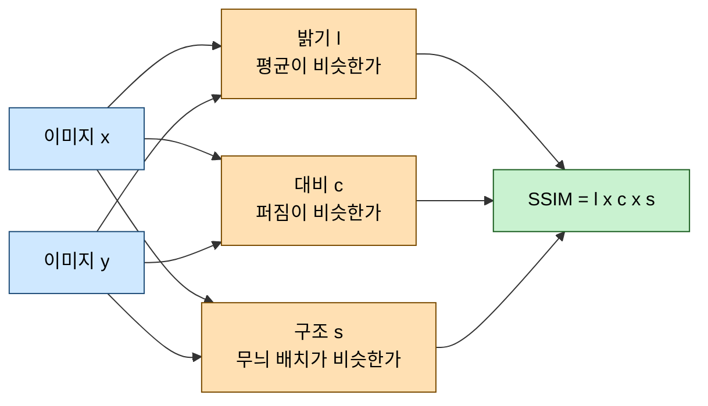

# SSIM: 두 이미지가 얼마나 닮았는가

> 이 문서의 모든 수치는 `resource/netcdf` 의 실제 GK2A 구름 프레임(250×250, 0~1 정규화)으로
> 직접 측정한 값이다. TensorFlow `tf.image.ssim(..., max_val=1.0)` 기준.
> ConvLSTM 자체는 [convlstm_principles.md](convlstm_principles.md), 쉬운 설명은
> [convlstm_easy_guide.md](convlstm_easy_guide.md) 에 있다.

**SSIM**(Structural SIMilarity, 구조적 유사도)은 두 이미지가 사람 눈에 얼마나 비슷해 보이는지를
0~1 로 재는 지표다. `ConvLSTM_prediction.ipynb` 는 이것을 **평가 지표이자 손실 함수의 절반**으로 쓴다.

---

## 1. 핵심 요약 — MAE 와 무엇이 다른가

| | MAE | SSIM |
| --- | --- | --- |
| 재는 것 | 픽셀 값이 **얼마나** 어긋났나 | 무늬와 구조가 **어떻게** 달라졌나 |
| 계산 범위 | 픽셀 하나씩 독립 | 이웃 11×11 을 함께 |
| 좋은 값 | 0 에 가까울수록 | **1 에 가까울수록** |
| 손실로 쓸 때 | 그대로 | **`1 - SSIM`** 으로 뒤집어서 |
| 못 잡는 것 | 흐릿해짐, 구조 붕괴 | 절대 오차의 크기 |

> [!IMPORTANT]
> MAE 는 **얼마나** 틀렸는지만 보고, SSIM 은 **무엇이** 틀렸는지를 본다.
> 그래서 둘을 절반씩 섞어 쓴다.

---

## 2. MAE 만으로는 부족한 이유

같은 구름 사진에 서로 다른 왜곡을 주되, **MAE 가 모두 0.030 이 되도록** 크기를 맞춰 측정했다.

| 왜곡 방식 | MAE | SSIM | 1 − SSIM |
| --- | --- | --- | --- |
| 원본 그대로 | 0.00000 | 1.0000 | 0.0000 |
| 전체를 똑같이 밝게 | 0.03018 | **0.9973** | 0.0027 |
| 5×5 블러 (흐릿하게) | 0.03038 | **0.7090** | 0.2910 |
| 랜덤 노이즈 추가 | 0.03014 | **0.7814** | 0.2186 |

MAE 는 셋 다 "똑같이 0.030 만큼 틀렸다"고 판정한다. 하지만 SSIM 은 전혀 다르게 본다.

- **전체를 밝게**: 구름의 모양과 배치는 그대로다 → 0.9973, 거의 같은 그림으로 인정
- **블러**: 값의 어긋남은 같지만 경계가 뭉개졌다 → 0.7090, 크게 감점
- **노이즈**: 무늬가 지저분해졌다 → 0.7814, 역시 감점

이 차이가 next-frame prediction 에서 결정적이다. 신경망은 확신이 없으면 **흐릿하게 그려서
MAE 를 줄이려는 습성**이 있는데, MAE 만 손실로 쓰면 이 꼼수를 막을 수 없다.
SSIM 을 손실에 섞으면 "흐릿하게 그리면 크게 감점된다"는 압력이 생긴다.

---

## 3. SSIM 은 세 가지를 각각 본다

SSIM 은 두 이미지를 **밝기 · 대비 · 구조** 세 항목으로 나눠 채점하고 곱한다.



| 항목 | 무엇을 재나 | 쉬운 말로 |
| --- | --- | --- |
| 밝기 (luminance) | 두 이미지의 **평균**이 비슷한가 | 전체적으로 비슷하게 밝은가 |
| 대비 (contrast) | 두 이미지의 **표준편차**가 비슷한가 | 선명함이 비슷한가 |
| 구조 (structure) | 두 이미지의 **상관관계**가 높은가 | 밝은 곳과 어두운 곳의 배치가 같은가 |

핵심은 **구조** 항이다. 밝기와 대비를 각각 정규화해 제거하고 남는 "무늬 그 자체"를 비교한다.
구름이 통째로 밝아지거나 어두워져도 구조 점수는 유지된다.

---

## 4. 수식

세 항목은 각각 이렇게 정의된다. $\mu$ 는 평균, $\sigma$ 는 표준편차, $\sigma_{xy}$ 는 공분산이다.

$$
l(x,y) = \frac{2\mu_x\mu_y + C_1}{\mu_x^2 + \mu_y^2 + C_1}, \qquad
c(x,y) = \frac{2\sigma_x\sigma_y + C_2}{\sigma_x^2 + \sigma_y^2 + C_2}, \qquad
s(x,y) = \frac{\sigma_{xy} + C_3}{\sigma_x\sigma_y + C_3}
$$

$$\text{SSIM}(x,y) = l(x,y) \cdot c(x,y) \cdot s(x,y)$$

세 식이 모두 $\dfrac{2ab}{a^2+b^2}$ 꼴이라는 점에 주목하면 이해가 쉽다.
$a = b$ 일 때 값이 정확히 1 이고, 두 값이 벌어질수록 0 으로 떨어진다.

세 항을 곱한 뒤 정리하면 흔히 쓰는 한 줄짜리 형태가 된다.

$$\text{SSIM}(x,y) = \frac{(2\mu_x\mu_y + C_1)(2\sigma_{xy} + C_2)}{(\mu_x^2 + \mu_y^2 + C_1)(\sigma_x^2 + \sigma_y^2 + C_2)}$$

### 상수 $C_1, C_2$ 는 왜 있나

분모가 0 에 가까워질 때 값이 폭발하는 것을 막는 안정화 항이다.
$L$ 은 픽셀 최대값이고, 기본 계수는 $K_1 = 0.01$, $K_2 = 0.03$ 이다.

$$C_1 = (K_1 L)^2, \qquad C_2 = (K_2 L)^2, \qquad C_3 = C_2 / 2$$

> [!WARNING]
> $L$ 이 곧 `max_val` 인자다. **데이터 범위와 반드시 일치시켜야 한다.**
> 0~1 로 정규화한 데이터에 `max_val=255` 를 넘기면 $C_1, C_2$ 가 과도하게 커져
> 모든 쌍이 1 에 가까운 값으로 나오고, 지표가 사실상 무력해진다.
> `ConvLSTM_prediction.ipynb` 가 `max_val=1.0` 을 쓰는 것은 앞 셀에서 0~1 정규화를 했기 때문이다.

---

## 5. 전역이 아니라 11×11 창으로 계산한다

SSIM 을 이미지 전체의 평균·분산으로 한 번만 계산하면 안 된다. 실제로 해보면 이렇다.

| 왜곡 | 전역 통계로 분해한 구조 항 | 전역 SSIM(근사) | 실제 `tf.image.ssim` |
| --- | --- | --- | --- |
| 5×5 블러 | 0.9787 | 약 0.978 | **0.7090** |
| 랜덤 노이즈 | 0.9873 | 약 0.987 | **0.7814** |

전역 통계로는 블러가 거의 완벽해 보인다. 이미지 **전체**의 평균과 분산은 블러를 걸어도
크게 변하지 않기 때문이다. 그러나 우리가 잃은 것은 "동네마다의 무늬"다.

그래서 실제 SSIM 은 **11×11 가우시안 창을 한 칸씩 밀면서 위치마다 점수를 매기고, 그 평균**을 낸다.
지역 창으로 봐야 경계가 뭉개진 것이 드러난다.

> 창 크기가 11 이므로 **이미지 한 변이 11 보다 작으면 계산이 불가능하다.**
> `ConvLSTM_prediction.ipynb` 의 96×96 패치와 250×250 전체 프레임은 모두 충분히 크다.

---

## 6. TensorFlow 에서 쓸 때

`tf.image.ssim(a, b, max_val=1.0)` 한 줄이면 위 수식을 전부 계산해 준다.
직접 구현한 값과 대조하면 차이가 `1.8e-07` (float32 정밀도 한계)로, **같은 계산**임이 확인된다.

다만 네 가지는 알고 써야 한다.

| 항목 | 내용 |
| --- | --- |
| 반환값 | 스칼라가 아니라 **배치별 점수** `(N,)` |
| 입력 | 반드시 4차원 `(N, H, W, C)` |
| 미분 | **가능** — 그래서 손실로 쓸 수 있다 |
| 최소 크기 | 한 변이 `filter_size`(11) 이상이어야 한다 |

### 반환값이 벡터라는 점

```python
tf.image.ssim(x, y, max_val=1.0)   # 입력 (2, 64, 64, 1) -> 반환 (2,)
# array([0.98557496, 0.98524666])
```

배치마다 점수가 하나씩 나오므로 **`tf.reduce_mean` 으로 한 번 더 묶어야** 한 개의 손실값이 된다.
`ConvLSTM_prediction.ipynb` 의 `ssim_metric()` 과 `ssim_mae_loss()` 가 모두 `reduce_mean` 을 거치는 이유다.

입력 차원을 맞추는 코드도 같은 맥락이다.

```python
a = a[..., None]        # (N, H, W)    -> (N, H, W, 1)   채널 축 추가
frames_n[i][None]       # (H, W)       -> (1, H, W)      배치 축 추가
```

### 미분이 되기 때문에 손실이 될 수 있다

```
gradient 계산 성공 : True
gradient shape     : (2, 64, 64, 1)   입력과 같은 모양
0 이 아닌 값 비율   : 100.0%
```

모든 평가 지표가 이렇지는 않다. 정확도(accuracy)처럼 계단 모양인 지표는 기울기가 0 이거나
정의되지 않아 손실로 쓸 수 없다. SSIM 은 연속이고 미분 가능해서
**평가 지표와 손실 함수를 겸할 수 있다.**

### 기본 파라미터

```python
tf.image.ssim(img1, img2, max_val,
              filter_size=11, filter_sigma=1.5, k1=0.01, k2=0.03)
```

네 값 모두 원논문의 표준값이라 보통 건드리지 않는다.
반면 `max_val` 은 기본값이 없어 **반드시 직접 넘겨야 한다**(4장의 경고 참고).

> [!WARNING]
> 한 변이 11 보다 작은 이미지를 넣으면 `InvalidArgumentError` 가 난다.
> 창을 놓을 자리가 없기 때문이다. 작은 패치로 학습할 때 `PATCH` 를 11 미만으로 줄이면 여기서 막힌다.

---

## 7. 손실 함수로 쓰기

SSIM 은 **클수록 좋은** 지표라 그대로는 손실이 될 수 없다. 손실은 작을수록 좋아야 하므로 뒤집는다.

$$\mathcal{L} = 0.5 \cdot \text{MAE} + 0.5 \cdot (1 - \text{SSIM})$$

```python
def ssim_mae_loss(y_true, y_pred):
  mae = tf.reduce_mean(tf.abs(y_true - y_pred))
  ssim = tf.reduce_mean(tf.image.ssim(y_true, y_pred, max_val=1.0))
  return 0.5 * mae + 0.5 * (1.0 - ssim)
```

두 항이 서로 다른 실패를 막는다.

| 항 | 막아 주는 것 |
| --- | --- |
| MAE | 값 자체가 크게 어긋나는 것 |
| 1 − SSIM | 흐릿해지고 경계가 뭉개지는 것 |

---

## 8. 우리 프로젝트의 SSIM 읽는 법

`ConvLSTM_prediction.ipynb` 의 실측 결과다.

| 모델 | MAE | SSIM | 1 − SSIM |
| --- | --- | --- | --- |
| Persistence | 0.00623 | 0.9595 | 0.0405 |
| ConvLSTM (4 epoch) | 0.00392 | 0.9866 | 0.0134 |

SSIM 만 보면 0.9595 → 0.9866, **겨우 0.027 오른 것처럼 보인다.**
하지만 SSIM 은 1 이 만점이라 상단이 압축돼 보이는 지표다. `1 - SSIM`("안 닮은 정도")으로 바꾸면
0.0405 → 0.0134, 즉 **3.0배 줄었다.**

> [!TIP]
> SSIM 이 0.95 를 넘어가면 소수점 뒤 변화가 눈에 잘 안 들어온다.
> 개선 폭을 볼 때는 항상 `1 - SSIM` 으로 바꿔서 비교하라. 0.99 와 0.98 은
> 1% 차이가 아니라 **안 닮은 정도가 2배** 차이다.

---

## 9. 언제 무엇을 쓸 것인가

| 상황 | 선택 | 이유 |
| --- | --- | --- |
| 출력이 이미지이고 선명도가 중요 | MAE + (1−SSIM) 혼합 | 흐릿해지는 것을 막는다 |
| 픽셀 값의 물리적 정확도가 목적 | MAE 또는 MSE 단독 | SSIM 은 절대 오차를 통제하지 않는다 |
| 이미지가 11×11 보다 작음 | SSIM 사용 불가 | 창을 놓을 수 없다 |
| 밝기 차이를 무시하고 구조만 보고 싶음 | SSIM 의 구조 항 단독 | 밝기·대비 항을 빼고 계산 |
| 사람 눈의 판단과 더 맞추고 싶음 | MS-SSIM | 여러 해상도에서 SSIM 을 재 평균낸다 |

> [!WARNING]
> SSIM 이 높다고 예측이 정확한 것은 아니다. **구조만 비슷하고 값이 전부 어긋난 경우**에도
> 점수가 높게 나올 수 있다. 반드시 MAE 같은 절대 오차 지표와 **함께** 봐야 한다.
> `ConvLSTM_prediction.ipynb` 가 두 지표를 나란히 출력하는 것도 그래서다.

---

## 참고

- Wang et al., *Image Quality Assessment: From Error Visibility to Structural Similarity*, IEEE TIP 2004 — SSIM 원논문
- 모델 원리: [convlstm_principles.md](convlstm_principles.md)
- 쉬운 설명: [convlstm_easy_guide.md](convlstm_easy_guide.md)
- 구현 파이프라인: [nc_predict_pipeline.md](nc_predict_pipeline.md)
