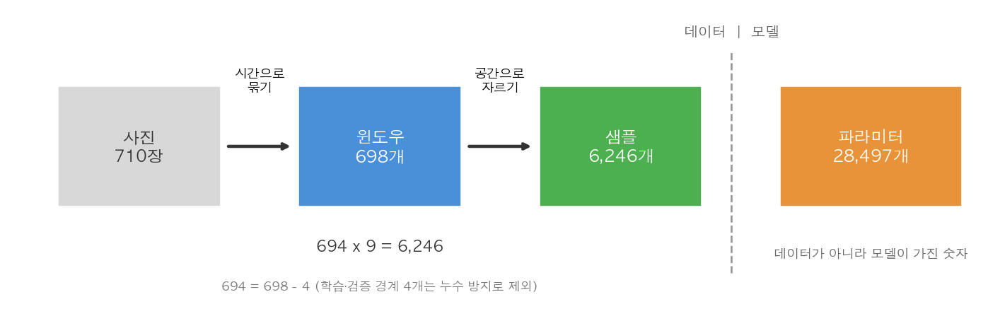
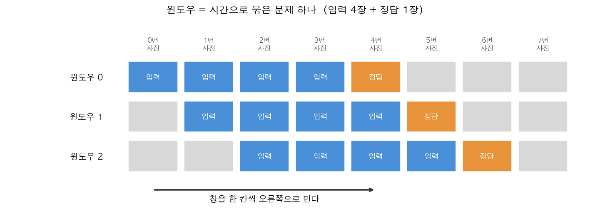
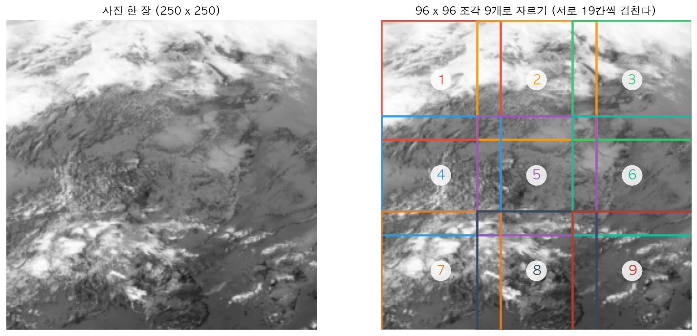
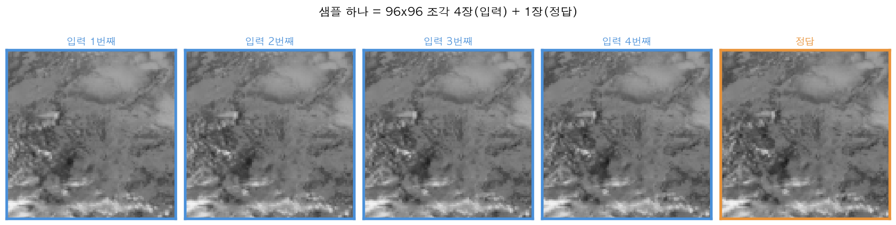
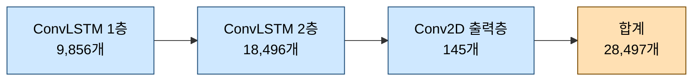

# 그림으로 보는 네 단어: 윈도우 · 패치 · 샘플 · 파라미터

> 이 문서의 그림은 모두 `resource/netcdf` 의 실제 구름 사진으로 그린 것이다.
> 숫자도 `ConvLSTM_prediction.ipynb` 를 실제로 돌려 나온 값이다.
> 개념 전체 흐름은 [convlstm_easy_guide.md](convlstm_easy_guide.md) 를 참고하라.

`ConvLSTM_prediction.ipynb` 를 읽다 보면 **윈도우 · 패치 · 샘플 · 파라미터** 네 단어가 계속 나온다.
비슷해 보이지만 전혀 다른 것이라, 그림으로 하나씩 짚는다.

---

## 1. 한눈에 보기

가장 먼저 기억할 것은 하나다. **셋은 데이터고, 하나는 모델이다.**



| 단어 | 무엇인가 | 어느 쪽 | 개수 |
| --- | --- | --- | --- |
| 윈도우 (window) | **시간**으로 묶은 문제 하나 | 데이터 | 698 |
| 패치 (patch) | **공간**으로 자른 조각 | 데이터 | 윈도우마다 9 |
| 샘플 (sample) | 신경망이 실제로 푸는 문제 한 건 | 데이터 | 6,246 |
| 파라미터 (parameter) | 모델이 공부해서 찾아낸 숫자 | **모델** | 28,497 |

> [!IMPORTANT]
> 윈도우와 패치는 **자르는 방향이 다르다.**
> 윈도우는 시간을 자르고, 패치는 공간을 자른다. 방향이 다르니 **서로 곱해진다.**

---

## 2. 윈도우 — 시간으로 묶기

사진이 2분마다 한 장씩 쌓인다. 여기서 **4장을 입력, 그다음 1장을 정답**으로 삼아 문제를 만든다.
이 묶음 하나가 윈도우다.



중요한 것은 **창을 한 칸씩만 민다**는 점이다. 5장씩 뚝뚝 끊는 게 아니다.

| 윈도우 | 입력 사진 | 정답 사진 |
| --- | --- | --- |
| 0번 | 0, 1, 2, 3 | 4 |
| 1번 | 1, 2, 3, 4 | 5 |
| 2번 | 2, 3, 4, 5 | 6 |

그림에서 보듯 윈도우 0의 **정답**이던 4번 사진이 윈도우 1에서는 **입력**으로 다시 쓰인다.
사진 한 장이 여러 문제에 재사용되는 것이다.

사진 710장에서 이렇게 만들 수 있는 윈도우는 **698개**다.
(710에서 마지막 4장은 뒤에 붙일 정답이 없고, 결측으로 끊긴 자리가 두 곳 있어 706이 아니라 698이다.)

---

## 3. 패치 — 공간으로 자르기

윈도우 하나는 250×250 사진 5장이다. 이대로 학습하기엔 크고 무거우니 **작은 조각으로 자른다.**



96×96 크기로 가로 3번, 세로 3번 → **9조각**이 나온다.

여기서 두 가지를 눈여겨볼 것이 있다.

**조각들이 서로 겹친다.** 그림의 사각형들이 서로 파고든 것이 보인다. 19칸씩 겹치도록 잘랐다.
겹치지 않게 96칸씩 건너뛰면 250 안에 두 조각밖에 안 들어가서 **오른쪽과 아래쪽 58칸이
한 번도 학습되지 않는다.** 77칸씩 건너뛰면 0, 77, 154 세 자리가 나오고 154+96=250 으로 딱 맞는다.

**조각마다 다른 구름이 들어 있다.** 1번 조각은 위쪽 두꺼운 구름대, 9번 조각은 아래쪽 흩어진 구름이다.
서로 다른 상황이므로 **서로 다른 문제**가 된다. 이것이 조각내기의 진짜 이득이다.

### 스트라이드 — 한 번에 옮기는 거리

조각을 뜰 때 **얼마씩 옮겨 가며 자를지**가 `STRIDE` 다. 조각 크기(96)와 비교하면 성질이 정해진다.

| STRIDE | 조각 시작점 | 개수 | 오른쪽 끝 | 결과 |
| --- | --- | --- | --- | --- |
| 60 | 0, 60, 120 | 3 | 216 | 36칸 겹침 (지나치게 겹쳐 낭비) |
| **77** | 0, 77, 154 | 3 | **250** | 19칸 겹침, 끝에 딱 맞음 |
| 96 | 0, 96 | 2 | 192 | 겹침 없음, **58칸이 안 쓰임** |
| 120 | 0, 120 | 2 | 216 | **24칸 건너뜀** (학습 안 되는 띠 발생) |

- 조각 크기보다 **작으면** 겹치고, **같으면** 딱 붙고, **크면** 틈이 생긴다.
- 77 을 고른 이유는 `154 + 96 = 250` 으로 오른쪽 끝에 정확히 닿는 가장 큰 값이기 때문이다.

> [!NOTE]
> 같은 "옮기는 거리"라는 말이 이 프로젝트에서 세 군데 나온다. 움직이는 주체가 각각 다르다.
>
> | 어디서 | 무엇이 움직이나 | 값 |
> | --- | --- | --- |
> | 시간축 | 윈도우가 사진 위를 | 1장씩 |
> | 공간축 | 패치가 사진 위를 | 77칸씩 |
> | 모델 안 | 돋보기(커널)가 입력 위를 | 1칸씩 (기본값) |

---

## 4. 샘플 — 신경망이 먹는 한 건

윈도우를 패치로 자르고 나면 나오는 최종 단위가 샘플이다.
**96×96 조각 4장(입력) + 1장(정답)** 이 한 세트다.



다섯 장이 거의 똑같아 보일 것이다. **그게 정상이다.**
2분 사이에 구름이 거의 안 움직이기 때문이고, 바로 이것이 "아무것도 안 하기(Persistence)"가
강력한 기준선인 이유다. 모델은 이 미세한 차이를 알아맞혀야 한다.

신경망은 이 샘플을 한 건씩 받아서 "입력 4장을 보고 정답 1장을 그려라"를 연습한다.

---

## 5. 파라미터 — 이것만 모델 쪽이다

앞의 셋과 성격이 완전히 다르다. **데이터가 아니라 모델이 가진 숫자**다.



이 28,497개가 앞에서 말한 **"돋보기 숫자"** 다. 공부란 이 값들을 조금씩 고쳐 나가는 일이다.

| | 샘플 | 파라미터 |
| --- | --- | --- |
| 정체 | 풀어야 할 문제 | 문제를 푸는 도구 |
| 개수를 정하는 것 | 데이터를 어떻게 자르느냐 | 모델을 어떻게 설계하느냐 |
| 데이터를 늘리면 | 늘어난다 | **그대로다** |

> [!WARNING]
> **문제집이 두꺼워져도 학생 머리 용량은 커지지 않는다.**
> 샘플을 9배로 늘려도 파라미터는 28,497개 그대로다.
> 반대로 파라미터만 크고 샘플이 적으면 문제를 통째로 외워 버린다(과적합).

---

## 6. 숫자를 따라가 보기

네 단어가 실제로 어떻게 이어지는지 끝까지 계산해 본다.

| 단계 | 계산 | 결과 |
| --- | --- | --- |
| 사진 | 하루치 2분 간격 | 710장 |
| 윈도우 | 연속 구간 3개에서 각각 (길이 − 4) | 176 + 446 + 76 = **698** |
| 누수 방지 | 학습/검증 경계 4개 버림 | 694 |
| 샘플 | 694 × 9조각 | **6,246** |
| 나누기 | 학습 5,022 + 검증 1,224 | 6,246 |
| 배치 | 5,022 ÷ 16 | **314 step/epoch** |
| 파라미터 | 9,856 + 18,496 + 145 | **28,497** (데이터와 무관) |

한 바퀴(epoch)를 돌면 314번 파라미터를 고친다. 4바퀴면 1,256번이다.

### 698 이 아니라 694 인 이유

위 표에서 윈도우는 698개인데 곱하기는 694로 한다. 4개가 어디로 갔을까?
**학습용과 검증용의 경계에서 4개를 일부러 버린다.**

버리지 않으면 이런 일이 생긴다.

| | 입력 사진 | 정답 사진 |
| --- | --- | --- |
| 학습에 쓴 마지막 문제 | 561, 562, 563, 564 | **565** |
| 시험에 쓸 첫 문제 | 562, 563, 564, **565** | 566 |

시험 문제의 **입력**에 565 가 들어 있는데, 565 는 학습할 때 **정답으로 이미 본 사진**이다.
공부하면서 답을 본 내용을 시험에서 힌트로 받는 셈이라 점수가 부당하게 좋아진다.
이것을 **누수(leakage)** 라고 한다.

4개를 버리면 시험 첫 문제가 566 부터 시작해, 학습의 마지막 정답(565)과 겹치지 않는다.

> 왜 하필 4개인가? 입력이 4장이기 때문이다. 시험 문제의 입력 4장이 학습 구간을 넘어오지 않으려면
> 정확히 `IN_FRAMES` 만큼 띄워야 한다. `IN_FRAMES` 를 6으로 바꾸면 6개를 버리게 된다.

```python
train_starts = starts[:cut]
val_starts   = starts[cut + IN_FRAMES:]   # 경계 4개를 버려 누수 차단
```

---

## 7. 자주 헷갈리는 것

| 헷갈리는 질문 | 답 |
| --- | --- |
| 윈도우와 샘플은 같은 말인가 | 아니다. 윈도우를 9조각 내면 샘플 9개가 된다 |
| 패치를 쓰면 메모리가 절약되나 | 아니다. 겹쳐서 중복 저장하므로 0.70 → 0.93 GB 로 **늘어난다** |
| 샘플이 많으면 학습률이 올라가나 | 아니다. 학습률은 `Adam(1e-3)` 로 따로 정해진 값이다 |
| 그럼 샘플을 늘리는 이유는 | 같은 데이터를 반복하는 것보다 **다양한 상황**을 보는 게 낫기 때문이다 |
| 파라미터를 늘리면 성능이 오르나 | 샘플이 충분할 때만. 아니면 외워 버린다 |

마지막 두 줄은 실제로 재 본 결과다. 업데이트 횟수를 똑같이 맞춰 비교했다.

| 공부 방식 | 문제 수 | 고친 횟수 | 검증 오차 |
| --- | --- | --- | --- |
| **9조각을 4바퀴** | 2,700 | 676 | **0.00604** |
| 1조각을 36바퀴 | 300 | 684 | 0.00896 |

고친 횟수는 676 대 684 로 거의 같은데 결과가 갈린다. 차이를 만든 것은 **문제의 다양성**이다.

---

## 참고

- 전체 개념 흐름 (쉬운 설명): [convlstm_easy_guide.md](convlstm_easy_guide.md)
- 모델 층 구성 (그림 설명): [convlstm_model_structure.md](convlstm_model_structure.md)
- 수식과 모델 원리: [convlstm_principles.md](convlstm_principles.md)
- 코드가 어떻게 처리하는지: [nc_predict_pipeline.md](nc_predict_pipeline.md)
- 닮은 정도(SSIM) 지표: [ssim_explained.md](ssim_explained.md)
