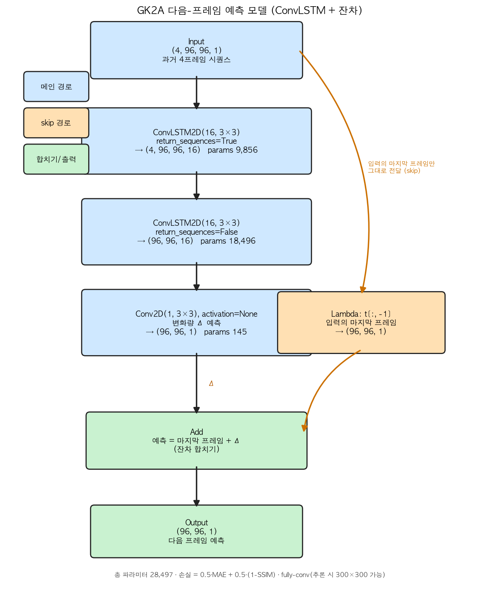
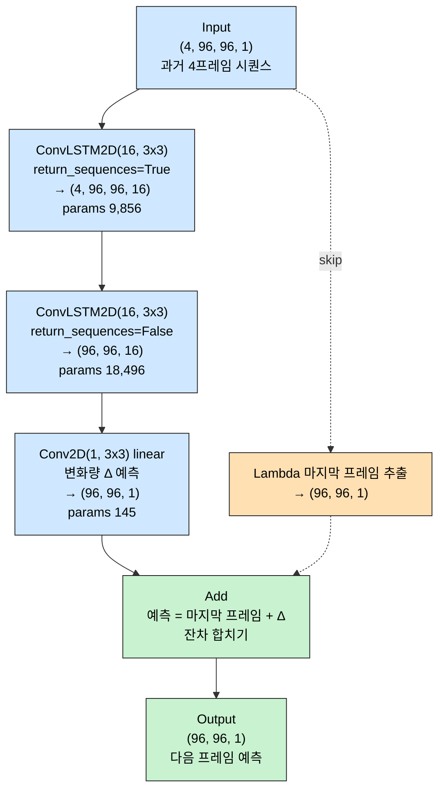

# GK2A 다음-프레임 예측 모델 구조

`nc_predict.ipynb` 의 `build_model()` 신경망 구조 시각화 문서.
ConvLSTM 기반 **잔차(residual) + SSIM 손실** 모델이다.

- 입력: 과거 4프레임 시퀀스 `(4, H, W, 1)`
- 출력: 다음 1프레임 `(H, W, 1)`
- 총 파라미터: **28,497**
- 손실: `0.5 · MAE + 0.5 · (1 - SSIM)`
- fully-conv 라 학습은 96×96 패치, 추론은 300×300 전체 프레임으로 가능

---

## 1. 구조 다이어그램 (이미지)



> 파란색 = 메인 경로(시계열 → 변화량 Δ 예측), 주황색 = skip 경로(입력의 마지막 프레임을
> 그대로 전달), 초록색 = 합치기/출력. 핵심은 **마지막에 둘을 더하는 잔차 구조**다.

---

## 2. 구조 다이어그램 (Mermaid · 인터랙티브)

> **렌더링 안 될 때**: VS Code **기본** 마크다운 미리보기는 Mermaid 를 지원하지 않는다.
> 확장 **"Markdown Preview Mermaid Support"** (bierner) 를 설치해야 미리보기(⌘K V)에서 그래프가 나온다.
> GitHub · Obsidian · Typora 등은 기본 지원한다. (아래 블록 자체는 mermaid 파서로 문법 검증 완료)



---

## 3. 레이어 표

| 순서 | 레이어 | 출력 shape | params | 역할 |
| :---: | --- | --- | ---: | --- |
| 0 | `Input` | (4, 96, 96, 1) | 0 | 과거 4프레임 시퀀스 입력 |
| 1 | `ConvLSTM2D(16)` | (4, 96, 96, 16) | 9,856 | 시간축 따라 공간 패턴 학습, 시퀀스 유지 |
| 2 | `ConvLSTM2D(16)` | (96, 96, 16) | 18,496 | 시퀀스를 마지막 시점 하나로 압축 |
| 3 | `Conv2D(1)` linear | (96, 96, 1) | 145 | 변화량 **Δ** 예측 (음수 가능 → 활성화 없음) |
| 4 | `Lambda t[:,-1]` | (96, 96, 1) | 0 | (skip) 입력의 마지막 프레임만 추출 |
| 5 | `Add` | (96, 96, 1) | 0 | **예측 = 마지막 프레임 + Δ** |
| | **합계** | | **28,497** | |

---

## 4. 텐서 shape 흐름

```text
입력 (4, 96, 96, 1)
   │  과거 4장
   ▼
ConvLSTM2D(return_sequences=True)  → (4, 96, 96, 16)   # 시간축 유지, 채널 16
   ▼
ConvLSTM2D(return_sequences=False) → (96, 96, 16)      # 시간축 소멸(마지막 상태)
   ▼
Conv2D(1)                          → (96, 96, 1) = Δ   # 채널 16 → 1, 변화량
   │
   │   (skip) 입력의 마지막 프레임  → (96, 96, 1)
   ▼   ───────────────────────────┐
Add( 마지막 프레임 , Δ )           ◄┘
   ▼
출력 (96, 96, 1)  = 다음 프레임 예측
```

---

## 5. 설계 포인트 (왜 이렇게?)

- **잔차 구조(`Add`)**: 신경망은 "다음 프레임 전체"가 아니라 **변화량 Δ만** 학습한다.
  베이스(마지막 프레임)는 그대로 가져오므로 입력의 선명함을 계승 → **예측 흐릿함 완화**.
- **`Conv2D` activation=None**: Δ 는 음수가 될 수 있어 `sigmoid`/`relu` 가 아닌 **linear**.
- **`Lambda` + `Add`(Functional API)**: 입력에서 갈래가 나와 끝에서 합쳐지는 Y자 구조라
  `Sequential` 로는 표현 불가. 텐서를 직접 잇는 Functional API 가 필수.
- **fully-conv (공간 크기 None)**: 96×96 패치로 학습하고도 추론 시 300×300 전체를 한 번에 처리.
- **손실 `0.5·MAE + 0.5·(1-SSIM)`**: MAE 로 선명도 유지(평균회귀 억제) + SSIM 으로 구조/엣지 보존.

---

## 6. (참고) graphviz 로 Keras 공식 다이어그램 생성

`keras.utils.plot_model` 로 더 상세한 그림을 뽑으려면 시스템 패키지가 필요하다.

```bash
brew install graphviz        # macOS 시스템 패키지
pip install pydot
```

```python
keras.utils.plot_model(model, to_file='keras_model.png',
                       show_shapes=True, show_layer_names=True, dpi=120)
```
